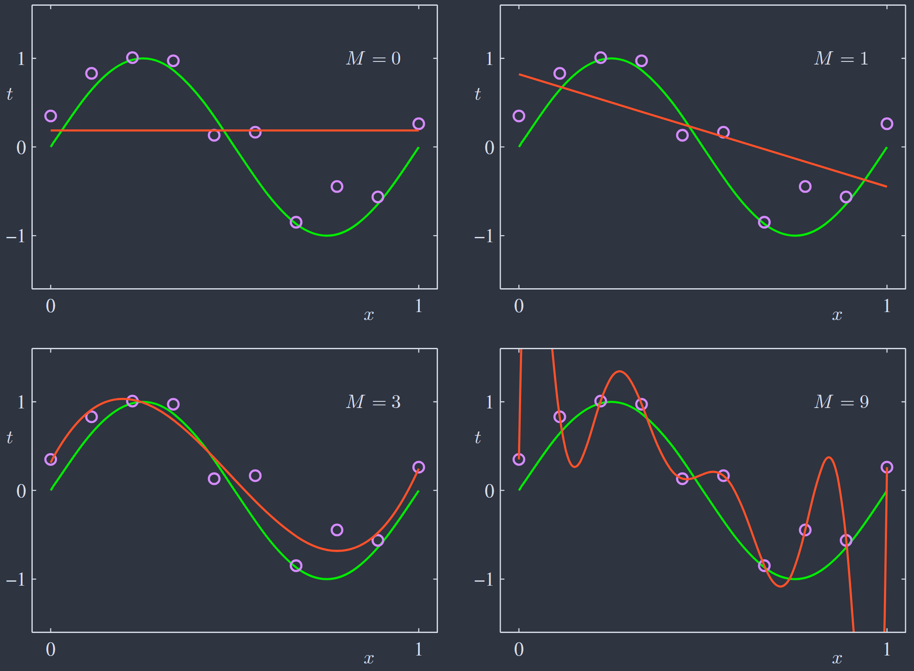
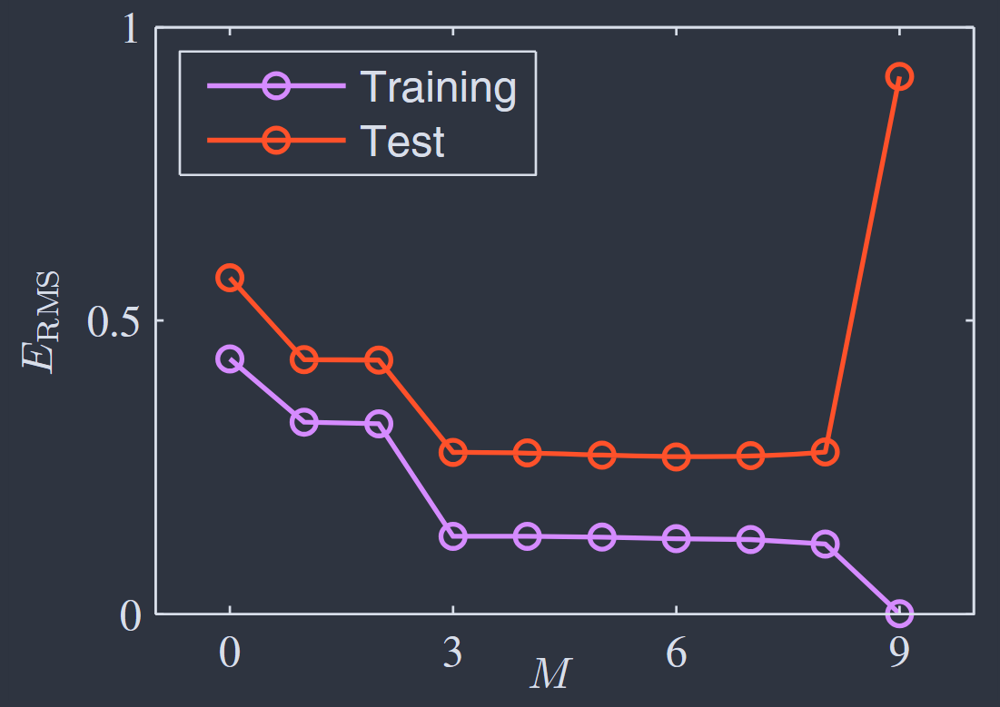
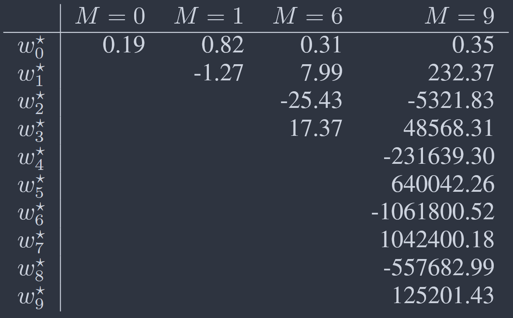
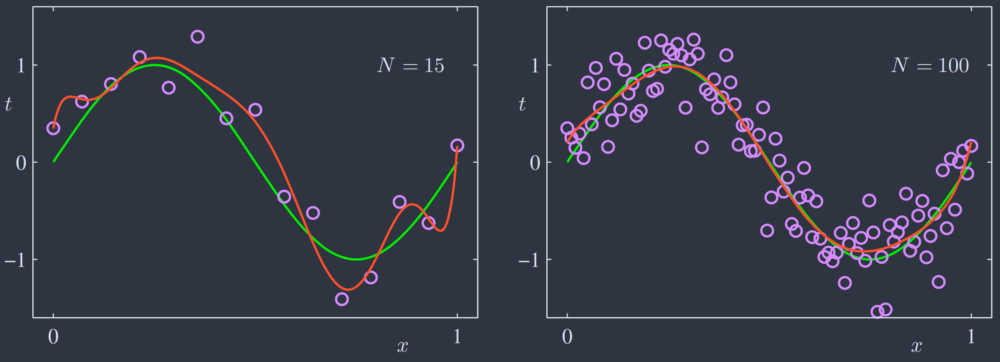
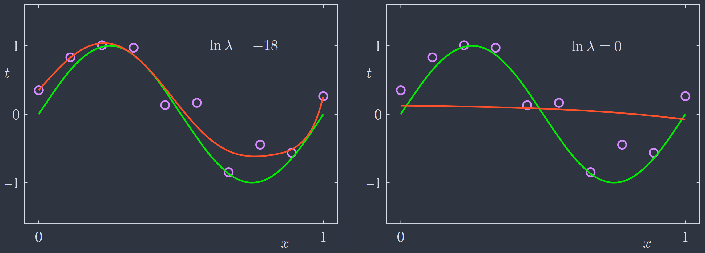
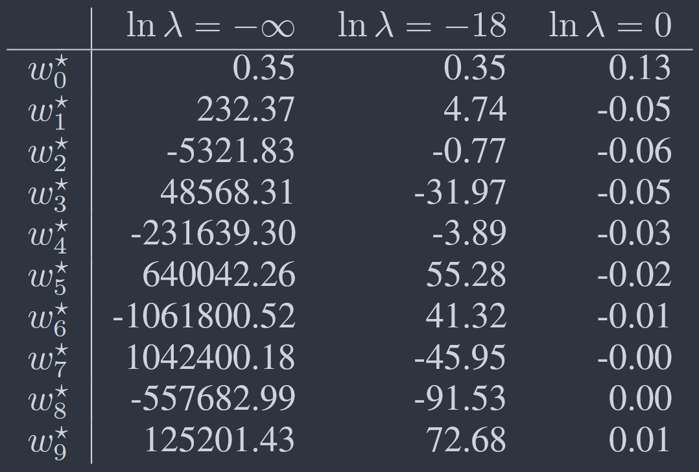
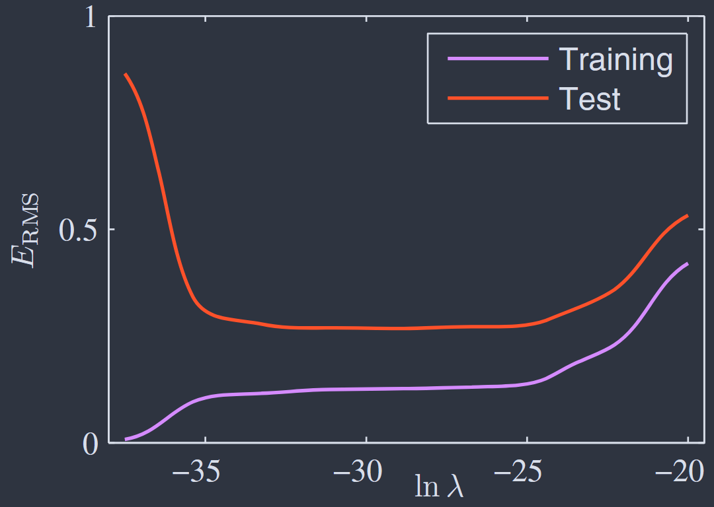
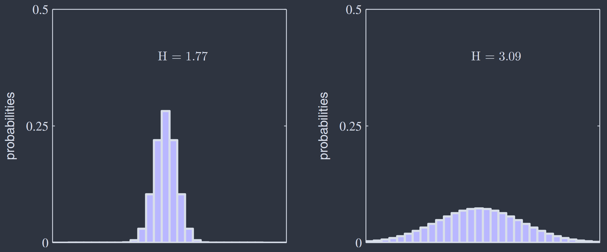

> Although these might sound like daunting topics, they are in fact straightforward, and a clear understanding of them is essential if machine learning techniques are to be used to best effect in practical applications.
## 1. POLYNOMIAL CURVE FITTING
### Preliminary
假设给定训练集 $S$ 包含 $N$ 个观察点 $\mathbf{X} \equiv (x_1, x_2, \cdots, x_N)^\mathrm{T}$ 以及对应观察值 $\mathbf{T} \equiv (t_1, t_2, \cdots, t_N)^\mathrm{T}$ ．目标为对新的输入 $\widehat{x}$ 预测其对应值 $\widehat{\,t\,}$．这里我们将其视为简单的曲线拟合问题．特别地，选取如下形式的多项式函数作为拟合目标：

$$
y(x;\mathbf{w}) = w_0 + w_1 x + w_2 x^2 + \cdots + w_M x^M = \sum_{j=0}^M w_j x^j
$$

???+ note "Remark"
	如上 $y(x;\mathbf{w})$ 关于 $x$ 非线性，但是关于参数 $\mathbf{w}$ 线性，被称为 **线性模型（Linear Model）**．

### Parameter
参数 $\mathbf{w}$ 的值可由最小化 **误差函数（Error Function）** 的方式确定．误差函数衡量了给定参数 $\mathbf{w}$ 时预测函数 $y(x;\mathbf{w})$ 和训练集数据的误差度，如均方误差：

$$
E(\mathbf{w}) = \frac12 \sum_{n=1}^N\, [y(x_n;\mathbf{w}) - t_n]^2
$$

由 $E(\mathbf{w})$ 关于 $\mathbf{w}$ 的凸性，其有唯一的极小值点．记 $\mathbf{w}^* = \operatorname{arg}\min_\mathbf{w} E(\mathbf{w})$，对应结果多项式为 $y(x;\mathbf{w}^*)$．

现在问题转为确定多项式的阶数 $Ｍ$．下图为 $M = 0,1,3,9$ 时拟合结果多项式的对比图像（绿色为原曲线，红色为拟合曲线）．

此外还可以进行一些定量分析．考虑测试集 $T$，对于不同 $M$ 计算在 $T$ 上的 **均方根误差（Root-mean-square，RMS）**：

$$
E_{\text{RMS}} = \sqrt{\frac{2 E(\mathbf{w}^*)}{N}}
$$

训练集和测试集上的均方根误差随 $M$ 分布图如下：

可以看到，$M$ 从 $0$ 开始增加时，结果多项式拟合效果持续上升．但 $M = 9$ 时，虽然训练集误差降低到 $0$，但测试误差激增，产生 **过拟合（Over-fitting）** 现象．

### Regularization
如上的结果似乎存在一些矛盾：

1. 低阶多项式可视为高阶多项式的特殊情形，$M=9$ 的结果应该至少与 $M=3$ 相当．
2. 数据是从 $\sin(2\pi x)$ 函数中加噪生成的，其 [Taylor Expansion](https://en.wikipedia.org/wiki/Taylor_series) 包括所有阶的项，拟合结果应该随 $M$ 增长而改善．

我们从以下两个视角考察这个问题：

首先是系数 $\mathbf{w}^*$ 随 $M$ 的量级变化．

直观来说，具有较大阶数 $M$ 的复杂多项式越来越适应目标值上的随机噪声．

其次是给定模型（$M=9$）对不同量级数据集的拟合效果变化．

数据集越大，就越能容得起对数据拟合一个更复杂的模型．

???+ note "Remark"
	一个粗略的经验法则：数据点的数量不应少于模型中自适应参数数量的某个倍数（例如5或10）．

一个经常用来控制过拟合现象的技巧是引入 **正则化（Regularization）** 项．最简单的方式为添加系数的二阶和：

$$
\widetilde{E}(\mathbf{w}) = \frac12 \sum_{n=1}^M\, [y(x_n;\mathbf{w}) - t_n]^2 + \frac{\lambda}{2} \Vert \mathbf{w} \Vert^2
$$

???+ note "Remark"
	值得注意一点，通常会省略正则化项中的系数 $w_0$，因为包含该系数会导致结果依赖于目标变量的原点选择．或者，该系数配以独立的正则化系数．

如下图表展示了 $M=9$ 时，添加不同系数 $\lambda$ 的正则项后，拟合结果对比图，系数 $\mathbf{w}$ 量级对比表和 $E_{\text{RMS}}$ 变化趋势图：

## 2. PROBABILITY THEORY
概率论基本知识可参考 Wiki: [Probability Theory](https://en.wikipedia.org/wiki/Probability_theory)，[Expectation](https://en.wikipedia.org/wiki/Expected_value)，[Covariance](https://en.wikipedia.org/wiki/Covariance)．

### Bayesian Probabilities
???+ note "The Rules of Probability"
	$$
	\begin{align}
	\textbf{sum rule}\qquad &\mathbb{P}(X) = \sum_Y \mathbb{P}(X,Y) \\
	\textbf{product rule}\qquad &\mathbb{P}(X,Y) = \mathbb{P}(Y \vert X)\cdot \mathbb{P}(X)
	\end{align}
	$$

由以上的基本法则，可以推出如下条件概率之间的关系：

???+ note "Bayes‘s Theorem"
	$$
	\mathbb{P}(Y \vert X) = \frac{\mathbb{P}(X \vert Y) \cdot \mathbb{P}(Y)}{\mathbb{P}(X)} = \frac{\mathbb{P}(X \vert Y) \cdot \mathbb{P}(Y)}{\sum_Y \mathbb{P}(X \vert Y) \cdot \mathbb{P}(Y)}
	$$

若 $X = \mathcal{D}$ 为观测数据，$Y=\mathbf{w}$ 为模型参数，则：

- $p(\mathbf{w})$ 称为 $\mathbf{w}$ 的 **先验概率（Prior Probability）**，因其是在观测前确定的概率；
- $p(\mathbf{w} \vert \mathcal{D})$ 称为 $\mathbf{w}$ 的 **后验概率（Posterior Probability）**，因其是在观测数据后得到的概率；
- $p(\mathcal{D}\vert \mathbf{w})$ 称为关于 $\mathbf{w}$ 的 **似然函数（Likelihood Function）**，代表了对于不同参数向量 $\mathbf{w}$ 观测数据出现的可能性．

此时，Bayes' Theorem 可重新表述为：

$$
\text{posterior} \propto \text{likelihood} \times \text{prior}
$$

???+ note "Remark"
	注意似然不是一个关于 $\mathbf{w}$ 的概率分布，因而只称为函数，其关于 $\mathbf{w}$ 的积分结果不一定为 $1$．如上正比关系也是关于 $\mathbf{w}$ 而言．

在频率学派和贝叶斯学派中，似然 $p(\mathcal{D}\vert \mathbf{w})$ 都扮演着重要的角色，但具体使用方式截然不同：

- 在频率学派中，$\mathbf{w}$ 被视为由某种估计器（如最大似然估计）确定的固定参数，并且误差棒由可能的数据集 $\mathcal{D}$ 的分布决定；
- 在贝叶斯学派中，只有唯一的数据集 $\mathcal{D}$ （即观测到的那一个），并且参数 $\mathbf{w}$ 的不确定性由其分布 $p(\mathbf{w})$ 表示．

### Gaussian Distribution
???+ note "Gaussian Distribution"
	一维高斯分布：

	$$
	\mathcal{N}(x\vert \mu, \sigma^2) = \frac{1}{(2\pi \sigma^2)^{1/2}} \exp\left\{ -\frac{1}{2\sigma^2}(x-\mu)^2 \right\}
	$$

	其中 $\mu$ 为均值，$\sigma$ 为标准差，$\beta=1/ \sigma^2$ 为精度．计算有：

	$$
	\mathbb{E}[x] = \mu, \quad \mathbb{E}[x^2] = \mu^2 + \sigma^2,\quad \operatorname{var}[x] = \mathbb{E}[x^2] - \mathbb{E}[x]^2 = \sigma^2
	$$

	$D$ 维高斯分布：

	$$
	\mathcal{N}(\mathbf{x}\vert \mathbf{\mu}, \mathbf{\Sigma}) = \frac{1}{(2\pi)^{D/2}} \frac{1}{\vert \mathbf{\Sigma}\vert^{1/2}} \exp \left\{ -\frac12 (\mathbf{x}-\mu)^\mathrm{T} \mathbf{\Sigma}^{-1} (\mathbf{x}-\mu) \right\}
	$$

	其中 $\mathbf{\mu}$ 为均值，$\mathbf{\Sigma}$ 为协方差

### Curve Fitting Re-visited
重新考虑 [第一节](#1-polynomial-curve-fitting) 中的曲线拟合问题．使用概率分布表达目标变量的不确定性，即对于输入 $x$，假设其对应值 $t \sim \mathcal{N}(y(x,\mathbf{w}),\beta^{-1})$ ：

$$
p(t\vert x,\mathbf{w},\beta) = \mathcal{N}(t\vert y(x,\mathbf{w}),\beta^{-1})
$$

现在使用训练集 $S=(\mathbf{X},\mathbf{T})$ 来决定参数 $\mathbf{w}, \beta$．

- 频率学派 **最大似然（Maximum Likelihood，ML）** 估计．

	似然函数计算如下：

	$$
	\begin{align}
	p(\mathbf{T}\vert \mathbf{X},\mathbf{w},\beta) &= \prod_{n=1}^N p(t_n\vert x_n, \mathbf{w},\beta) = \prod_{n=1}^N \mathcal{N}(t_n\vert y(x_n,\mathbf{w}),\beta) \\
	-\ln p(\mathbf{T}\vert \mathbf{X},\mathbf{w},\beta) &= \frac{\beta}{2}\sum_{n=1}^N [y(x_n,\mathbf{w})-t_n]^2 - \frac N2 \ln\beta + \frac N2\ln(2\pi)
	\end{align}
	$$

	最大化似然可得：

	$$
	\begin{align}
	\mathbf{w}_{\rm{ML}} &= \arg \min_{\mathbf{w}}\, \frac12[y(x_n,\mathbf{w})-t_n]^2 \\
	\beta_{\mathrm{ML}}^{-1} &= \frac1N \sum_{n=1}^N [y(x_n,\mathbf{w_{\mathrm{ML}}})-t_n]^2
	\end{align}
	$$

	即第一节中均方误差的形式实际为最大似然的结果．

- 贝叶斯思想 **最大后验（Maximum Posterior，MAP）** 估计．

	引入参数 $\mathbf{w}$ 的先验分布：

	$$
	p(\mathbf{w}\vert \alpha) = \mathcal{N}(\mathbf{w}\vert \mathbf{0},\alpha^{-1}\mathbf{I}) = \left(\frac{\alpha}{2\pi}\right)^{(M+1)/2} \exp\left\{ -\frac{\alpha}2 \mathbf{w}^{\mathrm{T}}\mathbf{w} \right\}
	$$

	由贝叶斯公式计算后验有：

	$$
	\begin{align}
	p(\mathbf{w}\vert \mathbf{X},\mathbf{T},\alpha,\beta) &\propto p(\mathbf{T}\vert \mathbf{X},\mathbf{w},\beta) p(\mathbf{w}\vert \alpha) \\
	-\ln p(\mathbf{w}\vert \mathbf{X},\mathbf{T},\alpha,\beta) = \frac{\beta}{2}\sum_{n=1}^N [y(x_n,&\mathbf{w})-t_n]^2 + \frac{\alpha}2 \mathbf{w}^{\mathrm{T}}\mathbf{w}- \frac N2 \ln\beta + \text{Const}
	\end{align}
	$$

	最大化后验可得：

	$$
	\begin{align}
	\mathbf{w}_{\rm{MAP}} &= \arg \min_{\mathbf{w}}\, \frac\beta2[y(x_n,\mathbf{w})-t_n]^2 + \frac\alpha2 \mathbf{w}^{\mathrm{T}}\mathbf{w} \\
	\beta_{\mathrm{MAP}}^{-1} &= \frac1N \sum_{n=1}^N [y(x_n,\mathbf{w_{\mathrm{MAP}}})-t_n]^2
	\end{align}
	$$

	即第一节中加入正则项的均方误差的形式实际为最大后验的结果，其中 $\lambda=\alpha/\beta$．

- 完全贝叶斯方法

	如上方法仍停留在对 $\mathbf{w}$ 作点估计，下面处理中会对 $\mathbf{w}$ 取值作积分．这里假设参数 $\alpha,\beta$ 值已知，考虑 $p(t\vert x,\mathbf{X},\mathbf{T})$，计算有：

	$$
	p(t\vert x,\mathbf{X},\mathbf{T}) = \int p(t\vert x,\mathbf{w}) p(\mathbf{w}\vert \mathbf{X},\mathbf{T})\, \mathrm{d}\mathbf{w} = \mathcal{N}(t\vert m(x),s^{2}(x))
	$$

	均值和方差由如下式子给出：

	$$
	\begin{align}
	m(x) &= \beta \mathbf{\phi}(x)^\mathrm{T}\mathbf{S}\sum_{n=1}^N \mathbf{\phi}(x_{n})t_{n}\\
	s^{2}(x) &= \beta^{-1} + \mathbf{\phi}(x)^\mathrm{T}\mathbf{S}\mathbf{\phi}(x) \\ \\
	\mathbf{S}^{-1} = \alpha \mathbf{I} + &\beta \sum_{n=1}^N \mathbf{\phi}(x_{n})\mathbf{\phi}(x)^\mathrm{T}, \quad \mathbf{\phi}_{i}(x) = x^i
	\end{align}
	$$

	可以看到：
	
	- 均值和方差都是依赖于 $x$ 的；
	- 方差第一项 $\beta^{-1}$ 表示由目标变量上的噪声引起的预测值 $t$ 的不确定性，类似 $\beta_{\text{ML}}^{-1}$．第二项源于 $\mathbf{w}$ 的不确定性，是贝叶斯处理的结果．

## 3. DECISION THEORY
概率论提供了数学框架，量化和处理不确定性．决策理论将会基于此给出不同情况下的最优决策．

以分类任务为例，假设 $\mathbf{x}$ 为输入向量，$t$ 为输出向量，其可分类为 $\mathcal{C}_{k}$．

- **推断（Inference）** 任务包括决定 $p(\mathbf{x},\mathcal{C_{k}})$；
- **决策（Decision）** 任务包括在某种最优情况下根据 $\mathbf{x}$ 决定 $t$ 的类别 $\mathcal{C}_{k}$．

### Minimizing Misclassification Rate
将输入空间分为 **决策域（Decision Regions）** $\mathcal{R}_{k}$ ，认为 $\mathcal{R}_{k}$ 中的点对应于类别 $\mathcal{C}_{k}$．从而最小化如下误分类率：

$$
\begin{align}
p(\text{mistake}) &= p(\mathbf{x} \in \mathcal{R}_{1},\mathcal{C}_{2} ) + p(\mathbf{x} \in \mathcal{R}_{2},\mathcal{C}_{1})  \\
&= \int_{\mathcal{R}_{1}} p(\mathbf{x},\mathcal{C}_{2})\, \mathrm{d}\mathbf{x}  + \int_{\mathcal{R}_{2}} p(\mathbf{x},\mathcal{C}_{1})\, \mathrm{d}\mathbf{x}
\end{align} 
$$

多类别情况下可最大化如下正确率：

$$
\begin{align}
p(\text{correct}) &= \sum_{k=1}^K p(\mathbf{x}\in \mathcal{R}_{k},\mathcal{C}_{k})  \\
&= \sum_{k=1}^K \int_{\mathcal{R}_{k}} p(\mathbf{x},\mathcal{C}_{k})\, \mathrm{d}\mathbf{x} \\
&= \sum_{k=1}^K \int_{\mathcal{R}_{k}} p(\mathcal{C}_{k}\vert \mathbf{x}) p(\mathbf{x})\, \mathrm{d}\mathbf{x}
\end{align} 
$$

其中对于每一个 $\mathbf{x}$，$p(\mathbf{x})$ 固定，只需将其归类为拥有最大后验 $p(\mathcal{C}_{k}\vert \mathbf{x})$ 的类别 $\mathcal{C}_{k}$．

### Minimizing Expected Loss
实际情况中，每种误分类所带来的损失不一样．记 $L_{k,j}$ 为将类别 $\mathcal{C}_{k}$ 的点误分类为 $\mathcal{C}_{j}$ 的损失，最小化如下的损失函数：

$$
\mathbb{E}[L] = \sum_{k} \sum_{j} \int_{\mathcal{R}_{j}} L_{k,j} p(\mathbf{x},\mathcal{C}_{k})\, \mathrm{d}\mathbf{x} = \sum_{k}\sum_{j} \int_{\mathcal{R}_{j}} L_{k,j}p(\mathcal{C}_{k}\vert \mathbf{x})p(\mathbf{x})\, \mathrm{d}\mathbf{x}
$$

同样，将每个 $\mathbf{x}$ 归类为拥有最小 $\sum_{k}L_{k,j}p(\mathcal{C}_{k}\vert x)$ 的类别 $\mathcal{C}_{j}$．

### Reject Option
设定阈值 $\theta$，对于最大后验 $\max_{k} p(\mathcal{C}_{k}\vert \mathbf{x})\leq \theta$ 的输入 $\mathbf{x}$ 进行人工检测．

### Inference & Decision
实际中有如下的三种策略：

- 建模 $p(\mathbf{x}\vert \mathcal{C}_{k})$ 和 $p(\mathcal{C}_{k})$ 或等价地建模 $p(\mathbf{x},\mathcal{C}_{k})$ ，由贝叶斯定理得到后验 $p(\mathcal{C}_{k}\vert \mathbf{x})$ ，再进行决策．
	
	???+ note "Remark"
		如上显示或隐式建模了输入分布 $p(\mathbf{x})$ 的模型称为 **生成模型（Generative Model）**．因可以采样生成合成数据点．可用于异常检测等任务．
	
- 建模后验 $p(\mathcal{C}_{k}\vert \mathbf{x})$ ，再进行决策．

	???+ note "Remark"
		如上显示建模后验的模型称为 **判别模型（Discriminative Model）**．

- 建模判别函数 $f(\cdot)$，直接将输入 $\mathbf{x}$  映射到类别标签 $\mathcal{C}_{k}$．

???+ note "Remark"
	显示或隐式建模后验 $p(\mathcal{C}_{k}\vert \mathbf{x})$ 有诸多好处，其一用处如下： 
	对于存在稀有样本的情况，训练集的构造需要平衡正常样本和稀有样本的比例．这会影响样本的先验，从而得到错误的后验．根据贝叶斯定理，后验正比于先验．因此可以将训练集得到的后验除以训练集先验再乘上实际先验，最后归一化得到正确后验．直接建模判别函数无法实现这一点．

## 4. INFORMATION THEORY

### Introduction
对于离散随机变量 $x \sim p$，定义 $h(\cdot)$ 为关于 $p$ 的单调函数，表示信息量．那么当 $x$ 和 $y$ 独立时，有：

$$
\begin{align}
h(p(x,y) = h(p(x)) + h(p(y)),\ p(x,y) = p(x)p(y)
\end{align}
$$

可得：

$$
h(x) = h(p(x)) = -\log_{2} p(x)
$$

???+ note "Remark"
	对数的底数选择是任意的．目前采用信息论中常用的以 $2$ 为底，此时其单位为 “比特（bits）”；后面采用以 $e$ 为底，此时其单位为 “奈特（nats）”．

其包含的平均信息量称为 **熵（Entropy）**，计算如下：

$$
\mathrm{H}[x] = -\sum_{x}p(x)\log_{2}p(x)
$$

直观来说，分布平均的随机变量熵值大，分布集中在某些点的随机变量熵值小．

下面将熵的概念推广到连续性随机变量 $x \sim p \in C[x]$ ：

将实轴等距分割，每一段距离为 $\Delta$ ，$x$ 在 $[i\Delta,(i+1)\Delta]$ 中的概率为：

$$
\int_{i\Delta}^{(i+1)\Delta} p(x) \, \mathrm{d}x = p(x_{i})\Delta
$$

将其视为离散分布，对应熵为：

$$
\mathrm{H}_{\Delta} = -\sum_{i} p(x_{i})\Delta \ln(p(x_{i})\Delta) = -\sum_{i} p(x_{i})\Delta\ln p(x_{i}) - \ln\Delta
$$

忽略第二项 $\ln\Delta$ ，令 $\Delta\to 0$，则有：

$$
\mathrm{H}[x] = \lim_{ \Delta \to 0 } \left\{ -\sum_{i}p(x_{i})\Delta \ln p(x_{i}) \right\} = -\int p(x)\ln p(x) \, \mathrm{d}x
$$

称之为 **微分熵（Differential Entropy）** ．

???+ note "Remark"
	注意到微分熵和离散熵之间相差 $\ln\Delta$ ，这反映了精确指定一个连续变量需要大量比特．

由 [Lagrange 乘数法](https://en.wikipedia.org/wiki/Lagrange_multiplier) 计算知，离散分布情况下，最大熵对应于均匀分布．下面推导连续分布情况下的最大熵分布：

为保证最大值的良定性，对 $p(x)$ 做如下约束：

$$
\begin{align}
\int_{-\infty}^{\infty} p(x) \, \mathrm{d}x &= 1 \\
\int_{-\infty}^{\infty} xp(x) \, \mathrm{d}x &= \mu \\
\int_{-\infty}^{\infty} (x-\mu)^{2}p(x) \, \mathrm{d}x &= \sigma^{2}
\end{align}
$$

由 Lagrange 乘数法计算有：

$$
p(x) = \frac{1}{(2\pi\sigma^{2})^{1/2}}\exp \left\{ -\frac{(x-\mu)^{2}}{2\sigma^{2}} \right\} 
$$

即连续分布情况下的最大熵对应于高斯分布，此时微分熵为：

$$
\mathrm{H}[x] = \frac{1}{2}[1+\ln(2\pi\sigma^{2})]
$$

???+ note "Remark"
	由上式 $\mathrm{H}[x]$ 表达式也可以看出，分布越分散熵值越大．并且微分熵可以为负值，当 $\sigma^{2} < 1/(2\pi e)$ 时有 $\mathrm{H}[x] < 0$ ．

假设现在有联合分布 $p(x,y)$ ．若 $x$ 的值已知，则确定某一 $y$ 值所需的额外信息为 $-\ln p(y\vert x)$ ，从而确定 $y$ 所需的平均信息量为：

$$
\mathrm{H}[y\vert x] = -\int \int p(x,y)\ln p(y\vert x)\, \mathrm{d}y\, \mathrm{d}x
$$

称之为给定 $x$ 下 $y$ 的 **条件熵（Conditional Entropy）**．由乘法法则，计算有：

$$
\mathrm{H}[x,y] = \mathrm{H}[y\vert x] + \mathrm{H}[x]
$$

### Relative Entropy & Mutual Information
假设有未知分布 $p(x)$，建模得到近似分布 $q(x)$，则以 $q(x)$ 传递 $x$ 值所需的平均额外信息量为：

$$
\begin{align}
\text{KL}(p\Vert q) &= -\int p(x)\ln q(x) \, \mathrm{d}x - \left[ -\int p(x)\ln p(x)\, \mathrm{d}x \right]  \\
&= -\int p(x)\ln \left[ \frac{q(x)}{p(x)} \right] \, \mathrm{d}x
\end{align}
$$

称之为 **相对熵（Relative Entropy）** 或 **KL 散度（Kullback-Leibler Divergence）**．

???+ note "Properties"
	KL 散度有如下两个重要性质：

	- 非对称性

		$$
		\text{KL}(p\Vert q) \not\equiv \text{KL}(q\Vert q)
		$$

	- 非负性

		利用 [Jensen 不等式](https://en.wikipedia.org/wiki/Jensen%27s_inequality)：对于凸函数 $f$，

		$$
		f(\mathbb{E}[x]) \leq \mathbb{E}[f(x)]
		$$

		取 $f(x) = -\ln x$，
		
		$$
		\text{KL}(p\Vert q) = -\int p(x)\ln \left[ \frac{q(x)}{p(x)} \right] \, \mathrm{d}x \geq -\ln \int q(x)\, \mathrm{d}x = 0
		$$
		
		因此，可以视 KL 散度为两个分布 $p(x)$ 和 $q(x)$ 之间不相似性的度量．

若两个分布 $p,q$ 独立，则有 $p(x,y) = p(x)p(y)$ ．而当 $p,q$ 不独立时，可使用 KL 散度衡量两个分布之间的“独立度”：

$$
\begin{align}
\mathrm{I}[x,y] &\equiv \text{KL}(p(x,y)\Vert p(x)p(y)) \\
&= -\iint p(x,y)\ln \left[ \frac{p(x)p(y)}{p(x,y)} \right] \, \mathrm{d}x \, \mathrm{d}y 
\end{align}
$$

称之为 $x$ 和 $y$ 之间的 **互信息（Mutual Information）**．

此外，有如下关系式：

$$
\mathrm{I}[x,y] = \mathrm{H}[x] - \mathrm{H}[x\vert y] = \mathrm{H}[y] - \mathrm{H}[y\vert x]
$$

即互信息为在观测 $y$ 后 $x$ 信息的减少量．