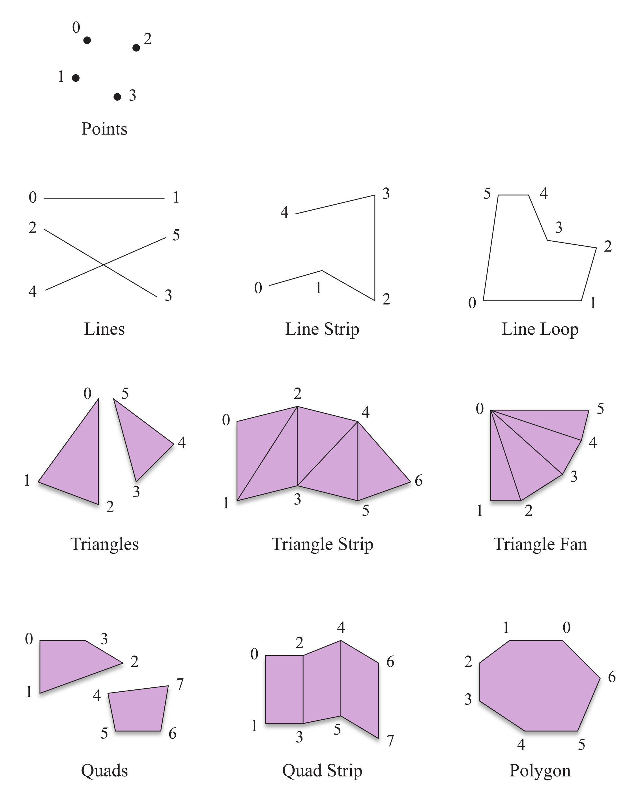
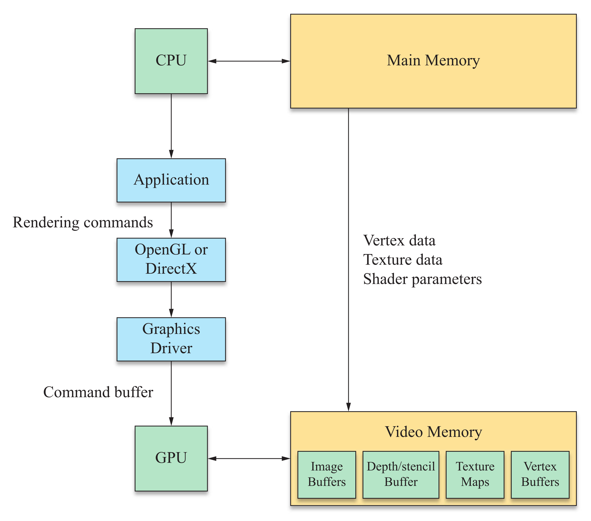
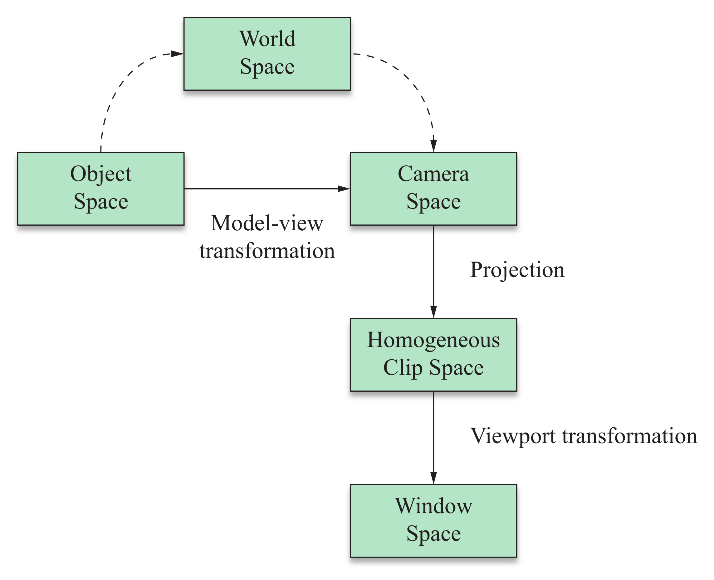
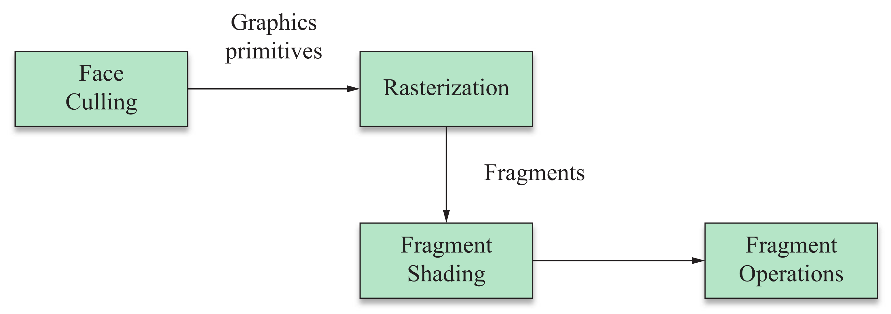
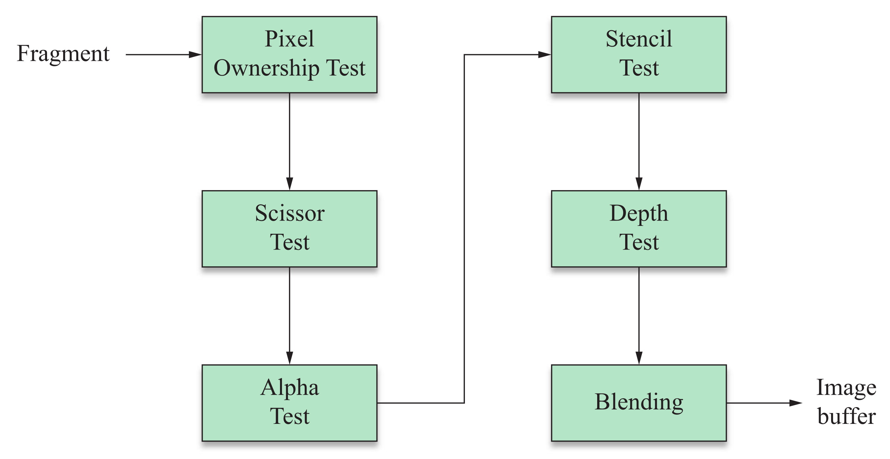

> This chapter provides a preliminary review of the rendering pipeline.

## 1. GRAPHICS PROCESSORS

考虑一个待渲染的场景，其通常由多个独立物体组成．每个物体的几何形式包括两部分：

- 顶点集合．
- 一个特定类型的 **图元（Graphics Primitive）**，其表明顶点如何连接成形状．

如下图展示了 OpenGL 库中的图元类型，多数情况下，3D 模型表面由一列三角形表示：

/// caption
Figure 1: OpenGL 库定义的十种图元类型．数字表示顶点被指定的顺序．
///

### Communications Between CPU & GPU
渲染过程通常是 **异步操作（Asynchronous Operation）** 的，即 CPU 发放渲染命令给 GPU 后，先继续进行其他任务，为节省时间提高性能．

如下为 CPU 和 GPU 之间具体通信过程图：

/// caption
Figure 2: CPU 和 GPU 之间的通信过程图．
///

通信过程如下：

1. 应用程序通过图形 API （如 OpenGL）发起绘制调用．
2. 图形 API 具体实现由 GPU 驱动提供，将 API 调用转换为 GPU 可执行命令，并组织相关状态和资源．
3. 驱动将生成的 GPU 命令提交到 GPU 命令队列或缓冲区．
4. GPU 命令处理器读取命令，执行渲染．

???+ note "Remark"
	OpenGL 的调用接口称为 **硬件抽象层（Hardware Abstraction Layer，HAL）**，因其提供了一系列函数可以在任何支持 OpenGL 架构的硬件上运行．

### VRAM
一块显卡拥有独立的内存核心，称之为 **VRAM（Video Random Access Memory）**．GPU 会存储信息在 VRAM 中，尤其是如下几种常用数据：

- 图像缓冲（Image Buffers）
	
	图像缓冲分为前图像缓冲和后图像缓冲．前图像缓冲包含所有 **视口（Viewport）** 可见的像素数据；后图像缓冲为 GPU 渲染场景的位置，用户不可见．当后图像渲染完成后，会发生 **缓冲交换（Buffer Swap）**，使得后图像缓冲变为前图像缓冲．该操作通常与显示器刷新率同步，以避免图像撕裂．

- 深度缓冲（Depth Buffer / Z-buffer）
	
	对于图像缓冲的每一个像素，深度缓冲存储该像素的深度值，用于执行隐藏面消除．方式是仅当像素深度小于图像缓冲中已有像素的深度时，才绘制该像素．

- 模板缓冲（Stencil Buffer）
	
	对于图像缓冲的每一个像素，模板缓冲存储一个整数掩码，用于限制渲染的区域．

- 纹理映射（Texture Maps）
	
	纹理映射为提供给表面的图像，用于提高视觉细节．在高级应用中，其不止包括简单像素图，还有向量图等．

## 2. VERTEX TRANSFORMATION
几何数据会以三维形式传递给图形硬件，从而最重要的顶点变换为将其转为二维视口可见数据．该过程包含了多个坐标系之间的变换，如下图所示：

/// caption
Figure 3: 渲染管线中的坐标空间关系图． 
///

具体步骤如下：

1. 单个模型的顶点数据存储在 **物体空间（Object Space）**，其为该模型的局部坐标系统．
2. 每个模型的位置和方向存储在 **世界空间（World Space）**，其为全局坐标系统．
3. 在渲染前，顶点需变换到 **相机空间（Camera Space）**，其 $x$ 和 $y$ 轴与显示器对齐，$z$ 轴与观察方向平行．顶点可通过复合变换，直接由物体空间变换到相机空间，称之为 **模型-视图变换（Model-view Transformation）** ．
4. 相机空间的顶点经过 **投影变换（Projection Transformation）**到 **齐次裁剪空间（Homogeneous Clip Space）**．该变换在 4D **齐次坐标（Homogeneous Coordinates）**中进行，并且结果会裁剪在可见区域范围内．在齐次裁剪空间中，顶点具有 **标准化设备坐标（Normalized Device Coordinates）**，即 $x,y,z \in [-1,1]$ ．
5. 最后顶点经过 **视口变换（Viewport Transformation）**到 **窗口空间（Window Space）**，将标准坐标映射到视口的像素坐标范围．$z$ 坐标通常映射到 $[0,1]$ ，再缩放至深度缓冲中每像素位数对应的整数范围．

此外，GPU 还会进行其他顶点变换：

- **逐顶点光照（Per-vertex Lighting）** 和 **逐像素光照（Per-pixel Lighting）** 计算．
- **纹理坐标（Texture Coordinates）** 计算．

## 3. RASTERIZATION & FRAGMENT OPERATIONS
当顶点变换到窗口空间后，GPU 会决定被图元覆盖的视口像素．根据图元填充像素的过程称为 **光栅化（Rasterization）**．此时 GPU 会计算各像素的深度、颜色、纹理坐标，结合像素位置，统称为 **片元（Fragment）**．

图元转变为片元集合的过程如下图所示：

/// caption
Figure 4: 图元经光栅化转变为片元集合示意图．在着色后，片元会经历一系列操作．
///

光栅化前后存在两个操作：

- 面剔除（Face Culling）
	
	该操作仅会对多边形图元进行，移除面向或背向相机的多边形，以加速渲染．

- 片元着色（Fragment Shading）
	
	该操作决定光栅化后各像素的最终颜色和深度．

片元被写入到图像缓冲前需进行一系列操作，大多为判断其是否应绘制在视口上，如下图所示：

/// caption
Figure 5: 片元被写入到图像缓冲前的操作图。
///

具体操作如下：

1. 首要且必不可少的操作为 **像素所有权测试（Pixel Ownership Test）**，判断片元是否位于显示器可见的视口中．一个可能的测试失败原因为，其他窗口遮挡了该视口．
2. **剪刀测试（Scissor Test）**，判断片元是否在程序设定的 **剪刀矩形（Scissor Rectangle）** 范围内．
3. **透明度测试（Alpha Test）**，判断片元透明度与预设值的关系．
4. **模板测试（Stencil Test）**，判断片元位置对应的模板缓冲值与预设值的关系．
5. **深度测试（Depth Test）**，判断片元深度值和当前深度缓冲值．若测试通过，使用该片元深度值更新深度缓冲值．
6. **混合（Blending）** 操作结合片元最终颜色和该位置对应图像缓冲的颜色，计算新的颜色值．片元透明度和图像缓冲存储的透明度也可能作为参数．

???+ note "Remark"
	如上测试逻辑上发生在片元着色后，但大多数 GPU 会在片元着色前尽可能多地执行测试，以减少时间花费。