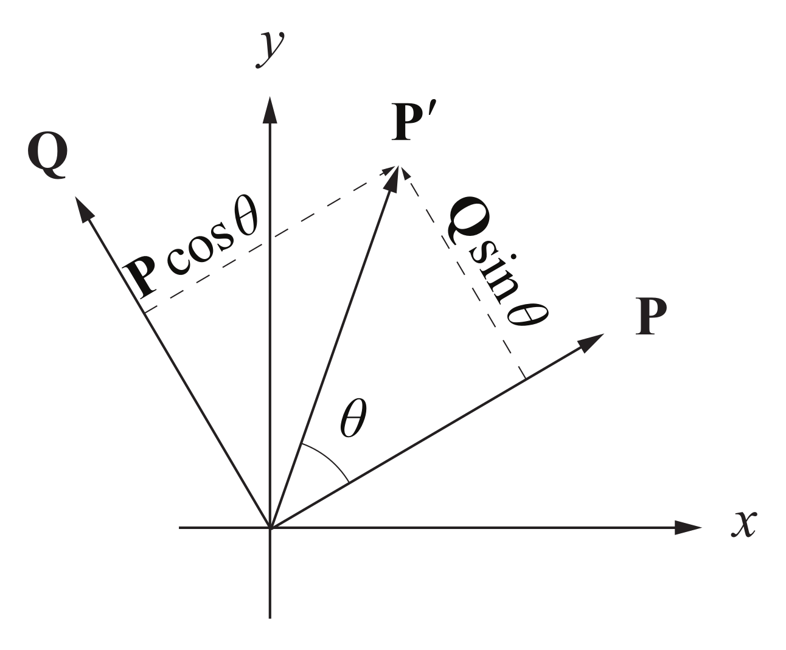
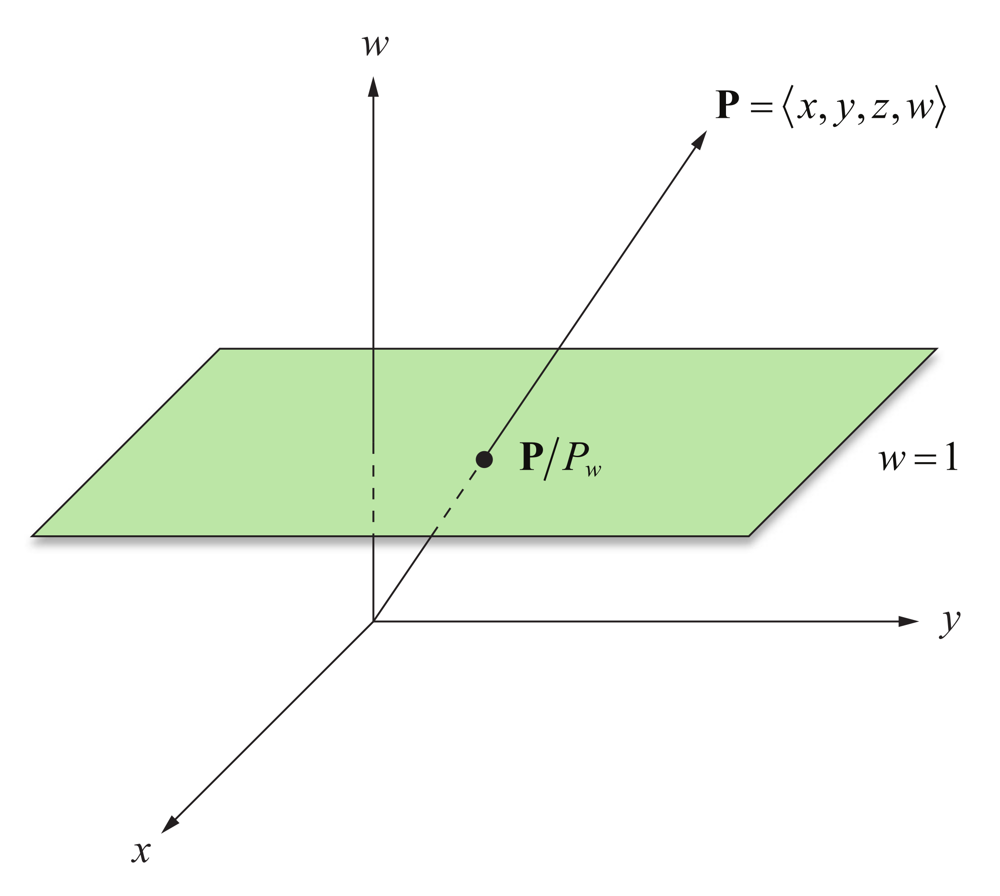
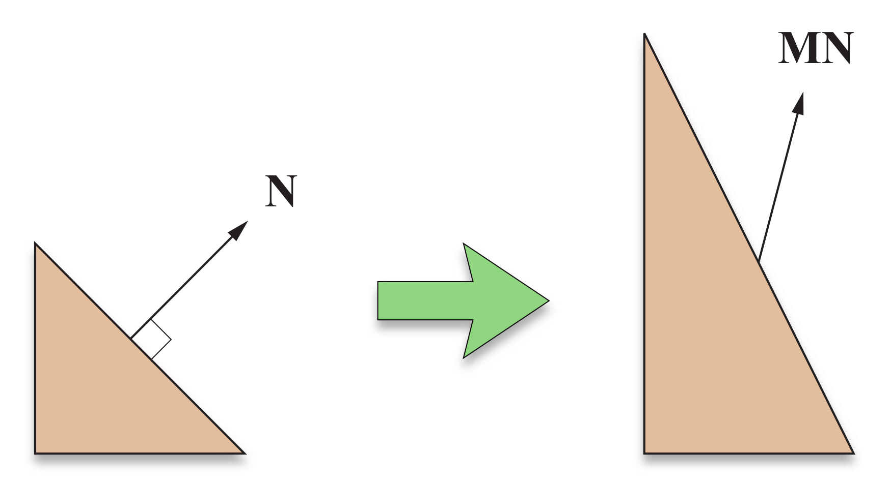
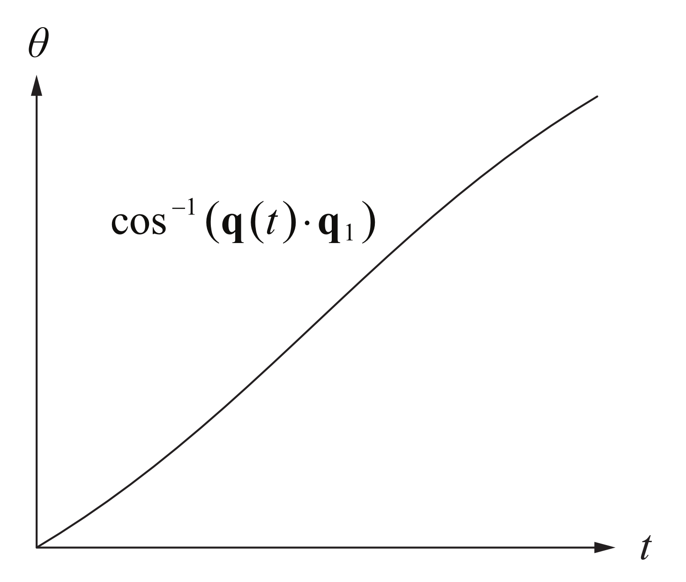
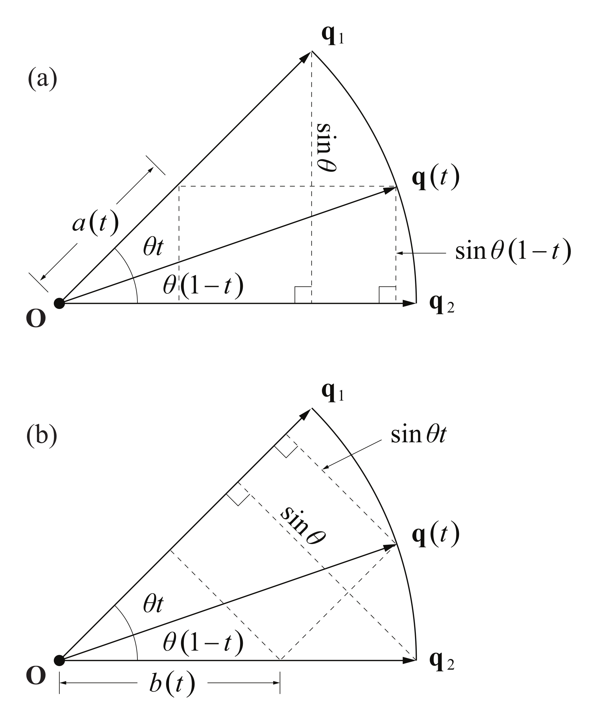

> Throughout any 3D graphics engine architecture, it is often necessary to transform a set of vectors from one coordinate space to another. ... In this chapter, we concern ourselves with linear transformations among different Cartesian coordinate frames. Such transformations include simple scales and translations, as well as arbitrary rotations.

## 1. LINEAR TRANSFORMATIONS
考虑 3D 坐标系统 $O$ ，$\mathbf{p}$ 在 $O$ 中坐标 $\left< x,y,z \right>$ ．引入另一坐标系统 $O'$ ，$\mathbf{p}$ 在 $O'$ 中坐标 $\left< x',y',z' \right>$ ，可写成如下线性函数：

$$
\begin{align}
x'(x,y,z) &= U_{1}x + V_{1}y + W_{1}z + T_{1} \\
y'(x,y,z) &= U_{2}x + V_{2}y + W_{2}z + T_{2} \\
z'(x,y,z) &= U_{3}x + V_{3}y + W_{3}z + T_{3}
\end{align}
$$

这构成了 $O$ 到 $O'$ 的 **线性变换（Linear Transformation）**，可记为如下矩阵形式：

$$
\begin{bmatrix}
x' \\
y' \\
z'
\end{bmatrix} = \begin{bmatrix}
U_{1} & V_{1} & W_{1} \\
U_{2} & V_{2} & W_{2} \\
U_{3} & V_{3} & W_{3}
\end{bmatrix}\begin{bmatrix}
x \\
y \\
z
\end{bmatrix} + \begin{bmatrix}
T_{1} \\
T_{2} \\
T_{3}
\end{bmatrix}
$$

其中 $\mathbf{T}$ 表示从 $O$ 原点到 $O'$ 原点的平移变换．若该线性变换可逆，则 $O'$ 到 $O$ 的线性变换为：

$$
\begin{bmatrix}
x \\
y \\
z
\end{bmatrix} = \begin{bmatrix}
U_{1} & V_{1} & W_{1} \\
U_{2} & V_{2} & W_{2} \\
U_{3} & V_{3} & W_{3}
\end{bmatrix}^{-1} \left( \begin{bmatrix}
x' \\
y' \\
z'
\end{bmatrix} - \begin{bmatrix}
T_{1} \\
T_{2} \\
T_{3}
\end{bmatrix} \right) 
$$

目前，暂时只考虑 $\mathbf{T}\equiv\mathbf{0}$  的线性变换．

### Orthogonal Matrices
图形学中，大部分 $3\times3$ 矩阵都为正交阵，其定义如下：

???+ note "Definition"
	一个可逆 $n\times n$ 矩阵 $\mathbf{M}$ 称为 **正交阵（Orthogonal）** 当且仅当 $\mathbf{M}^{-1}=\mathbf{M}^{\mathsf{T}}$．

设正交阵 $\mathbf{M}=\begin{bmatrix}V_{1} & V_{2} & \cdots & V_{n}\end{bmatrix}$ ，由定义知其列向量 $\left\{ V_{1},V_{2},\dots,V_{n} \right\}$ 构成标准正交集；同理，对于标准正交集 $\left\{ V_{1},V_{2},\dots,V_{n} \right\}$ ，可构造出正交阵 $\mathbf{M}=\begin{bmatrix}V_{1} & V_{2} & \cdots & V_{n}\end{bmatrix}$ ．

正交阵有如下重要性质：

???+ note "Theorem"
	若 $n\times n$ 矩阵 $\mathbf{M}$ 为正交阵，则 $\mathbf{M}$ 保长度和角度．
	
	实际上，对于向量 $\mathbf{p}_1,\mathbf{p}_2$ ，计算有：
	
	$$(\mathbf{M}\mathbf{p}_{1})\cdot(\mathbf{M}\mathbf{p}_{2}) = (\mathbf{M}\mathbf{p}_{1})^\mathsf{T}(\mathbf{M}\mathbf{p}_{2}) = \mathbf{p}_{1}^\mathsf{T}\mathbf{M}^\mathsf{T}\mathbf{M}\mathbf{p}_{2} = \mathbf{p}_{1}^\mathsf{T}\mathbf{p}_{2} = \mathbf{p}_{1}\cdot \mathbf{p}_{2}
	$$

由于正交阵的保长和保角性，其会保持坐标系统的整体结构．从而正交阵可分解为反射和旋转的组合．

其中，**反射变换（Reflection Transform）** 指将点按特定方向镜像的操作．

### Handedness
在 $3$ 维空间中，一组坐标基 $\mathcal{B}=\left\{ \mathbf{v}_{1},\mathbf{v}_{2},\mathbf{v}_{3} \right\}$ 具有名为 **手性（Handedness）** 的性质．若 $(\mathbf{v}_{1}\times \mathbf{v}_{2})\cdot \mathbf{v}_{3}>0$ ，称之为右手系；若 $(\mathbf{v}_{1}\times \mathbf{v}_{2})\cdot \mathbf{v}_{3}<0$ 称之为左手系．

手性只会受到反射变换的影响：

- 进行奇数次反射变换会反转手性．
- 进行偶数次反射变换等价于旋转，不改变手性．

从而，一系列反射变换 = 单次旋转变换 + 至多一次反射变换．

对于变换 $\mathbf{M}$ ，可计算其行列式判断是否存在反射：

- 若 $\det\mathbf{M}>0$ 则不存在反射．
- 若 $\det \mathbf{M}<0$ 则存在反射．

特别地，对正交阵 $\mathbf{M}$ ，由于 $\vert \det \mathbf{M}\vert=1$ ，有如下判断：

- 若 $\det\mathbf{M}=1$ 则 $\mathbf{M}$ 表示纯旋转．
- 若 $\det\mathbf{M}=-1$ 则 $\mathbf{M}$ 表示旋转 + 反射．

## 2. SCALING TRANSFORMS
对于向量 $\mathbf{p}$ ，可进行如下从简单到复杂的缩放变换：

- **一致缩放（Uniform Scale）**：
	
	以一致因子 $a$ 缩放 $\mathbf{p}$ ，即 $\mathbf{p}'=a\mathbf{p}$ ，有矩阵表达：
	
	$$
	\mathbf{p}' = \begin{bmatrix}
	a & 0 & 0 \\
	0 & a & 0 \\
	0 & 0 & a
	\end{bmatrix} \begin{bmatrix}
	p_{x} \\
	p_{y} \\
	p_{z}
	\end{bmatrix}
	$$

- **非一致缩放（Nonuniform Scale）**：
	
	对 $x,y,z$ 轴以不同因子缩放，有矩阵表达：
	
	$$
	\mathbf{p}' = \begin{bmatrix}
	a & 0 & 0 \\
	0 & b & 0 \\
	0 & 0 & c
	\end{bmatrix} \begin{bmatrix}
	p_{x} \\
	p_{y} \\
	p_{z}
	\end{bmatrix}
	$$

- 对任意轴非一致缩放：
	
	设 $\mathbf{u}$ 轴缩放因子 $a$ ，$\mathbf{v}$ 轴缩放因子 $b$ ， $\mathbf{w}$ 轴缩放因子 $c$ ．则先从 $(\mathbf{i},\mathbf{j},\mathbf{k})$ 坐标系统变换到 $(\mathbf{u},\mathbf{v},\mathbf{w})$ 坐标系统，再进行缩放，最后变换回 $(\mathbf{i},\mathbf{j},\mathbf{k})$ 坐标系统．矩阵表达如下：
	
	$$
	\mathbf{p}' = \begin{bmatrix}
	U_{x} & V_{x} & W_{x} \\
	U_{y} & V_{y} & W_{y} \\
	U_{z} & V_{z} & W_{z}
	\end{bmatrix} \begin{bmatrix}
	a & 0 & 0 \\
	0 & b & 0 \\
	0 & 0 & c
	\end{bmatrix} \begin{bmatrix}
	U_{x} & V_{x} & W_{x} \\
	U_{y} & V_{y} & W_{y} \\
	U_{z} & V_{z} & W_{z}
	\end{bmatrix}^{-1} \begin{bmatrix}
	p_{x} \\
	p_{y} \\
	p_{z}
	\end{bmatrix}
	$$

## 3. ROTATION TRANSFORMS
对于向量 $\mathbf{p}$ 和轴 $\mathbf{v}$ ，考虑 $\mathbf{p}$ 关于 $\mathbf{v}$ 逆时针旋转 $\theta$ 得到 $\mathbf{p}'$ （以 $\mathbf{v}$ 指向方向观察），研究 $\mathbf{p}'$ 和旋转矩阵 $\mathbf{R}_{\mathbf{v}}(\theta)$ 表达式．

首先考虑二维情况．对于 2D 向量 $\mathbf{p}$ ，可将其逆时针旋转 $90^{\circ}$ 得到 $\mathbf{q}=\left< -p_{y},p_{x} \right>$ ．向量 $\mathbf{p}$ 和 $\mathbf{q}$ 构成 $x-y$ 平面的正交基．

/// caption
Figure 1: $\mathbf{p}'$ 关于基向量 $\mathbf{p},\mathbf{q}$ 的分解示意图．
///

如图，此时 $\mathbf{p}'$ 有如下线性表示：

$$
\mathbf{p}' = \mathbf{p}\cos\theta + \mathbf{q}\sin\theta = \begin{bmatrix}
\cos\theta & -\sin\theta \\
\sin\theta & \cos\theta
\end{bmatrix} \mathbf{p}
$$

即旋转矩阵为：

$$
\mathbf{R}(\theta) = \begin{bmatrix}
\cos\theta & -\sin\theta \\
\sin\theta & \cos\theta
\end{bmatrix}
$$

将如上结果推广到三维情况，可得到沿 $x,y,z$ 轴进行旋转变换的旋转矩阵：

$$
\begin{align}
\mathbf{R}_{x}(\theta) &= \begin{bmatrix}
1 & 0 & 0 \\
0 & \cos\theta & -\sin\theta \\
0 & \sin\theta & \cos\theta
\end{bmatrix} \\
\mathbf{R}_{y}(\theta) &= \begin{bmatrix}
\cos\theta & 0 & \sin\theta \\
0 & 1 & 0 \\
-\sin\theta & 0 & \cos\theta
\end{bmatrix} \\
\mathbf{R}_{z}(\theta) &= \begin{bmatrix}
\cos\theta & -\sin\theta & 0 \\
\sin\theta & \cos\theta & 0 \\
0 & 0 & 1
\end{bmatrix}
\end{align}
$$

### Arbitrary Rotation
现在考虑向量 $\mathbf{p}$ 关于任意轴 $\mathbf{v}$ 进行逆时针旋转 $\theta$ ．不妨设 $\mathbf{v}$ 为单位向量．

首先将 $\mathbf{p}$ 关于 $\mathbf{v}$ 进行分解：

$$
\begin{align}
\operatorname{proj}_{\mathbf{v}}\mathbf{p} &= (\mathbf{v}\cdot \mathbf{p})\mathbf{v} \\
\operatorname{perp}_{\mathbf{v}}\mathbf{p} &= \mathbf{p} - (\mathbf{v}\cdot \mathbf{p})\mathbf{v}
\end{align}
$$

只需要计算 $\operatorname{perp}_{\mathbf{v}}\mathbf{p}$ 关于 $\mathbf{v}$ 的旋转结果．

此时旋转发生在二维平面，类似地构造正交基．将 $\operatorname{perp}_{\mathbf{v}}\mathbf{p}$ 逆时针旋转 $90^\circ$ ，可验证该向量为 $\mathbf{v}\times \mathbf{p}$ ．旋转后的向量有如下线性表示：

$$
[\mathbf{p} - (\mathbf{v}\cdot \mathbf{p})\mathbf{v}]\cos\theta + (\mathbf{v}\times \mathbf{p})\sin\theta
$$

加上 $\operatorname{proj}_{\mathbf{v}}\mathbf{p}$ 可得到 $\mathbf{p}'$ 表达式：

$$
\begin{align}
\mathbf{p}' = \mathbf{p}\cos\theta + (\mathbf{v}\times \mathbf{p})\sin\theta + \mathbf{v}(\mathbf{v}\cdot \mathbf{p})(1 - \cos\theta) \tag{$\ast$} \label{star} \\
\end{align}
$$

展开有：

$$
\begin{align}
\mathbf{p}' &= \begin{bmatrix}
1 & 0 & 0 \\
0 & 1 & 0 \\
0 & 0 & 1
\end{bmatrix} \mathbf{p}\cos\theta + \begin{bmatrix}
0 & -V_{z} & V_{y} \\
V_{z} & 0 & -V_{x} \\
-V_{y} & V_{x} & 0
\end{bmatrix} \mathbf{p}\sin\theta + \begin{bmatrix}
V_{x}^{2} & V_{x}V_{y} & V_{x}V_{z} \\
V_{x}V_{y} & V_{y}^{2} & V_{y}V_{z} \\
V_{x}V_{z} & V_{y}V_{z} & V_{z}^{2} 
\end{bmatrix}\mathbf{p}(1 - \cos\theta) \\
&= \begin{bmatrix}
c+(1-c)V_{x}^{2} & (1-c)V_{x}V_{y}-sV_{z} & (1-c)V_{x}V_{z}+sV_{y} \\
(1-c)V_{x}V_{y}+sV_{z} & c+(1-c)V_{y}^{2} & (1-c)V_{y}V_{z}-sV_{x} \\
(1-c)V_{x}V_{z}-sV_{y} & (1-c)V_{y}V_{z}+sV_{x} & c+(1-c)V_{z}^{2}
\end{bmatrix} \mathbf{p}
\end{align}
$$

其中 $c=\cos\theta,s=\sin\theta$ ．即旋转矩阵为：

$$
\mathbf{R}_{\mathbf{v}}(\theta) = \begin{bmatrix}
c+(1-c)V_{x}^{2} & (1-c)V_{x}V_{y}-sV_{z} & (1-c)V_{x}V_{z}+sV_{y} \\
(1-c)V_{x}V_{y}+sV_{z} & c+(1-c)V_{y}^{2} & (1-c)V_{y}V_{z}-sV_{x} \\
(1-c)V_{x}V_{z}-sV_{y} & (1-c)V_{y}V_{z}+sV_{x} & c+(1-c)V_{z}^{2}
\end{bmatrix} 
$$

## 4. HOMOGENEOUS COORDINATES
现在处理 $\mathbf{T}\not\equiv\mathbf{0}$ 的线性变换，即进行如下变换：

$$
\mathbf{p}' = \mathbf{M}\mathbf{p} + \mathbf{T}
$$

若进行两次变换，则会得到如下杂乱形式：

$$
\begin{align}
\mathbf{p}' &= \mathbf{M}_{2}(\mathbf{M}_{1}\mathbf{p}+\mathbf{T}_{1}) + \mathbf{T}_{2} \\
&= (\mathbf{M}_{2}\mathbf{M}_{1})\mathbf{p} + \mathbf{M}_{2}\mathbf{T}_{1} + \mathbf{T}_{2}
\end{align}
$$

### Four-Dimensional Transforms
一个优雅的解决方案为，将 3D 坐标 $\left< x,y,z \right>$ 拓展到 4D **齐次坐标（Homogeneous Coordinates）** $\left< x,y,z,w \right>$ ，使用 $4\times4$ 矩阵进行变换．

- 对于 3D 点 $\mathbf{p}$ ，令 $w=1$ ．
- 对于 3D 向量 $\mathbf{v}$ ，令 $w=0$ ．一方面，向量对于平移变换具有不变性，另一方面与两点差 $\mathbf{q}-\mathbf{p}$ 构成向量的 $w=0$ 对应．

此时 $4\times4$ 变换矩阵可构造为：

$$
\mathbf{F} = \left[ \begin{array}{ccc:c}
{} & {} & {} & {} \\
{} & \mathbf{M} & {} & \mathbf{T} \\
{} & {} & {} & {} \\
\hdashline
{} & 0 & {} & 1
\end{array} \right] = \left[
\begin{array}{ccc:c}
M_{11} & M_{12} & M_{13} & T_x \\
M_{21} & M_{22} & M_{23} & T_y \\
M_{31} & M_{32} & M_{33} & T_z \\
\hdashline
0 & 0 & 0 & 1
\end{array}
\right]
$$

若变换可逆，有 $\mathbf{p}=\mathbf{M}^{-1}\mathbf{p}'-\mathbf{M}^{-1}\mathbf{T}$ ， $\mathbf{F}^{-1}$ 可表示为：

$$
\mathbf{F}^{-1} = \left[ \begin{array}{ccc:c}
{} & {} & {} & {} \\
{} & \mathbf{M}^{-1} & {} & -\mathbf{M}^{-1}\mathbf{T} \\
{} & {} & {} & {} \\
\hdashline
{} & 0 & {} & 1
\end{array} \right] = \left[
\begin{array}{ccc:c}
M^{-1}_{11} & M^{-1}_{12} & M^{-1}_{13} & -(\mathbf{M}^{-1}\mathbf{T})_{x} \\
M^{-1}_{21} & M^{-1}_{22} & M^{-1}_{23} & -(\mathbf{M}^{-1}\mathbf{T})_{y} \\
M^{-1}_{31} & M^{-1}_{32} & M^{-1}_{33} & -(\mathbf{M}^{-1}\mathbf{T})_{z} \\
\hdashline
0 & 0 & 0 & 1
\end{array}
\right]
$$

计算可验证 $\mathbf{F}\mathbf{F}^{-1}=\mathbf{I}_{4}$ ．

### Geometrical Interpretation
考虑一个逆向映射 $\mathscr{F}$，将 4D 点 $\mathbf{p}=\left< x,y,z,w \right>,w\neq0$ 映射到 3D 点 $\widetilde{\mathbf{p}}$ ：

$$
\widetilde{\mathbf{p}} = \left< \frac{x}{w},\frac{y}{w},\frac{z}{w} \right> 
$$

如下图所示，$\widetilde{\mathbf{p}}$ 为 $\rm OP$ 和三维平面 $w=1$ 交点：

/// caption
Figure 2: 4D 点 $\mathbf{p}$ 投影到三维空间 $w=1$ 示意图（略去 $z$ 轴以便可视化）．
///

即映射 $\mathscr{F}$ 满足如下性质：

$$
\mathscr{F}(a\mathbf{p}) = \mathscr{F}(\mathbf{p}), \quad \forall a \neq 0
$$

具体讨论可见 [Section 5.5]

## 5. TRANSFORMING NORMAL VECTORS
顶点除位置信息外，还会记录额外信息，如法向量和切向量．从而顶点变换时，还需变换额外信息．

考虑点 $\mathbf{p}$ ，对应法向量 $\mathbf{n}$ ，切向量 $\mathbf{t}$ ，变换矩阵 为$\mathbf{M}$ ：

- 对于 **切向量（Tangent Vector）**：
	
	切向量通常以与临近点作差计算，如 $\mathbf{t}=\mathbf{q}-\mathbf{p}$ ，从而变换后的切向量为 $\mathbf{M}\mathbf{q}-\mathbf{M}\mathbf{p}=\mathbf{M}\mathbf{t}$ ，即变换矩阵仍为 $\mathbf{M}$ ．

- 对于 **法向量（Normal Vector）**：
	
	法向量使用 $\mathbf{M}$ 变换会导致变换后与表面不垂直，如下图所示：
	
	
	/// caption
	Figure 3: 使用非正交矩阵 $\mathbf{M}$ 变换法向量 $\mathbf{n}$ 示意图．
	///
	
	设正确的法向变换矩阵为 $\mathbf{G}$ ，下面推导 $\mathbf{G}$ 表达式：
	
	由于法向和切向垂直，所以有 $\mathbf{n}\cdot\mathbf{t}=0$ ，且变换后的 $\mathbf{n}',\mathbf{t}'$ 也应满足：
	
	$$
	\begin{align}
	0 = \mathbf{n}'\cdot \mathbf{t}' &= (\mathbf{G}\mathbf{n})\cdot(\mathbf{M}\mathbf{t})  \\
	&= (\mathbf{G}\mathbf{n})^\mathsf{T}(\mathbf{M}\mathbf{t}) \\
	&= \mathbf{n}^\mathsf{T}\mathbf{G}^\mathsf{T}\mathbf{M}\mathbf{t}
	\end{align}
	$$
	
	若 $\mathbf{G}^\mathsf{T}\mathbf{M}=\mathbf{I}$ ，则上式成立，即 $\mathbf{G}=(\mathbf{M}^{-1})^\mathsf{T}$ ．

当 $\mathbf{M}$ 为正交阵时，有 $(\mathbf{M}^{-1})^\mathsf{T}=\mathbf{M}$ ，此时可避免取逆和转置运算，尤其 $\mathbf{M}$ 为旋转矩阵 $\mathbf{R}_{x},\mathbf{R}_{y},\mathbf{R}_{z},\mathbf{R}_{\mathbf{v}}$ ．

???+ note "Remark"
	如上由原矩阵 $\mathbf{M}$ 变换的向量称为 **逆变向量（Contravariant Vector）**，由 $(\mathbf{M}^{-1})^\mathsf{T}$ 变换的向量称为 **协变向量（Covariant Vector）**．

## 6. QUATERNIONS
在许多情况下，旋转矩阵有上位替代：**四元数（Quaternion）**，因其有如下优点：

- 占用更少存储空间．
- 复合运算需要更少操作数．
- 插值计算更简单．

### Quaternion Mathematics
四元数集，记为 $\mathbb{H}$ ，可视为四维向量空间．对于 $\mathbf{q}\in\mathbb{H}$ ，有如下形式：

$$
\mathbf{q} = \left< w,x,y,z \right> = w + x \mathbf{i} + y \mathbf{j} + z \mathbf{k} =: s + \mathbf{v}
$$

其中 $s$ 为标量部分 $w$ ，$\mathbf{v}$ 为向量部分 $x \mathbf{i}+y \mathbf{j}+ z \mathbf{k}$ ．

加法运算与向量加法相同，构成交换群．下面考虑 $\mathbb{H}$ 上的乘法运算．类似复数，乘法使用分配律和如下规则定义：

$$
\begin{align}
\mathbf{i}^2 = &\mathbf{j}^{2} = \mathbf{k}^{2} = -1 \\
\mathbf{i}\mathbf{j} &= -\mathbf{j}\mathbf{i} = \mathbf{k} \\
\mathbf{j}\mathbf{k} &= -\mathbf{k}\mathbf{j} = \mathbf{i} \\
\mathbf{k}\mathbf{i} &=-\mathbf{i}\mathbf{k} = \mathbf{j}
\end{align}
$$

验证可知，该乘法满足结合律，不满足交换律．对于 $\mathbf{q}_{1}=w_{1}+x_{1}\mathbf{i}+y_{1}\mathbf{j}+z_{1}\mathbf{k}=s_{1}+\mathbf{v}_{1}$ 和 $\mathbf{q}_{2}=w_{2}+x_{2}\mathbf{i}+y_{2}\mathbf{j}+z_{2}\mathbf{k}=s_{2}+\mathbf{v}_{2}$ ，乘积计算有：

$$
\begin{align}
\mathbf{q}_{1}\mathbf{q}_{2} &= (w_{1}w_{2}-x_{1}x_{2}-y_{1}y_{2}-z_{1}z_{2}) \\
&+ (w_{1}x_{2}+x_{1}w_{2}+y_{1}z_{2}-z_{1}y_{2})\, \mathbf{i} \\
&+ (w_{1}y_{2}-x_{1}z_{2}+y_{1}w_{2}+z_{1}x_{2})\, \mathbf{j} \\
&+ (w_{1}z_{2}+x_{1}y_{2}-y_{1}x_{2}+z_{1}w_{2})\, \mathbf{k} \\
&= s_{1}s_{2}-\mathbf{v}_{1}\cdot\mathbf{v}_{2}+s_{1}\mathbf{v}_{2}+s_{2}\mathbf{v}_{1}+\mathbf{v}_{1}\times\mathbf{v}_{2}
\end{align}
$$

类似复数，四元数也存在共轭：

???+ note "Definition"
	四元数 $\mathbf{q}=s+\mathbf{v}$ 的 **共轭（Conjugate）** 定义为 $\overline{\mathbf{q}}=s-\mathbf{v}$ ． 

计算可知如下关系式成立：

$$
\mathbf{q}\overline{\mathbf{q}} = \overline{\mathbf{q}}\mathbf{q} = \mathbf{q} \cdot \mathbf{q} = \Vert \mathbf{q} \Vert^{2} =: q^{2}
$$

从而可以定义四元数的逆：

???+ note "Definition"
	非 $0$ 四元数 $\mathbf{q}$ 的 **逆（Inverse）** 记为 $\mathbf{q}^{-1}$ ，计算知：
	
	$$
	\mathbf{q}^{-1} = \frac{\overline{\mathbf{q}}}{q^{2}}
	$$

综上，可知 $\mathbb{H}$ 为[环](https://en.wikipedia.org/wiki/Ring_(mathematics))，又称哈密顿四元数环．

### Rotations with Quaternions
考虑三维空间变换 $\varphi: \mathbb{R}^3\to \mathbb{R}^3$ ，其为旋转变换当且仅当满足如下性质：保长度、保角度、保手性，即：

$$
\begin{align}
\Vert \varphi(\mathbf{P})\Vert &= \Vert \mathbf{P}\Vert \tag{1}\label{1} \\
\varphi(\mathbf{P}_{1})\cdot \varphi(\mathbf{P}_{2}) &= \mathbf{P}_{1}\cdot \mathbf{P}_{2} \tag{2}\label{2} \\
\varphi(\mathbf{P}_{1})\times \varphi(\mathbf{P}_{2}) &= \varphi(\mathbf{P}_{1}\times \mathbf{P}) \tag{3}\label{3}
\end{align}
$$

将 $\varphi$ 延拓到四元数环 $\mathbb{H}$ 上，令 $\varphi(s+\mathbf{v})=s+\varphi(\mathbf{v})$ ，则 $\eqref{2}$ 式可改写为：

$$
\varphi(\mathbf{P}_{1})\cdot \varphi(\mathbf{P}_{2}) = \varphi(\mathbf{P}_{1}\cdot \mathbf{P}_{2})
$$

视 $\mathbf{P}_{1}$ 和 $\mathbf{P}_{2}$ 为虚四元数，其满足关系式：$\mathbf{P}_{1}\mathbf{P}_{2}=-\mathbf{P}_{1}\cdot \mathbf{P}_{2}+\mathbf{P}_{1}\times \mathbf{P}_{2}$ ，进而 $\eqref{1},\eqref{2},\eqref{3}$ 式与下式等价：

$$
\varphi(\mathbf{P}_{1})\varphi(\mathbf{P}_{2}) = \varphi(\mathbf{P}_{1}\mathbf{P}_{2}) \tag{$\ast\ast$}\label{star2}
$$

等价性证明细节如下：

??? note "Lemma 1"
	设四元数 $\mathbf{q}_{1}=s_{1}+\mathbf{v}_{1},\mathbf{q}_{2}=s_{2}+\mathbf{v}_{2}$ ，则 $\overline{\mathbf{q}_{1}\mathbf{q}_{2}}=\bar{\mathbf{q}}_{2}\bar{\mathbf{q}}_{1}$ 。
	
	证：由 $\mathbf{q}_1\mathbf{q}_2$ 展开式计算有：
	
	$$
	\begin{align}
	\overline{\mathbf{q}_{1}\mathbf{q}_{2}} &= s_{1}s_{2}-\mathbf{v}_{1}\cdot\mathbf{v}_{2}-s_{1}\mathbf{v}_{2}-s_{2}\mathbf{v}_{1}-\mathbf{v}_{1}\times \mathbf{v}_{2} \\
	\bar{\mathbf{q}}_{2}\bar{\mathbf{q}}_{1} &= s_{1}s_{2}-(-\mathbf{v}_{1})\cdot(-\mathbf{v}_{2})+s_{1}(-\mathbf{v}_{2})+s_{2}(-\mathbf{v}_{1})+(-\mathbf{v}_{2})\times(-\mathbf{v}_{1}) \\
	&= s_{1}s_{2}-\mathbf{v}_{1}\cdot \mathbf{v}_{2}-s_{1}\mathbf{v}_{2}-s_{2}\mathbf{v}_{1}-\mathbf{v}_{1}\times \mathbf{v}_{2}
	\end{align}
	$$
	
	即 $\overline{\mathbf{q}_1\mathbf{q}_2}=\bar{\mathbf{q}}_2\bar{\mathbf{q}}_1$ ，得证。

??? note "Lemma 2"
	设四元数 $\mathbf{q}_{1},\mathbf{q}_{2}$ ，则 $\Vert\mathbf{q}_{1}\mathbf{q}_{2}\Vert=\Vert\mathbf{q}_{1}\Vert\Vert\mathbf{q}_{2}\Vert$ 。
	
	证：由 Lemma 1，计算有：
	
	$$
	\begin{align}
	\Vert \mathbf{q}_{1}\mathbf{q}_{2} \Vert^{2} &= (\mathbf{q}_{1}\mathbf{q}_{2})(\overline{\mathbf{q}_{1}\mathbf{q}_{2}}) \\
	&= (\mathbf{q}_{2}\mathbf{q}_{1})(\bar{\mathbf{q}}_{1}\bar{\mathbf{q}}_{2})  \\
	&= \mathbf{q}_{1}(\mathbf{q}_{2}\bar{\mathbf{q}}_{2})\bar{\mathbf{q}}_{1}  \\
	&= \Vert \mathbf{q}_{2} \Vert^{2} (\mathbf{q}_{1}\bar{\mathbf{q}}_{1})  \\
	&= \Vert \mathbf{q}_{2}\Vert^{2}\Vert \mathbf{q}_{1} \Vert^{2}
	\end{align}
	$$
	
	即 $\Vert\mathbf{q}_1\mathbf{q}_2\Vert=\Vert\mathbf{q}_1\Vert\Vert\mathbf{q}_2\Vert$ ，得证。	

??? note "Proof"
	$\eqref{1},\eqref{2},\eqref{3}$ 式推 $\eqref{star2}$ 式显然。下证 $\eqref{star2}$ 式推 $\eqref{1},\eqref{2},\eqref{3}$ 式：
	
	由关系式：
	
	$$
	\mathbf{P}_{1}\cdot \mathbf{P}_{2} = - \frac{\mathbf{P}_{1}\mathbf{P}_{2}+\mathbf{P}_{2}\mathbf{P}_{1}}{2}, \quad \mathbf{P}_{1}\times \mathbf{P}_{2} = \frac{\mathbf{P}_{1}\mathbf{P}_{2}-\mathbf{P}_{2}\mathbf{P}_{1}}{2}
	$$
	
	结合 $\varphi(\mathbf{P}_1),\varphi(\mathbf{P}_2)$ 也为虚四元数，计算可知：
	
	$$
	\varphi(\mathbf{P}_{1}\cdot\mathbf{P}_{2}) = \varphi(\mathbf{P}_{1})\cdot\varphi(\mathbf{P}_{2}), \quad \varphi(\mathbf{P}_{1}\times \mathbf{P}_{2}) = \varphi(\mathbf{P}_{1})\times \varphi(\mathbf{P}_{2})
	$$
	
	而 
	
	$$
	\Vert\varphi(\mathbf{P})\Vert^{2}=\varphi(\mathbf{P})\cdot \varphi(\mathbf{P})=\mathbf{P}\cdot \mathbf{P}=\Vert \mathbf{P}\Vert^{2}
	$$
	
	即 $\Vert\varphi(\mathbf{P}\Vert=\Vert\mathbf{P}\Vert$ ，三式成立，得证。

满足 $\eqref{star2}$ 式的 $\varphi$ 称为 **同态（Homomorphism）**．任取非 $0$ 四元数 $\mathbf{q}$ ，构造 $\varphi_{\mathbf{q}}(\mathbf{P})=\mathbf{q}\mathbf{P}\mathbf{q}^{-1}$ ，可验证其为同态，从而 $\varphi_{\mathbf{q}}$ 对应三维空间的一个旋转变换．

考虑关于单位轴 $\mathbf{A}$ 旋转角 $\theta$ 的旋转变换，下面研究对应四元数 $\mathbf{q}$ 的形式．

由于 $\varphi_{a \mathbf{q}}=\varphi_{\mathbf{q}},\forall a\neq0$ ，不妨设 $\mathbf{q}=s+\mathbf{v}$ 为单位四元数．$\varphi_{\mathbf{q}}$ 计算如下：

$$
\begin{align}
\varphi_{\mathbf{q}}(\mathbf{P}) = \mathbf{q}\mathbf{P}\mathbf{q}^{-1} &= (s+\mathbf{v})\mathbf{P}(s-\mathbf{v}) \\
&= s^{2}\mathbf{P}+2s\mathbf{v}\times \mathbf{P}+(\mathbf{v}\cdot \mathbf{P})\mathbf{v}-\mathbf{v}\times \mathbf{P}\times \mathbf{v}
\end{align}
$$

利用 [Chap.2](./chapter2-vectors&matrices.md#cross-product) 中叉乘性质改写 $\mathbf{v}\times \mathbf{P}\times \mathbf{v}$，并设 $\mathbf{v}=t\mathbf{A}$ 计算有：

$$
\begin{align}
\varphi_{\mathbf{q}}(\mathbf{P}) &= (s^{2}-\mathbf{v}^{2})\mathbf{P}+2s\mathbf{v}\times \mathbf{P}+2(\mathbf{v}\cdot \mathbf{P})\mathbf{v} \\
&= (s^{2}-t^{2})\mathbf{P}+2st\mathbf{A}\times \mathbf{P}+2t^{2}(\mathbf{A}\cdot \mathbf{P})\mathbf{A}
\end{align}
$$

与旋转公式 $\eqref{star}$ 式对比可知：

$$
\begin{align}
s^{2} - t^{2} &= \cos\theta \\
2st &= \sin\theta \\
2t^{2} &= 1 - \cos\theta
\end{align}
$$

求解得 $t=\sin(\theta/2),s=\cos(\theta/2)$ ，即对应四元数为：

$$
\mathbf{q} = \cos \frac{\theta}{2} + \mathbf{A}\sin \frac{\theta}{2}
$$

???+ note "Remark"
	- 存储四元数 $\mathbf{q}$ 占用空间为 $4$ ，而存储旋转矩阵 $\mathbf{M}$ 占用空间为 $9$ ．
	- 由于 $\varphi_{\mathbf{q}_{2}}\circ \varphi_{\mathbf{q}_{1}}=\varphi_{\mathbf{q}_{1}\mathbf{q}_{2}}$ ，四元数复合所需乘加操作数为 $16$ ，而旋转矩阵复合所需乘加操作数为 $27$ ．

下面推导四元数 $\mathbf{q}$ 对应的旋转矩阵 $\mathbf{R}_{\mathbf{q}}$ 形式：

记 $\mathbf{q}=\left< w,x,y,z \right>$ ，由 $\mathbf{q}=s+t\mathbf{A}$ ，$\Vert\mathbf{A}\Vert=1$ ，可知：

$$
\begin{gathered}
w=s,x=tA_{x},y=tA_{y},z=tA_{z} \\
x^{2}+y^{2}+z^{2} = t^{2}A^{2} = t^{2}
\end{gathered}
$$

代入 $\varphi_{\mathbf{q}}$ 关于 $\mathbf{A}$ 的表达式有：

$$
\begin{gathered}
\varphi_{\mathbf{q}}(\mathbf{P}) = \begin{bmatrix}
w^{2}-x^{2}-y^{2}-z^{2} & 0 & 0 \\
0 & w^{2}-x^{2}-y^{2}-z^{2} & 0 \\
0 & 0 & w^{2}-x^{2}-y^{2}-z^{2}
\end{bmatrix} \mathbf{P} \\
+ \begin{bmatrix}
0 & -2wz & 2wy \\
2wz & 0 & -2wx \\
-2wy & 2wx & 0
\end{bmatrix} \mathbf{P} + \begin{bmatrix}
2x^{2} & 2xy & 2xz \\
2xy & 2y^{2} & 2yz \\
2xz & 2yz & 2z^{2}
\end{bmatrix} \mathbf{P}
\end{gathered}
$$

又由 $\Vert\mathbf{q}\Vert=1$ ，可知 $w^{2}+x^{2}+y^{2}+z^{2}=1$ ，代入上式化简得：

$$
\mathbf{R}_{\mathbf{q}} = \begin{bmatrix}
1-2y^{2}-2z^{2} & 2xy-2wz & 2xz+2wy \\
2xy+2wz & 1-2x^{2}-2z^{2} & 2yz-2wx \\
2xz-2wy & 2yz+2wx & 1-2x^{2}-2y^{2}
\end{bmatrix}
$$

### Spherical Linear Interpolation
对于两个变换结果中间的部分，通常使用插值进行生成．下面研究四元数的插值：

最简单的方式为 **线性插值（Linear Interpolation）**．对两个单位四元数 $\mathbf{q}_{1},\mathbf{q}_{2}$ ，线性插值为：

$$
\mathbf{q}(t) = (1-t)\mathbf{q}_{1} + t\mathbf{q}_{2}
$$

由于先前讨论需求 $\mathbf{q}$ 为单位四元数，将其归一化为：

$$
\mathbf{q}(t) = \frac{(1-t)\mathbf{q}_{1}+t\mathbf{q}_{2}}{\Vert (1-t)\mathbf{q}_{1}+t\mathbf{q}_{2}\Vert}
$$

该插值存在一个问题：$\mathbf{q}(t)$ 在 $\mathbf{q}_{1}$ 和 $\mathbf{q}_{2}$ 之间并非匀速变化，如下图所示：

/// caption
Figure 4: $\mathbf{q}(t)$ 从 $\mathbf{q}_{1}$ 到 $\mathbf{q}_{2}$ 变化时，夹角 $\theta$ 随参数 $t$ 变化图．
///

下面寻找满足单位长度和匀速变化的插值函数 $\mathbf{q}(t)$ ：

设 $\mathbf{q}_{1}$ 和 $\mathbf{q}_{2}$ 夹角为 $\theta$ ，则 $\mathbf{q}(t)$ 与 $\mathbf{q}_{1}$ 夹角为 $\theta t$ ．令 

$$
\mathbf{q}(t) = a(t) \mathbf{q}_{1} + b(t) \mathbf{q}_{2}
$$

如下图所示：

/// caption
Figure 5: (a) $\mathbf{q}(t)$ 在 $\mathbf{q}_{1}$ 上的分量；(b) $\mathbf{q}(t)$ 在 $\mathbf{q}_{2}$ 上的分量．利用相似三角形计算分量系数 $a(t)$ 和 $b(t)$ 示意图． 
///

利用图中的相似三角形，可计算出如下关系式

$$
a(t) = \frac{\sin(\theta(1-t))}{\sin\theta}, \quad b(t) = \frac{\sin(\theta t)}{\sin\theta}
$$

从而定义 **球面线性插值（Spherical Linear Interpolation，Slerp）** 函数 $\mathbf{q}(t)$ 为：

$$
\mathbf{q}(t) = \frac{\sin(\theta(1-t))}{\sin\theta} \mathbf{q}_{1} + \frac{\sin(\theta t)}{\sin\theta} \mathbf{q}_{2}
$$

???+ note "Remark"
	由于 $\mathbf{q}$ 和 $-\mathbf{q}$ 代表同一旋转变换，通常取满足 $\mathbf{q}_{1}\cdot \mathbf{q}_{2}\geq 0$ 的符号，对应插值的最短路径．