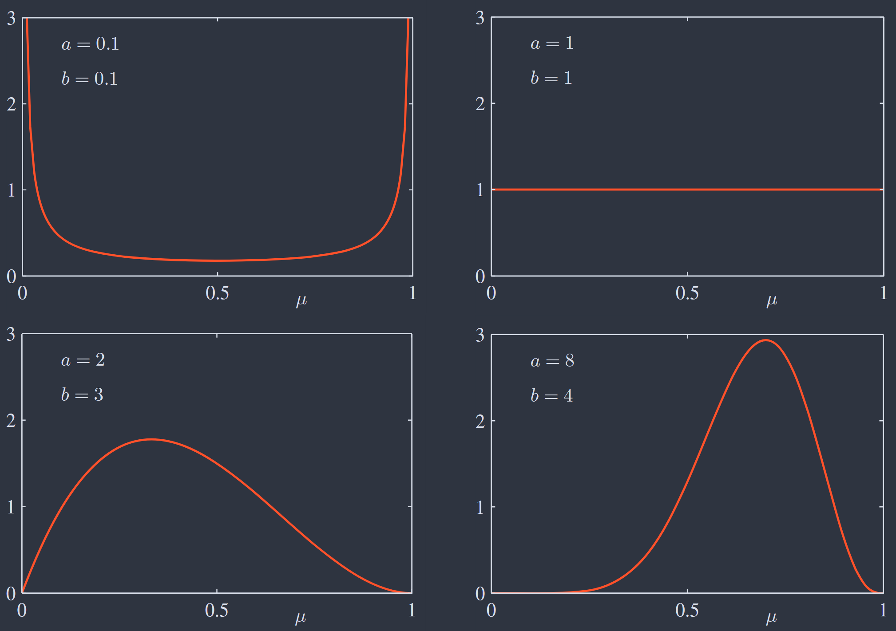
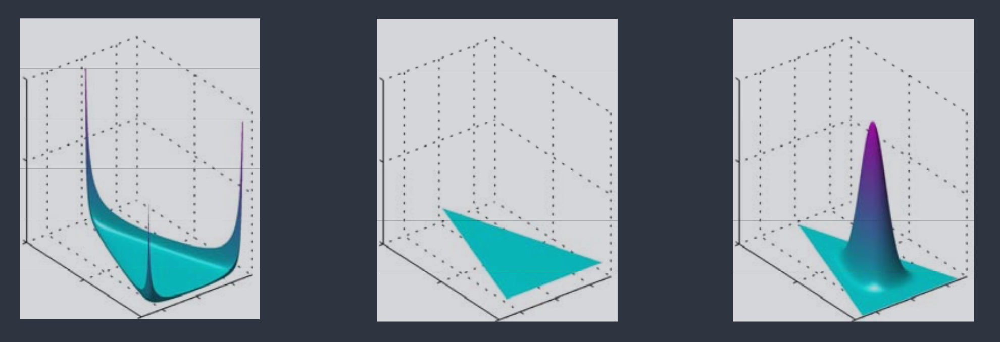

> As well as being of great interest in their own right, these distributions can form building blocks for more complex models and will be used extensively throughout the book.

本章假设数据点独立同分布（i.i.d）．
## 1. BINARY VARIABLES

### Bernoulli & Binomial Distribution

???+ note "Bernoulli Distribution"
	考虑二元随机变量 $x \in \{0,1\}$，其分布如下：
	
	$$
		\begin{cases}
		p(x=1\vert \mu) = \mu \\
		p(x=0\vert \mu) = 1 - \mu, \quad 0\leq \mu\leq 1
		\end{cases}
	$$

	称之为 **伯努利分布（Bernoulli Distribution）**，表达式及矩值如下：

	$$
		\operatorname{Bern}(x\vert \mu) = \mu^x(1-\mu)^{1-x} \implies 
		\begin{cases}
		\begin{align}
		\mathbb{E}[x] &= \mu \\
		\operatorname{var}[x] &= \mu(1-\mu)
		\end{align}
		\end{cases}
	$$

假设数据集 $\mathcal{D}=\{x_{1},\dots,x_{N}\}$ 从分布 $p(x\vert \mu)$ 中采样，似然函数计算如下：

$$
	p(\mathcal{D}\vert \mu) = \prod_{n=1}^N p(x_{n}\vert \mu) = \prod_{n=1}^N \mu^{x_{n}}(1-\mu)^{1-x_{n}} \tag{$\ast$} \label{star}
$$

极大似然估计如下：

$$
	\mu_{\text{ML}} = \frac{1}{N} \sum_{n=1}^N x_{n}
$$

令 $m = x_{1}+\cdots+x_{N}$，即 $N$ 个数据点中 $x=1$ 的观测次数．如上 $\mu_{\text{ML}}$ 即为数据集中 $x=1$ 的观测比例．此外，可以研究 $m$ 的分布：

???+ note "Binomial Distribution"
	固定 $N$，由式 $\eqref{star}$ 知 $p(m\vert N,\mu) \propto \mu^m(1-\mu)^{N-m}$ ，系数为 “N选m” 的方式数．
	
	称之为 **二项分布（Binomial Distribution）**，表达式及矩值如下：

	$$
		\operatorname{Bin}(m\vert N,\mu) = \binom{N}{m} \mu^m (1-\mu)^{N-m} \implies
		\begin{cases}
		\begin{align}
		\mathbb{E}[m] &= \sum_{n=1}^N \mathbb{E}[x_{n}] = N\mu \\
		\operatorname{var}[m] &= \sum_{n=1}^N \operatorname{var}[x_{n}] = N\mu(1-\mu)
		\end{align}
		\end{cases}
	$$

### Beta Distribution
如上极大似然给出的参数估计对小数据集有严重过拟合问题，因此需寻求合适的先验进行贝叶斯式处理．

由式 $\eqref{star}$ 可知，似然 $\propto \mu^x(1-\mu)^{1-x}$，若有先验 $\propto \mu(1-\mu)$，则后验 $\propto \mu(1-\mu)$，即与先验函数形式相同．称之为 **共轭性（Conjugacy）**．

???+ note "Beta Distribution"
	如上构造的先验分布称为 **Beta 分布（Beta Distribution）**，表达式及矩值如下：

	$$
		\operatorname{Beta}(\mu\vert a,b) = \frac{\Gamma(a+b)}{\Gamma(a)\Gamma(b)} \mu^{a-1}(1-\mu)^{b-1} \implies 
		\begin{cases}
		\begin{align}
		\mathbb{E}[\mu] &= \frac{a}{a+b} \\
		\operatorname{var}[\mu] &= \frac{ab}{(a+b)^{2}(a+b+1)}
		\end{align}
		\end{cases}
	$$

不同超参数 $a,b$ 值对应的 Beta 分布示意图如下：
{: #beta}

令 $l=N-m$，计算后验如下：

$$
	p(\mu\vert m,l,a,b) = \operatorname{Beta}(\mu\vert a+m,b+l) = \frac{\Gamma(m+a+l+b)}{\Gamma(m+a)\Gamma(l+b)}\mu^{m+a-1}(1-\mu)^{l+b-1}
$$

对于该形式，有如下三种启发：

- 超参 $a,b$ 可解释为 $x=0$ 和 $x=1$ 的“有效观测数”．
  
	  如上先验到后验的分布变化，即将观测到的 $m,l$ 值添加到超参 $a,b$ 上．因此超参 $a,b$ 可视为经验中对两种情况的观测数量．

- 后验可视为新数据的先验，进行 **序列学习（Sequential Learning）**．

	  在实时学习、大数据集、数据持续流入且必须在看到全部数据前做出预测的场景中，可使用序列方法．

- 随观测数的提高，后验会越来越尖锐．

	  由 [Beta 分布示意图](#beta) 或 $\operatorname{var}[\mu]$ 形式可以看出，当 $a,b$ 增大时，分布会越来越集中．实际上，这是贝叶斯学习的一般性质：当越来越多数据被观测，后验分布的不确定性会稳步下降．
	  
	  考虑参数 $\mathrm{\theta}$ 的一般贝叶斯推断，数据集为 $\mathcal{D}$，有如下两个关系式：
	  
	$$
	\begin{align}
	\mathbb{E}_{\boldsymbol{\theta}}[\boldsymbol{\theta}] &= \mathbb{E}_{\mathcal{D}}[\mathbb{E}_{\boldsymbol{\theta}}[\boldsymbol{\theta}\vert \mathcal{D}]] \tag{1} \label{1}\\
	\operatorname{var}_{\boldsymbol{\theta}}[\boldsymbol{\theta}] &= \mathbb{E}_{\mathcal{D}}[\operatorname{var}_{\boldsymbol{\theta}}[\boldsymbol{\theta}\vert \mathcal{D}]] + \operatorname{var}_{\mathcal{D}}[\mathbb{E}_{\boldsymbol{\theta}}[\boldsymbol{\theta}\vert \mathcal{D}]] \tag{2} \label{2}
	\end{align}
	$$

	$\eqref{1}$ 式表示：在数据分布上平均来看，后验均值等于先验均值；
	
	$\eqref{2}$ 式表示：在数据分布上平均来看，后验方差小于先验方差（不确定度降低）．并且后验均值方差越大（数据信息更多），后验方差就会越小（不确定度更低）．

## 2. MULTINOMIAL DISTRIBUTION

考虑 $K$ 维随机变量 $\mathbf{x} \in \{0,1\}^K$ 且 $\sum_{k=1}^K x_{k} = 1$．记 $p(x_{k}=1)=\mu_{k}$，则 $\mathbf{x}$ 的分布如下：

$$
p(\mathbf{x}\vert \boldsymbol{\mu}) = \prod_{k=1}^K \mu_{k}^{x_{k}},\quad \boldsymbol{\mu} = (\mu_{1},\dots,\mu_{K})^\mathsf{T}
$$

$\mathbf{x}$ 可视为 Bernoulli Distribution 的推广，即有 $K$ 个可取值．其矩值如下：

$$
	\mathbb{E}[\mathbf{x}\vert \boldsymbol{\mu}] = (\mu_{1},\dots,\mu_{K})^\mathsf{T} = \boldsymbol{\mu}
$$

假设数据集 $\mathcal{D}=\left\{ \mathbf{x}_{1},\dots,\mathbf{x}_{N} \right\}$ 从分布 $p(\mathbf{x}\vert \boldsymbol{\mu})$ 中采样，似然函数计算如下：

$$
p(\mathcal{D}\vert \boldsymbol{\mu}) = \prod_{n=1}^N \prod_{k=1}^K \mu_{k}^{x_{nk}} =  \prod_{k=1}^K \mu_{k}^{\left( \sum_{n=1}^N x_{nk} \right)} = \prod_{k=1}^K \mu_{k}^{m_{k}} \tag{$\ast\ast$} \label{star2}
$$

极大似然估计如下：

$$
\mu_{k}^{\text{ML}} = \frac{m_{k}}{N}
$$

其中 $m_{k} = \sum_{n=1}^N x_{nk}$ ，表示 $x_{k}=1$ 的观测次数，$\mu_{k}^{\text{ML}}$ 即为 $x_{k}=1$ 的观测比例．同理，可以研究 $(m_{1},\dots,m_{K})$ 的分布：

???+ note "Multinomial Distribution"
	固定 $N$，由式 $\eqref{star2}$ 知 $p(m_{1},\dots,m_{K}\vert N,\boldsymbol{\mu}) \propto \prod_{k=1}^K \mu_{k}^{m_{k}}$ ，系数为 “N分K组” 的方式数：
	
	$$
	\binom{N}{m_{1}m_{2}\dots m_{K}} = \frac{N!}{m_{1}!m_{2}!\dots m_{K}!}, \quad \sum_{k=1}^K m_{k} = N
	$$
	
	称之为 **多项分布（Multinomial Distribution）**，表达式如下：
	
	$$
	\operatorname{Mult}(m_{1},\dots,m_{K}\vert N,\boldsymbol{\mu}) = \binom{N}{m_{1}m_{2}\dots m_{K}} \prod_{k=1}^K \mu_{k}^{m_{k}}
	$$

### Dirichlet Distribution

同 Beta Distribution ，共轭先验有如下形式：

$$
p(\boldsymbol{\mu}\vert \boldsymbol{\alpha}) \propto \prod_{k=1}^K \mu_{k}^{\alpha_{k}-1}, \quad \boldsymbol{\alpha} = (\alpha_{1},\dots,\alpha_{K})^\mathsf{T}
$$

???+ note "Dirichlet Distribution"
	如上共轭先验称为 **Dirichlet 分布（Dirichlet Distribution）**，表达式如下：
	
	$$
	\operatorname{Dir}(\boldsymbol{\mu}\vert \boldsymbol{\alpha}) = \frac{\Gamma(\alpha_{0})}{\Gamma(\alpha_{1})\cdots\Gamma(\alpha_{K})} \prod_{k=1}^K \mu_{k}^{\alpha_{k}-1},\ \sum_{k=1}^K \mu_{k} = 1, \ \alpha_{0} = \sum_{k=1}^K \alpha_{k}
	$$

不同超参 $\{\alpha_{k}\}$ 对应的 Dirichlet 分布示意图如下（从左到右依次为 $\{\alpha_{k}\} = 0.1, \{\alpha_{k}\} = 1, \{\alpha_{k}\} = 10$）：

计算后验如下：

$$
\begin{align}
p(\boldsymbol{\mu}\vert \mathcal{D},\boldsymbol{\alpha}) &= \operatorname{Dir}(\boldsymbol{\mu}\vert \boldsymbol{\alpha}+\mathbf{m}) \\
&= \frac{\Gamma(\alpha_{0} + N)}{\Gamma(\alpha_{1}+m_{1})\Gamma(\alpha_{2}+m_{2})\cdots\Gamma(\alpha_{K}+m_{K})} \prod_{k=1}^K \mu_{k}^{\alpha_{k}+m_{k}-1}
\end{align}
$$

## 3. GAUSSIAN DISTRIBUTION
