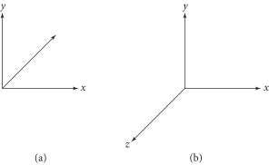

> Almost all nontrivial graphics programs are built on a foundation of geometric classes that represent mathematical constructs like points, vectors, and rays. Because these classes are ubiquitous throughout the system, good abstractions and efficient implementations are critical.

## 1. COORDINATE SYSTEMS
引入如下基本信息：

- 为使用坐标值 $(x,y,z)$ 表示三维点、向量、法向量，需要一个 **坐标系统（Coordiante System）**，其包含空间原点 $\mathbf{p}_{0}$ 和三个线性无关的向量表示 $x,y,z$ 轴，统称为 **框架（Frame）**．

- 为避免点、向量和框架之间的循环定义，需要一个 **标准框架（Standard Frame）**，其具备原点 $(0,0,0)$ 和基本向量 $(1,0,0),(0,1,0),(0,0,1)$ 。标准框架定义了规范坐标系统，称之为 **世界空间（World Space）**。其他框架都将相对于世界空间定义。

### Handedness
存在如下图两种三维坐标系统：**左手系（Left-handed）** 和 **右手系（Right-handed）**．本书中使用左手系坐标系统．

/// caption
Figure 1: (a) 左手系坐标系统，$z$ 轴指向页面内；(b) 右手系坐标系统，$z$ 轴指向页面外．
///

## 2. GEOMETRY

