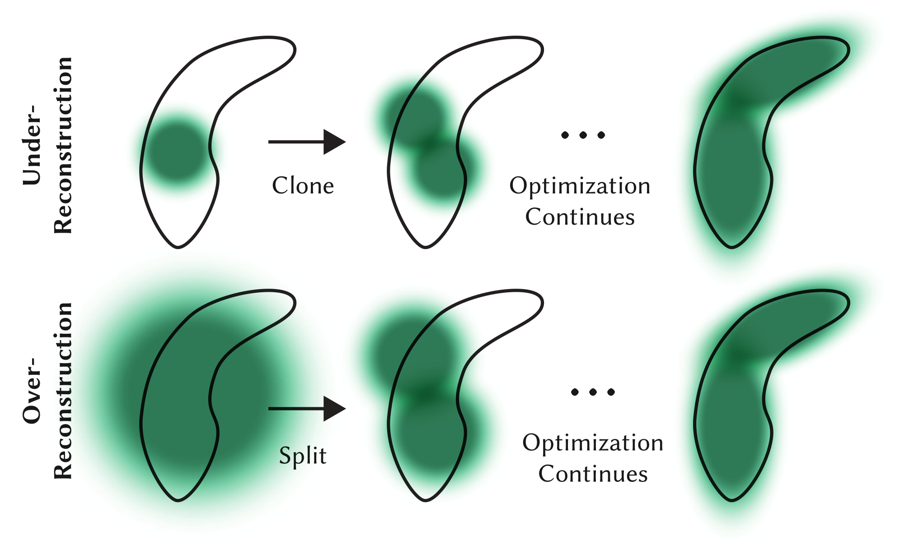

# 3D Gaussian Splatting for Real-Time Radiance Field Rendering

## ABSTRACT
Radiance Field methods have recently revolutionized novel-view synthesis of scenes captured with multiple photos or videos. However, achieving high visual quality still requires neural networks that are costly to train and render, while recent faster methods inevitably trade off speed for quality. For unbounded and complete scenes (rather than isolated objects) and 1080p resolution rendering, no current method can achieve real-time display rates. We introduce three key elements that allow us to achieve state-of-the-art visual quality while maintaining competitive training times and importantly allow high-quality real-time (>= 30 fps) novel-view synthesis at 1080p resolution. First, starting from sparse points produced during camera calibration, we represent the scene with 3D Gaussians that preserve desirable properties of continuous volumetric radiance fields for scene optimization while avoiding unnecessary computation in empty space; Second, we perform interleaved optimization/density control of the 3D Gaussians, notably optimizing anisotropic covariance to achieve an accurate representation of the scene; Third, we develop a fast visibility-aware rendering algorithm that supports anisotropic splatting and both accelerates training and allows realtime rendering. We demonstrate state-of-the-art visual quality and real-time rendering on several established datasets.

## FILES & LINKS
- **URL:**  [Open Online](http://arxiv.org/abs/2308.04079)
- **Zotero Entry:** [PDF](zotero://select/library/items/G65UKH6J)


## 1. PROBLEMS
给定一组 3D 静态场景图片 $\{\mathcal{I}_{k}\}$ ，以及 SfM 算法产生的稀疏点云，目标为重建 3D 场景表示。


## 2. METHOD
### Point-Based Rendering vs. Radiance Fields

 $\alpha$-混合的点渲染和 NeRF 风格的体渲染本质拥有相同的图像形成模型：

- NeRF 风格体渲染：
	
	$$
	C = \sum_{i=1}^N T_{i}(1-\exp(-\sigma_{i}\delta_{i}))\mathbf{c}_{i}, \quad T_{i} := \exp \left( -\sum_{j=1}^{i-1} \sigma_{j}\delta_{j} \right) 
	$$
	
	其中 $\sigma$ 为密度，$T$ 为透射率，$\mathbf{c}$ 为颜色，$\delta$ 为射线采样区间。令 $\alpha_i:=(1-\exp(-\sigma_i\delta_i))$ ，有 $T_i=\prod_{j=1}^{i-1}(1-\alpha_i)$ ，上式可改写为： 
	
	$$
	C = \sum_{i=1}^N T_{i}\alpha_{i}\mathbf{c}_{i} \tag{1} \label{1}
	$$

- $\alpha$-混合的点渲染：
	
	$$
	C = \sum_{i\in \mathcal{N}}\mathbf{c}_{i}\alpha_{i}\prod_{j=1}^{i-1}(1-\alpha_{j}) \tag{2} \label{2}
	$$
	
	其中 $\mathcal{N}$ 为覆盖该像素的有序点集大小， $\mathbf{c}_i$ 为各点颜色，$\alpha_i$ 为不透明度和足迹函数乘积。
	
从 $\eqref{1}$ 式和 $\eqref{2}$ 式可以看到两种方法图像形成模型相同，但渲染算法完全不同：

- NeRFs 为连续隐式表示，需要进行耗时的随机采样，带来噪声和计算开销。
- 点集为无结构离散表示，可以灵活进行几何体的创建，销毁，移动，同时节省计算资源。

### Differentiable 3D Gaussian Splatting
选择 3D Gaussian 作为基元，因其为可微表示并且易于投影到 2D 进行 $\alpha$-混合渲染。几何建模为无法向的 3D Gaussian 集。

仿照 [EWA-Splatting](ewa-splatting.md#elliptical-gaussian-kernels) 定义世界空间中心点为 $\boldsymbol{\mu}$ 的 Gaussian ：

$$
\mathcal{G}(\mathbf{x}-\boldsymbol{\mu}) = \exp \left( -\frac{1}{2}(\mathbf{x}-\boldsymbol{\mu})^\mathsf{T} \boldsymbol{\Sigma}^{-1}(\mathbf{x}-\boldsymbol{\mu}) \right) 
$$

使用 [EWA-Splatting](ewa-splatting.md#projective-transformation) 中 3D Gaussian 到 2D Gaussian 的变换方法：

先通过视角变换 $\mathbf{W}$ 和投影变换仿射近似 $\mathbf{J}$ 将 3D Gaussian 变换到光线空间：

$$
\boldsymbol{\Sigma}' = \mathbf{J}\mathbf{W}\boldsymbol{\Sigma}\mathbf{W}^\mathsf{T}\mathbf{J}^\mathsf{T}
$$

再去除 $\boldsymbol{\Sigma}'$ 的第三行和列得到 $2\times2$ 协方差矩阵 $\boldsymbol{\Sigma}^\text{2D}$ 。

对于优化方面，由于协方差 $\boldsymbol{\Sigma}$ 必须为半正定，难以直接梯度优化。考虑半正定矩阵的分解：

$$
\mathbf{\Sigma} = \mathbf{R}\mathbf{S}\mathbf{S}^\mathsf{T}\mathbf{R}^\mathsf{T}
$$

其中 $\mathbf{S}$ 为缩放矩阵，$\mathbf{R}$ 为旋转矩阵，即独立优化两个因子，为此使用 3D 向量 $\mathbf{s}$ 表示缩放以及 [四元数](../books/mathematics-for-3d-game-programming-and-computer-graphics/chapter3-transforms.md#6-quaternions) $\mathbf{q}$ 表示旋转。

为避免训练过程自动微分的显著开销，显式推导所有参数的梯度，具体细节如下：

??? note "Gradient Computation"
	TODO


### Directional Appearance
TODO

### Adaptive Control of Gaussians
由 SfM 提供的稀疏点云初始化 Gaussian 集并适应性控制其密度和数量。如下两种情况都会引起较大视图空间位置梯度：

- **欠重建（Under-Reconstruction）**：缺少几何特征区域。
- **过重建（Over-Reconstruction）**：Gaussian 覆盖大面积的区域。

对视图空间位置梯度平均幅度超过阈值 $\tau_{\text{pos}}$ 的 Gaussian 进行增密。具体细节及图示如下：

- 欠重建区域：
	
	复制一份相同大小的 Gaussian ，移动到位置梯度方向。

- 过重建区域：
	
	原 Gaussian 分为两个小 Gaussian ，放缩因子为 $\phi=1.6$ ，并以原 3D Gaussian 作为 PDF 采样初始化位置。


/// caption
Figure 1:  适应性 Gaussian 增密方案图。上：欠重建；下：过重建。
///

如上两种情况都会增加 Gaussian 数量，从而与其他体积表示方法类似，该优化过程可能会陷入局部最优，在输入相机附近产生漂浮伪影。一种有效的方法为：

<div class="steps" markdown>
1. 每 $N=100$ 轮迭代进行增密，并去除不透明度 $\alpha$ 低于阈值 $\epsilon_\alpha$ 的 Gaussian 。
2. 每 $N=3000$ 轮迭代设置 Gaussian 不透明度 $\alpha$ 近似为 $0$ 。
3. 优化过程会提高必需 Gaussian 的不透明度 $\alpha$ ，去除低于阈值 $\epsilon_\alpha$ 的 Gaussian ，实现密度控制。
</div>

### Fast Differentiable Rasterizer
为进行快速 $\alpha$-混合近似和避免泼溅数量限制，设计如下基于图块的光栅化方法：

首先将屏幕分割为 $16\times 16$ 图块，进行如下步骤：

<div class="steps" markdown>
1. Gaussian 预处理：

	首先使用保护带剔除极端位置的 Gaussian ，将保留的 Gaussian 从世界坐标变换到相机坐标，检查是否位于相机视锥体内（置信区间 $99\%$）。

2. Gaussian 实例化：

	考虑编号为 $g$ 投影深度为 $z_g$ 的 Gaussian ，其在屏幕空间覆盖的图块集合为 $\mathcal{T}_g$ ，为每个 splat-tile 创建实例：
	
	$$
	(g,t,z_g), \quad t \in \mathcal{T}_g
	$$
	
	并分配关键字：
	
	$$
	K_{g,t} = (t \ll 32) \mathbin{|}  \operatorname{encode}(z_g)
	$$
	
	即高32位为图块编号，低32位为深度编码。

3. Gaussian 排序：

	对所有实例进行全局 **GPU 基数排序（Radix Sort）** ，此时相同图块的实例排列在一起，并按深度由小到大排序。
	
	启动多线程并行寻找各图块对应的 Gaussian 列表：
	
	- 当前实例图块 ID 与前一个不同，则为对应区间起点。
	- 当前实例图块 ID 与后一个不同，则为对应区间终点。
	

4. Gaussian 光栅化：

	对每个图块启动一个线程块，并行加载 Gaussian 数据包到共享内存。对于给定像素，从前向后遍历 Gaussian 列表，计算颜色和累积不透明度，当累积不透明度恰好小于 $0.9999$ 时终止对应线程。按固定间隔查询图块中的线程，当所有像素均已饱和，该图块处理终止。

5. Gaussian 反向传播

	复用排序后的 Gaussian 列表，从后往前遍历。若 Gaussian 深度不超过像素记录的最大贡献深度，则进行覆盖检测和点处理。为得到梯度计算中所需的中间 Gaussian 透射率，各像素在前向过程记录最终透射率 $T$ ，在遍历过程中逐次除以各 Gaussian 透明度 $1-\alpha_i$ ，以节省资源负载。为数值稳定，在前向和后向过程中，跳过 $\alpha<\epsilon=\frac{1}{255}$ 的更新，并截断 $\alpha$ 小于 $0.99$ 。
</div>


### Optimization
给定 3D Gaussian $\mathcal{G}_{i}$ ，其具有如下优化参数：

$$
\mathcal{G}_{i} = (\boldsymbol{\mu}_{i},\mathbf{s}_{i},\mathbf{q}_{i},\alpha_{i},\left\{ f_{i,lm} \right\} )
$$

其中 $\boldsymbol{\mu}_{i}$ 为中心位置，$\mathbf{s}_{i},\mathbf{q}_{i}$ 为协方差分解的缩放和旋转因子，$\alpha_{i}$ 为不透明度，$\left\{ f_{i,lm} \right\}$ 为球谐系数。

为保证参数范围和梯度平滑，使用 Sigmoid 函数激活 $\alpha_{i}$ ，使用 Exponential 函数激活 $\mathbf{s}_{i}$ ，即：

$$
\begin{align}
\alpha_{i}' &= \frac{1}{1+\exp(\alpha_{i})} \\
\mathbf{s}_{i}' &= \exp(\mathbf{s}_{i})
\end{align}
$$

Gaussian 初始化为各向同性，轴长取与最近三点距离的平均值。对位置 $\boldsymbol{\mu}_{i}$ 使用类似 [Plenoxels] 中的标准指数衰减调度技术。

损失函数定义如下：

$$
\mathcal{L} = (1-\lambda) \mathcal{L}_{1} + \lambda \mathcal{L}_{\text{D-SSIM}}
$$

测试中取 $\lambda=0.2$ 。


## 3. EXPERIMENTS


## 4. THINKING
``` cpp
// Apply low-pass filter: every Gaussian should be at least
// one pixel wide/high. Discard 3rd row and column.
cov[0][0] += 0.3f;
cov[1][1] += 0.3f;
return { float(cov[0][0]), float(cov[0][1]), float(cov[1][1]) };
```
