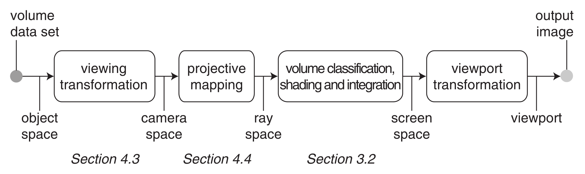
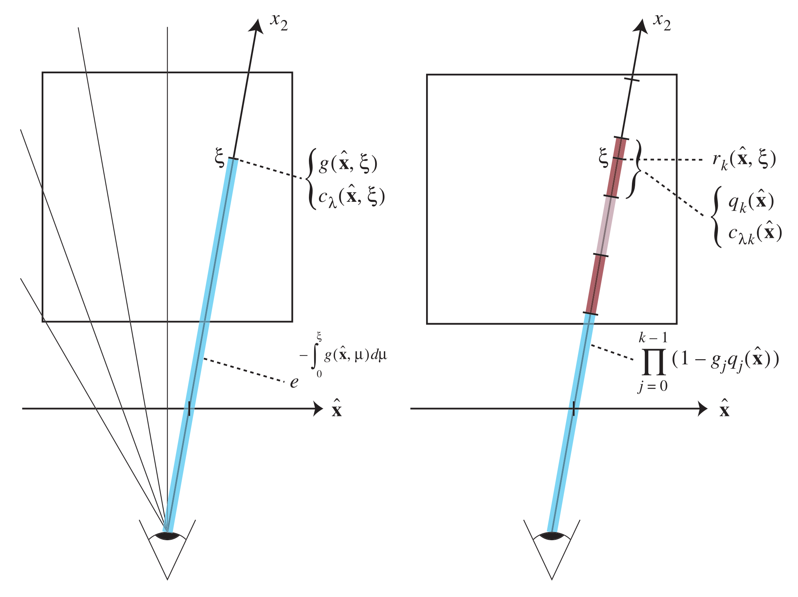
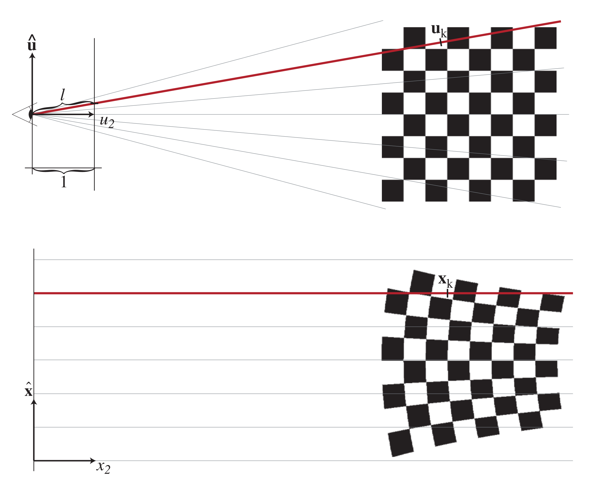
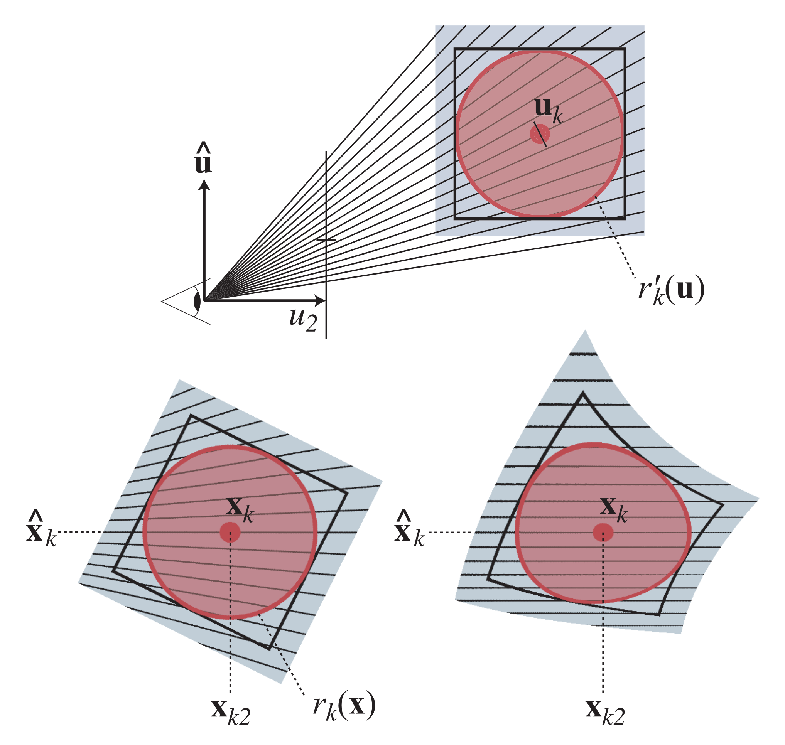
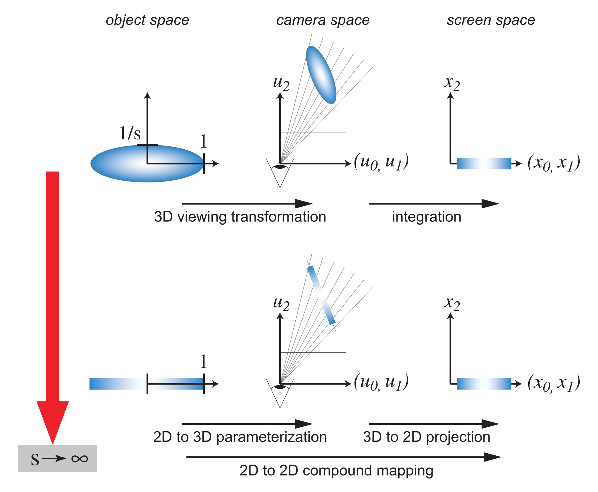
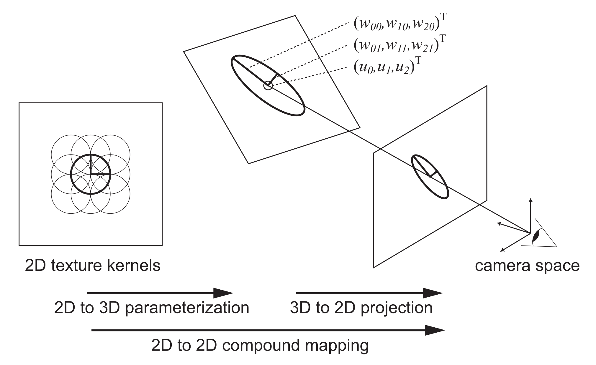

# EWA volume splatting

## ABSTRACT
In this paper we present a novel framework for direct volume rendering using a splatting approach based on elliptical Gaussian kernels. To avoid aliasing artifacts, we introduce the concept of a resampling filter combining a reconstruction with a low-pass kernel. Because of the similarity to Heckbert's EWA (elliptical weighted average) filter for texture mapping we call our technique EWA volume splatting. It provides high image quality without aliasing artifacts or excessive blurring even with non-spherical kernels. Hence it is suitable for regular, rectilinear, and irregular volume data sets. Moreover, our framework introduces a novel approach to compute the footprint function. It facilitates efficient perspective projection of arbitrary elliptical kernels at very little additional cost. Finally, we show that EWA volume reconstruction kernels can be reduced to surface reconstruction kernels. This makes our splat primitive universal in reconstructing surface and volume data.

## FILES & LINKS
- **URL:**  [Open Online](https://ieeexplore.ieee.org/document/964490/)
- **Zotero Entry:** [PDF](zotero://select/library/items/S5SVEB8E)

## 1. PROBLEMS
给定离散体样本集的原始标量 $\left\{ f_{k} \right\}$ ，目标为体渲染得到离散屏幕图像 $\left\{ I_{\lambda}(\hat{\mathbf{x}}_{i}) \right\}$ ．

## 2. METHOD
### Volume Rendering Pipeline
体渲染有如下两种基本方式：

- 反向映射：从图像平面的像素发射光线进入体数据．
- 前向映射：将体数据直接映射到图像平面．

本文方法基于前向映射，体渲染管线如下图所示：

/// caption
Figure 1:  前向映射体渲染管线．
///

### Splatting Algorithm
前向映射体渲染最常用的技术为 **泼溅算法（Splatting Algorithms）**．下面从低反照率近似的体渲染方程以及一些简化假设推导泼溅公式．

首先引入如下 **光线空间（Ray Space）** 的定义：

使用三维列向量 $\mathbf{x}=(x_{0},x_{1},x_{2})^\mathsf{T}$ 表示光线空间中的点．给定投影中心和投影平面，三个坐标的几何解释如下：

- 坐标 $(x_0,x_1)$ 指定投影平面上的一点．对于从投影中心穿过投影平面点 $(x_0,x_1)$ 的光线，称之为 **视线（Viewing Ray）**，记作 $\hat{\mathbf{x}}=(x_0,x_1)^\mathsf{T}$ ．
- 坐标 $x_2$ 指定投影中心到视线上一点的欧氏距离，也可记作 $\xi$ ．

为简化符号， $\mathbf{x},(\hat{\mathbf{x}},\xi)^\mathsf{T},(x_{0},x_{1},x_{2})^\mathsf{T}$ 都可表示光线空间的一点．

体渲染方程描述了波长为 $\lambda$ 的光沿长度为 $L$ 的光线 $\hat{\mathbf{x}}$ 传播到投影中心时的光强 $I_{\lambda}(\hat{\mathbf{x}})$ ：

$$
I_{\lambda}(\hat{\mathbf{x}}) = \int_{0}^{L} c_{\lambda}(\hat{\mathbf{x}},\xi)\sigma(\hat{\mathbf{x}},\xi)\exp \left( -\int_{0}^{\xi} \sigma(\hat{\mathbf{x}},\mu) \, d\mu  \right)  \, d\xi
$$

其中，各函数含义如下：

- $\sigma(\mathbf{x})$ 为 **消光函数（Extinction Function）**，定义了光遮挡率．
- $c_{\lambda}(\mathbf{x})$ 为 **放射系数（Emission Coefficient）**．
- $T(\xi):=\exp \left( -\int_{0}^{\xi} \sigma(\hat{\mathbf{x}},\mu) \, d\mu \right)$ 可解释为 **衰减因子（Attenuation Factor）**．
- $c_{\lambda}(\mathbf{x})\sigma(\mathbf{x})$ 称为 **源项（Source Term）**，描述了点 $\xi$ 沿射线 $\hat{\mathbf{x}}$ 方向散射的光强．

考虑如下物理模型：体积由吸收和发射光的独立粒子组成．此时消光函数由重建核 $g_{k}(\mathbf{x})$ 和权重系数 $\sigma_{k}$ 给出：

$$
\sigma(\mathbf{x}) = \sum_{k} \sigma_{k} g_{k}(\mathbf{x})
$$

代入 $I_{\lambda}(\hat{\mathbf{x}})$ 表达式有：

$$
I_{\lambda}(\hat{\mathbf{x}}) = \sum_{k} \left( \int_{0}^{L} c_{\lambda}(\hat{\mathbf{x}},\xi)\sigma_{k}g_{k}(\hat{\mathbf{x}},\xi)\prod_{j}\exp \left( -\sigma_{j}\int_{0}^{\xi} g_{j}(\hat{\mathbf{x}},\mu) \, d\mu  \right)  \, d\xi  \right) 
$$

为数值计算如上表达式，泼溅算法提出如下简化假设：

- 重建核 $g_k(\mathbf{x})$ 的局部支集 $S_k=[\xi_k^\text{in},\xi_k^\text{out}]$ 沿光线 $\hat{\mathbf{x}}$ 互不重叠，且按照从前往后排序．
- 放射系数 $c_\lambda(\mathbf{x})$ 沿光线 $\hat{\mathbf{x}}$ 在各支集 $S_k$ 上为定值，即 $c_{\lambda k}(\hat{\mathbf{x}})=c_{\lambda}(\hat{\mathbf{x}},\xi),\xi \in S_k$ ．
- 对 $\exp$ 使用 Taylor $1$ 阶近似，即 $\exp(x)\approx 1-x$ ．
- 忽略重建核的自遮挡，不出现在自身的透射率乘积中，即 
	
	$$
	\int_0^\xi g_j(\hat{\mathbf{x}},\mu) \, d\mu=0,\xi\in S_j
	$$	

对应示意图如下：

/// caption
Figure 2:  体渲染示意图．左：原体渲染方程；右：泼溅算法的近似方式．
///

由如上假设，计算有：

$$
I_{\lambda}(\hat{\mathbf{x}}) = \sum_{k} c_{\lambda k}(\hat{\mathbf{x}}) \sigma_{k} q_{k}(\hat{\mathbf{x}}) \prod_{j=0}^{k-1} (1 - \sigma_{j}q_{j}(\hat{\mathbf{x}})) \tag{$\ast$} \label{star}
$$

其中，$q_{k}(\hat{\mathbf{x}})$ 为重建核的积分，称为 **足迹函数（Footprint Function）**：

$$
q_{k}(\hat{\mathbf{x}}) = \int_{\mathbb{R}} g_{k}(\hat{\mathbf{x}},\xi) d\xi
$$

该 2D 函数指定了一个 3D 核在图像平面上的贡献．

$\eqref{star}$ 式为所有泼溅算法的基础公式，其高效性主要来源于如下方面：

- 利用预积分重建核，在体积分中只需 2D 插值．
- 可以使用具有更大范围的高质量核函数．

### Aliasing in Volume Splatting
当采样渲染图像到离散像素网格时，通常会发生 **混叠（Aliasing）** 问题．从信号处理角度，对混叠现象解释如下：

> 在连续函数被采样到规则网格之前，必须对其 **带限（Band-limit）** 至网格的 Nyquist 频率．

理论上，利用低通滤波器 $h(\hat{\mathbf{x}})$ 对 $I_{\lambda}(\hat{\mathbf{x}})$ 进行卷积操作可得抗混叠方程：

$$
(I_{\lambda}\otimes h)(\hat{\mathbf{x}}) = \int_{\mathbb{R}^{2}} \sum_{k} c_{\lambda k}(\eta)\sigma_{k}q_{k}(\eta)\prod_{j=0}^{k-1} (1-\sigma_{j}q_{j}(\eta))h(\hat{\mathbf{x}}-\eta) \, d \eta
$$

但实际中，$I_{\lambda}(\hat{\mathbf{x}})$ 只在离散点（像素中心）计算，故无法直接使用上述方程．

为利用低通滤波，提出如下简化假设重排积分：

- 放射系数 $c_{\lambda k}(\hat{\mathbf{x}})$ 在 $q_k$ 的支集上近似为定值，即 $c_{\lambda k}(\hat{\mathbf{x}})\approx c_{\lambda k}$ ．此时 $c_{\lambda}$ 在重建核的 3D 支集上为定值，即忽略了着色影响．
- 衰减因子在 $q_k$ 支集上近似为定值，即
	
	$$
	\prod_{j=0}^{k-1} (1 - \sigma_{j}q_{j}(\hat{\mathbf{x}})) \approx o_{k}
	$$

	原衰减因子表明足迹函数部分被一个更不透明的区域覆盖，即存在“软”边缘．将其近似为常数因无法避免边缘混叠．

由如上假设，计算有：

$$
\begin{align}
(I_{\lambda}\otimes h)(\hat{\mathbf{x}}) &\approx \sum_{k} c_{\lambda k}o_{k}\sigma_{k} \int_{\mathbb{R}^{2}} q_{k}(\eta)h(\hat{\mathbf{x}}-\eta)\, d \eta \\
&= \sum_{k}c_{\lambda k}o_{k}\sigma_{k}(q_{k}\otimes h)(\hat{\mathbf{x}})
\end{align}
$$

令 $\rho_{k}(\hat{\mathbf{x}}):=(q_{k}\otimes h)(\hat{\mathbf{x}})$ ，称为 **理想重采样滤波器（Ideal Resampling Filter）**，其替代了原先抗混叠方程中的 $q_{k}$ ，即：将直接带限 $I_{\lambda}(\hat{\mathbf{x}})$ 转为分别带限各足迹函数．

### Elliptical Gaussian Kernels
选择椭圆 Gaussian 作为重建核和低通滤波器，其具有如下重要性质：

- Gaussian 在仿射变换和卷积下封闭．
- 3D Gaussian 沿一个坐标轴积分会得到 2D Gaussian ．

定义中心点 $\mathbf{p}$ ，协方差 $\boldsymbol{\Sigma}$ 的椭圆 Gaussian 为：

$$
\mathcal{G}_{\boldsymbol{\Sigma}}(\mathbf{x}-\mathbf{p}) = \frac{1}{2\pi \left| \boldsymbol{\Sigma} \right|^{\frac{1}{2}} } e^{-\frac{1}{2} (\mathbf{x}-\mathbf{p})^\mathsf{T}\boldsymbol{\Sigma}^{-1}(\mathbf{x}-\mathbf{p})}
$$

记 $\mathbf{x}=(x_{0},x_{1},x_{2})^\mathsf{T},\mathbf{p}=(p_{0},p_{1},p_{2})^\mathsf{T}$ ，三条重要性质表述如下：

- 对于仿射变换 $\mathbf{u}=\Phi(\mathbf{x})=\mathbf{M}\mathbf{x}+\mathbf{c}$ ，替换 $\mathbf{x}=\Phi^{-1}(\mathbf{u})$ 有：
	
	$$
	\mathcal{G}_{\boldsymbol{\Sigma}}(\Phi ^{-1}(\mathbf{u})-\mathbf{p}) = \frac{1}{\left| \mathbf{M}^{-1} \right| } \mathcal{G}_{\mathbf{M}\boldsymbol{\Sigma}\mathbf{M}^\mathsf{T}}(\mathbf{u}-\Phi(\mathbf{p})) \tag{1} \label{1}
	$$

- 对于两个 Gaussian $\mathcal{G}_{\mathbf{X}}$ 和 $\mathcal{G}_{\mathbf{Y}}$ ，卷积结果为协方差 $\mathbf{X}+\mathbf{Y}$ 的 Gaussian ：
	
	$$
	(\mathcal{G}_{\mathbf{X}}\otimes \mathcal{G}_{\mathbf{Y}})(\mathbf{x}-\mathbf{p}) = \mathcal{G}_{\mathbf{X}+\mathbf{Y}}(\mathbf{x}-\mathbf{p}) \tag{2} \label{2}
	$$

- 对 3D Gaussian $\mathcal{G}_{\boldsymbol{\Sigma}}$ ，沿一个坐标轴积分结果为 2D Gaussian $\mathcal{G}_{\hat{\boldsymbol{\Sigma}}}$ ：
	
	$$
	\int_{\mathbb{R}^{2}} \mathcal{G}_{\boldsymbol{\Sigma}}(\mathbf{x}-\mathbf{p})\, d\xi = \mathcal{G}_{\hat{\boldsymbol{\Sigma}}}(\hat{\mathbf{x}}-\hat{\mathbf{p}}) \tag{3} \label{3}
	$$
	
	其中 $\hat{\mathbf{x}}=(x_0,x_1)^\mathsf{T},\hat{\mathbf{p}}=(p_0,p_1)^\mathsf{T}$ ，$2\times2$ 协方差矩阵 $\hat{\boldsymbol{\Sigma}}$ 为 $3\times3$ 协方差矩阵 $\boldsymbol{\Sigma}$ 去除第三行和列：
	
	$$
	\boldsymbol{\Sigma} = \begin{pmatrix}
	a & b & c \\
	b & d & e \\
	c & e & f
	\end{pmatrix} \Leftrightarrow \begin{pmatrix}
	a & b \\
	b & d
	\end{pmatrix} = \hat{\boldsymbol{\Sigma}}
	$$

下面介绍如何将椭圆 Gaussian 重建核从物体空间映射到光线空间．

### Viewing Transformation
重建核初始在物体空间，坐标为 $\mathbf{t}=(t_{0},t_{1},t_{2})^\mathsf{T}$ ，重建核为 $g_{k}''(\mathbf{t})=\mathcal{G}_{\boldsymbol{\Sigma}''}(\mathbf{t}-\mathbf{t}_{k})$ ．

记相机空间坐标为 $\mathbf{u}=(u_{0},u_{1},u_{2})^\mathsf{T}$ ，重建核为 $g_{k}'(\mathbf{u})$ ．物体坐标到相机坐标的仿射变换为 $\mathbf{u}=\varphi(\mathbf{t})=\mathbf{W}\mathbf{t}+\mathbf{d}$ ，称为 **视角变换（Viewing Transformation）**．

代入 $\mathbf{t}=\varphi ^{-1}(\mathbf{u})$ ，相机空间的重建核由 $\eqref{1}$ 式计算有：

$$
g_{k}'(\mathbf{u}) = \mathcal{G}_{\Sigma_{k}''}(\varphi ^{-1}(\mathbf{u})-\mathbf{t}_{k}) = \frac{1}{\left| \mathbf{W}^{-1} \right| } \mathcal{G}_{\Sigma_{k}'}(\mathbf{u}-\mathbf{u}_{k})
$$

其中 $\mathbf{u}_{k}=\varphi(\mathbf{t}_{k})$ 为相机坐标下 Gaussian 中心点，$\boldsymbol{\Sigma}_{k}'=\mathbf{W}\boldsymbol{\Sigma}_{k}''\mathbf{W}^\mathsf{T}$ 为相机坐标下 Gaussian 协方差矩阵．

### Projective Transformation
相机空间的原点位于投影中心，投影平面为 $u_{2}=1$ ．相机空间到光线空间的 **投影变换（Projective Transformation）** $\mathbf{x}=\mathbf{m}(\mathbf{u})$ 计算有：

$$
\begin{align}
\begin{pmatrix}
x_{0} \\
x_{1} \\
x_{2}
\end{pmatrix} &= \mathbf{m}(\mathbf{u}) = \begin{pmatrix}
u_{0}/u_{2} \\
u_{1}/u_{2} \\
\Vert (u_{0},u_{1},u_{2})^\mathsf{T}\Vert
\end{pmatrix} \\
\begin{pmatrix}
u_{0} \\
u_{1} \\
u_{2}
\end{pmatrix} &= \mathbf{m}^{-1}(\mathbf{x}) = \begin{pmatrix}
x_{0} / l\cdot x_{2} \\
x_{1} / l\cdot x_{2} \\
1 / l\cdot x_{2}
\end{pmatrix}
\end{align}
$$

其中 $l=\Vert(x_{0},x_{1},1)^\mathsf{T}\Vert$ ．

/// caption
Figure 3:  从相机空间到光线空间的投影变换示意图．上：相机空间；下：光线空间．
///

如上图所示，由于变换 $\mathbf{m}$ 非仿射变换，对 $\mathbf{m}(\mathbf{u})$ 进行 Taylor 展开，有局部仿射近似 $\mathbf{m}_{\mathbf{u}_{k}}$ ：

$$
\mathbf{m}_{\mathbf{u}_{k}}(\mathbf{u}) = \mathbf{x}_{k} + \mathbf{J}_{\mathbf{u}_{k}}\cdot(\mathbf{u}-\mathbf{u}_{k})
$$

其中 $\mathbf{x}_{k}=\mathbf{m}(\mathbf{u}_{k})$ 为光线空间 Gaussian 中心点，Jacobian $\mathbf{J}_{\mathbf{u}}$ 为 $\mathbf{m}$ 在 $\mathbf{u}$ 点的偏导数：

$$
\mathbf{J}_{\mathbf{u}} = \frac{\partial \mathbf{m}}{\partial \mathbf{u}}(\mathbf{u}) = \begin{pmatrix}
1 / u_{2} & 0 & -u_{0} / u_{2}^{2} \\
0 & 1 / u_{2} & -u_{1} / u_{2}^{2} \\
u_{0} / l' & u_{1} / l' & u_{2} / l'
\end{pmatrix}
$$

其中 $l'=\Vert(u_{0},u_{1},u_{2})^\mathsf{T}\Vert$ ．之后讨论省略下标 $\mathbf{u}_{k}$ ，因此 $\mathbf{m}(\mathbf{u})$ 表示局部仿射近似．代入 $\mathbf{u}=\mathbf{m}^{-1}(\mathbf{x})$ ，由 $\eqref{1}$ 式计算有：

$$
\begin{align}
g_{k}(\mathbf{x}) &= \frac{1}{\left| \mathbf{W}^{-1} \right| } \mathcal{G}_{\Sigma_{k}'}(\mathbf{m}^{-1}(\mathbf{x})-\mathbf{u}_{k}) \\
&= \frac{1}{\left| \mathbf{W}^{-1} \right| \left| \mathbf{J}^{-1} \right| } \mathcal{G}_{\Sigma_{k}}(\mathbf{x}-\mathbf{x}_{k})
\end{align}
$$

其中 $\boldsymbol{\Sigma}_{k}$ 为光线空间 Gaussian 协方差矩阵，由如下表达式给出：

$$
\begin{align}
\Sigma_{k} &= \mathbf{J}\Sigma_{k}'\mathbf{J}^\mathsf{T} \\
&= \mathbf{J}\mathbf{W}\Sigma_{k}''\mathbf{W}^\mathsf{T}\mathbf{J}^\mathsf{T}
\end{align}
$$

/// caption
Figure 4:  从相机空间映射重建核到光线空间示意图．上：相机空间．下：光线空间．左：局部仿射映射．右：精确映射．
///

如上图所示，局部仿射映射本质上用斜平行投影近似透视投影，仅对通过 $\mathbf{x}_{k}$ 的光线精确．

### Integration and Band-Limiting
由 $\eqref{3}$ 式积分 Gaussian 重建核可得 Gaussian 足迹函数 $q_{k}$ ：

$$
\begin{align}
q_{k}(\hat{\mathbf{x}}) &= \int_{\mathbb{R}} \frac{1}{\left| \mathbf{J}^{-1} \right| \left| \mathbf{W}^{-1} \right| } \mathcal{G}_{\Sigma_{k}}(\hat{\mathbf{x}}-\hat{\mathbf{x}}_{k},\xi-\xi_{k})\, d \xi \\
&= \frac{1}{\left| \mathbf{J}^{-1} \right| \left| \mathbf{W}^{-1} \right| }\mathcal{G}_{\hat{\Sigma}_{k}}(\hat{\mathbf{x}}-\hat{\mathbf{x}}_{k})
\end{align}
$$

选择 Gaussian 低通滤波器 $h=\mathcal{G}_{\boldsymbol{\Sigma}^h}(\hat{\mathbf{x}})$ ，其中协方差矩阵 $\boldsymbol{\Sigma}^h\in \mathbb{R}^{2\times2}$ 通常为单位矩阵 $\mathbf{I}_{2}$ ．由 $\eqref{2}$ 式计算卷积可得 EWA 体积重采样滤波器：

$$
\begin{align}
\rho_{k}(\hat{\mathbf{x}}) &= (q_{k}\otimes h)(\hat{\mathbf{x}}) \\
&= \frac{1}{\left| \mathbf{J}^{-1} \right| \left| \mathbf{W}^{-1} \right| }(\mathcal{G}_{\hat{\boldsymbol{\Sigma}}_{k}}\otimes \mathcal{G}_{\boldsymbol{\Sigma}^h})(\hat{\mathbf{x}}-\hat{\mathbf{x}}_{k}) \\
&= \frac{1}{\left| \mathbf{J}^{-1} \right| \left| \mathbf{W}^{-1} \right| }\mathcal{G}_{\hat{\boldsymbol{\Sigma}}_{k}+\boldsymbol{\Sigma}^h}(\hat{\mathbf{x}}-\hat{\mathbf{x}}_{k})
\end{align}
$$

### Surface Reconstruction Kernels
由于 EWA 体积重采样滤波器可以处理任意 Gaussian 重建核，可以沿表面法向扁平化重建核，提高等值面渲染精度．

对物体空间的 Gaussian 在一个方向上放缩 $1/s$ 倍，得到扁平化的 Gaussian 重建核：

$$
\boldsymbol{\Sigma}'' = \begin{pmatrix}
1 & 0 & 0 \\
0 & 1 & 0 \\
0 & 0 & \frac{1}{s^{2}}
\end{pmatrix}
$$

令 $\mathbf{T}^\text{3D}:=\mathbf{J}\mathbf{W}$ ，光线空间的协方差矩阵 $\Sigma$ 的表达式为：

$$
\boldsymbol{\Sigma} = \mathbf{J}\mathbf{W}\boldsymbol{\Sigma}''\mathbf{W}^\mathsf{T}\mathbf{J}^\mathsf{T} = \mathbf{T}^\text{3D}\boldsymbol{\Sigma}''{\mathbf{T}^\text{3D}}^\mathsf{T}
$$

去除 $\boldsymbol{\Sigma}$ 的第三行和列，并令 $s\to \infty$ ，计算得 2D Gaussian 足迹函数的协方差矩阵 $\hat{\boldsymbol{\Sigma}}$ ：

$$
\hat{\boldsymbol{\Sigma}} = \begin{pmatrix}
t_{00}^{2}+t_{01}^{2} & t_{00}t_{10}+t_{01}t_{11} \\
t_{00}t_{10}+t_{01}t_{11} & t_{10}^{2}+t_{11}^{2}
\end{pmatrix} = \mathbf{T}^\text{2D}{\mathbf{T}^\text{2D}}^\mathsf{T} = \begin{pmatrix}
t_{00} & t_{01} \\
t_{10} & t_{11}
\end{pmatrix} \begin{pmatrix}
t_{00} & t_{10} \\
t_{01} & t_{11}
\end{pmatrix}
$$

该扁平化过程如下图所示：

/// caption
Figure 5:  体重建核扁平化为面重建核示意图．上：渲染体积核．下：渲染表面核．
///

下面研究 2D 映射矩阵 $\mathbf{T}^\text{2D}$ ．

由 $\mathbf{T}^\text{3D}=\mathbf{J}\mathbf{W}$ ，$\mathbf{T}^\text{2D}$ 可分解为：

$$
\mathbf{T}^\text{2D} = \begin{pmatrix}
1 / u_{2} & 0 & -u_{0} / u_{2}^{2} \\
0 & 1 / u_{2} & -u_{1} / u_{2}^{2}
\end{pmatrix} \begin{pmatrix}
w_{00} & w_{01} \\
w_{10} & w_{11} \\
w_{20} & w_{21}
\end{pmatrix}
$$

该分解可解释为一个 3D 到 2D 映射和一个 2D 到 3D 映射的复合．如下图所示：

/// caption
Figure 6:  表面核渲染图．
///

具体分为如下三个阶段：

1. 将 2D 圆形纹理核映射到 3D 相机空间中由向量 $(w_{\text{00}},w_{\text{10}},w_{\text{20}})^\mathsf{T}$ 和 $(w_{\text{01}},w_{\text{11}},w_{\text{21}})^\mathsf{T}$ 定义的平面．
2. 进行缩放因子为 $1/u_2$ 的斜平行投影，该因子是透视投影的局部仿射近似．
3. 结合投影椭圆和低通滤波器，得到纹理过滤器．

## 3. EXPERIMENTS

## 4. THINKING

