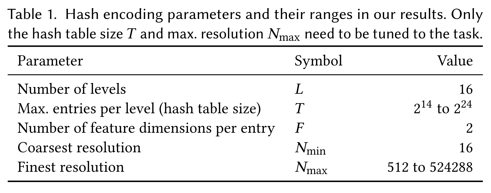
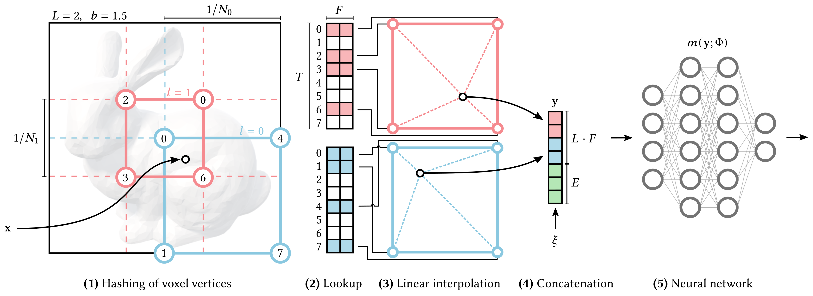

# Instant Neural Graphics Primitives with a Multiresolution Hash Encoding

## ABSTRACT
Neural graphics primitives, parameterized by fully connected neural networks, can be costly to train and evaluate. We reduce this cost with a versatile new input encoding that permits the use of a smaller network without sacrificing quality, thus significantly reducing the number of floating point and memory access operations: a small neural network is augmented by a multiresolution hash table of trainable feature vectors whose values are optimized through stochastic gradient descent. The multiresolution structure allows the network to disambiguate hash collisions, making for a simple architecture that is trivial to parallelize on modern GPUs. We leverage this parallelism by implementing the whole system using fully-fused CUDA kernels with a focus on minimizing wasted bandwidth and compute operations. We achieve a combined speedup of several orders of magnitude, enabling training of high-quality neural graphics primitives in a matter of seconds, and rendering in tens of milliseconds at a resolution of ${1920\!\times\!1080}$.

## FILES & LINKS
- **URL:**  [Open Online](http://arxiv.org/abs/2201.05989)
- **Zotero Entry:** [PDF](zotero://select/library/items/H4UEH68F)

## 1. PROBLEMS
考虑一个表示神经图像基元的 MLP $m(\mathbf{x};\Phi)$ ，目标为编码原始输入 $x$ 到更高维向量 $\mathbf{y}=\operatorname{enc}(\mathbf{x};\theta)$ ，提升紧致模型的拟合质量．

### Frequency Encoding

$$
\begin{align}
\operatorname{enc}(x) = \big(&\sin(2^0x),\sin(2^1x),\dots,\sin(2^{L-1}x), \\
&\cos(2^0x),\cos(2^1x),\dots,\cos(2^{L-1}x) \big)
\end{align}
$$

### Parametric Encoding

### Sparse Parametric Encoding

## 2. METHOD
### Multi-resolution Hash Encoding
对于 $\mathbf{y}=\operatorname{enc}(\mathbf{x},\theta)$ ，$\theta$ 表示为 $L\times T\times F$ 的多分辨率哈希表．其中 $L$ 为分辨率级别数，$T$ 为特征向量数，$F$ 为特征向量维数．具体特征如下：

- 分辨率级别之间相互独立，并存储网格顶点的特征向量．
- 分辨率按几何级数从范围 $[N_{\text{min}},N_{\text{max}}]$ 内取值：
	    
	$$
	\begin{align}
	N_{l} &:= \lfloor N_{\text{min}}\cdot b^l \rfloor , \quad l = 1,\dots,L \\
	b &:= \exp \left( \frac{\ln N_{\text{max}} - \ln N_{\text{min}}}{L-1} \right) 
	\end{align}
	$$

各参数具体信息如下：

/// caption
Table 1: 哈希编码参数及取值范围表．
///

采用如下空间哈希函数 $h: \mathbb{Z}^d \to \mathbb{Z}_{T}$：

$$
h(\mathbf{x}=(x_{1},\dots,x_{d})) = \left( \bigoplus_{i=1}^d \widetilde{x}_{i}\pi_{i} \right) \bmod T
$$

其中 $\oplus$ 表示按位 $\operatorname{XOR}$ ，$\pi_{i}$ 为互不相同的大质数．为消去维度相关性，$\{\widetilde{x}_{i}\}$ 为 $\{x_{i}\}$ 的随机置换．为实现独立性，只需置换 $d-1$ 维，从而取 $\pi_{1}:=1,\pi_{2}:=2\,654\,435\,761,\pi_{3}:=805\,459\,861$ ．

对于层级 $l$ ，输入坐标 $\mathbf{x}\in \mathbb{R}^d$ 位于其中一个网格，两个顶点为：

$$
\lfloor \mathbf{x}_{l} \rfloor := \lfloor \mathbf{x}\cdot N_{l} \rfloor , \quad \lceil \mathbf{x}_{l} \rceil := \lceil \mathbf{x}\cdot N_{l} \rceil 
$$

该层级 $\mathbf{x}$ 处的特征向量由顶点处特征 $d$-linear 插值得到，权重为 $\mathbf{w}_{l}:=\mathbf{x}_{l}-\lfloor \mathbf{x}_{l} \rfloor$ ．总计 $L$ 个特征向量和附加输入 $\xi\in \mathbb{R}^E$  拼接成 $\mathbf{y}\in \mathbb{R}^{LF+E}$ ．

如上过程总结如图：

/// caption
Figure 1: 2D 多分辨率哈希管线图．
///

???+ note "Remark (Implicit hash collision resolution)"
	本方法在存在哈希冲突下成功重建场景的关键为：不同分辨率层级提取不同特征，彼此互补．
	
	- 低分辨率层级不存在冲突，但只能提供粗略特征；高分辨率层级提供了精细特征，但存在大量冲突．由哈希函数特性，冲突会随机分布在空间中，并且同时在所有层级发生概率极低．
	- 对于冲突两点，其对重建结果的贡献几乎不同．特征优化会被重要点梯度主导．

### D-linear Interpolation
获取查询点特征使用 $d$-linear 插值而不是网格对齐，目的是保证 $m(\operatorname{enc}(\mathbf{x};\theta);\Phi)$ 连续．

对于高阶连续性需求（如拟合 SDF 需法向连续），有如下可选方案：

- $d$-quadratic 或 $d$-cubic 插值．
- 利用 **平滑阶梯函数（Smoothstep Function）**：
	  
	$$
	S_{1}(x) = x^{2}(3-2x)
	$$
	
	令 $\widetilde{\mathbf{w}}_l:=S_1(\mathbf{w}_l)$ ，由 $S_1^{\prime}(0)=S_1^{\prime}(1)=0$ ，网格边界处一阶导数无跳变，有 $C^1$ 光滑性． 

???+ note "Remark"
	- 使用“平滑阶梯函数”技巧会引发边界点在各层级处导数为 $0$ ．因此进行层级偏移，偏移量为 $1/(2N_{l})$ ．
	- 对于更高阶平滑性需求，可使用高阶平滑阶梯函数 $S_{n}$ ．但实验表明使用高阶 $S_{n}$ 反而会降低重建质量．

## 3. EXPERIMENTS

## 4. THINKING

