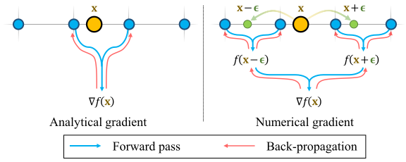

# Neuralangelo: High-Fidelity Neural Surface Reconstruction

## ABSTRACT
Neural surface reconstruction has been shown to be powerful for recovering dense 3D surfaces via image-based neural rendering. However, current methods struggle to recover detailed structures of real-world scenes. To address the issue, we present Neuralangelo, which combines the representation power of multi-resolution 3D hash grids with neural surface rendering. Two key ingredients enable our approach: (1) numerical gradients for computing higher-order derivatives as a smoothing operation and (2) coarse-to-fine optimization on the hash grids controlling different levels of details. Even without auxiliary inputs such as depth, Neuralangelo can effectively recover dense 3D surface structures from multi-view images with fidelity significantly surpassing previous methods, enabling detailed large-scale scene reconstruction from RGB video captures.

## FILES & LINKS
- **URL:**  [Open Online](https://ieeexplore.ieee.org/document/10205317/)
- **Zotero Entry:** [PDF](zotero://select/library/items/LMQWJJCI)

## 1. PROBLEMS
考虑一组 3D 物体图片 $\{\mathcal{I}_{k}\}$ ，目标为提高表面 $\mathcal{S}$ 重建质量．

SDF 的优化关键为其满足 Eikonal 方程 $\Vert \nabla f(\mathbf{x})\Vert_{2}=1$ ，从而有如下 Eikonal Loss：

$$
\mathcal{L}_{\text{eik}} = \frac{1}{N} \sum_{i=1}^N \left( \Vert \nabla f(\mathbf{x}_{i}) \Vert_{2} - 1 \right)^{2} 
$$
### Multi-resolution Hash Encoding
[Instant-NGP](instant-ngp.md)

### Analytic Gradient
现存方法计算表面法向使用解析梯度．但在三线性插值哈希编码下，解析梯度在空间中并不连续．

考虑点 $\mathbf{x}_{i}$ ，分辨率为 $N_{l}$ ，对应缩放点 $\mathbf{x}_{{i,l}}:=\mathbf{x}_{i}\cdot N_{l}$ ，插值权重为 $\mathbf{w}:=\mathbf{x}_{i,l}-\lfloor \mathbf{x}_{i,l} \rfloor$ ，该层级特征为：

$$
\gamma_{l}(\mathbf{x}_{i,l}) = \gamma_{l}(\lfloor \mathbf{x}_{i,l} \rfloor )\cdot(1-\mathbf{w}) + \gamma_{l}(\lceil \mathbf{x}_{i,l} \rceil )\cdot \mathbf{w}
$$

哈希编码对于坐标的导数计算为：

$$
\begin{align}
\frac{\partial\gamma_{l}(\mathbf{x}_{i,l})}{\partial \mathbf{x}_{i}} &= \gamma_{l}(\lfloor \mathbf{x}_{i,l} \rfloor )\cdot(  -\frac{\partial \mathbf{w}}{\partial \mathbf{x}_{i,l}}) + \gamma_{l}(\lceil \mathbf{x}_{i,l} \rceil )\cdot \frac{\partial \mathbf{w}}{\partial \mathbf{x}_{i,l}} \\
&= N_{l} \cdot(\gamma_{l}(\lceil \mathbf{x}_{i,l} \rceil ) - \gamma_{l}(\lfloor \mathbf{x}_{i,l} \rfloor ))
\end{align}
$$

此时，$\mathcal{L}_{\text{eik}}$ 仅反向传播到局部哈希项，即 $\gamma_{l}(\lfloor \mathbf{x}_{i,l} \rfloor)$ 和 $\gamma_{l}(\lceil \mathbf{x}_{i,l} \rceil)$ 

## 2. METHOD
### Numerical Gradient
为克服哈希编码解析梯度的局部性，使用数值梯度计算表面法线．

对于采样点 $\mathbf{x}_{i}=(x_{i},y_{i},z_{i})$ ，额外沿各坐标轴以步长 $\epsilon$ 采样一对点，以计算数值梯度：

$$
\nabla_{x}f(\mathbf{x}_{i}) = \frac{f(\gamma(\mathbf{x}_{i}+\boldsymbol{\epsilon}_{x})) - f(\gamma(\mathbf{x}_{i}-\boldsymbol{\epsilon}_{x})}{2\epsilon}, \quad \boldsymbol{\epsilon}_{x}=[\epsilon,0,0]
$$

如图，数值梯度可视为对解析梯度的平滑操作，同时优化多个网格：

/// caption
Figure 1: 解析梯度和数值梯度示意图．
///

### Progressive Learning
采用 Coarse-to-fine 的优化方式可以防止落入局部极小值．数值梯度对此有如下自然优势：

- 步长 $\epsilon$ ：
  
	大步长 $\epsilon$ 会保证表面法向在大尺度上的一致性；小步长 $\epsilon$ 会避免对细节的过度平滑．实践中，初始化 $\epsilon=N_{\text{max}}$ ，并在优化过程中指数递减，以匹配不同的哈希网格大小．
  
- 哈希网格分辨率 $N$：
  
	若所有分辨率网格都在优化开始时激活，精细网格会受到初始大步长 $\epsilon$ 的影响．因此，初始只激活一部分粗分辨率网格，当 $\epsilon$ 递减到一定空间尺寸，再激活对应分辨率网格．

### Optimization
损失函数定义如下：

$$
\mathcal{L} = \mathcal{L}_{\text{color}} + \lambda_{\text{eik}}\mathcal{L}_{\text{eik}} + \lambda_{\text{curv}}\mathcal{L}_{\text{curv}}
$$

- 颜色损失 $\mathcal{L}_{\text{color}}$ 同 [NeuS](neus.md#training) ．

- Eikonal 损失 $\mathcal{L}_{\text{eik}}$ 使用数值梯度计算．

- 为进一步提升重建曲面光滑性，添加曲率损失：
  
	$$
	\mathcal{L}_{\text{curv}} = \frac{1}{N} \sum_{i=1}^N \vert \nabla^{2} f(\mathbf{x}_{i})\vert
	$$
	
	该平均曲率使用离散 Laplacian 计算．

## 3. EXPERIMENTS

## 4. THINKING

