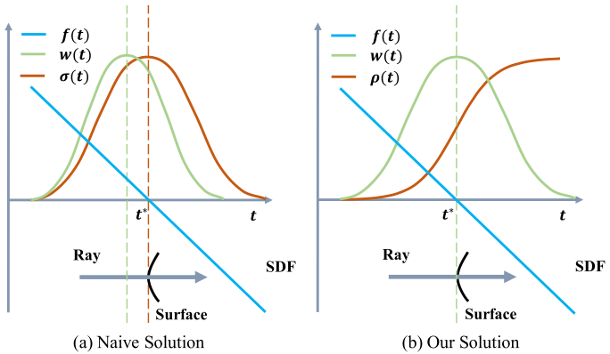
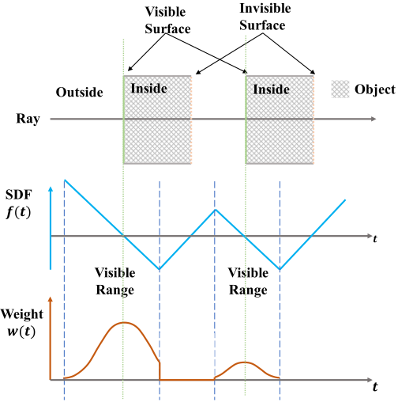
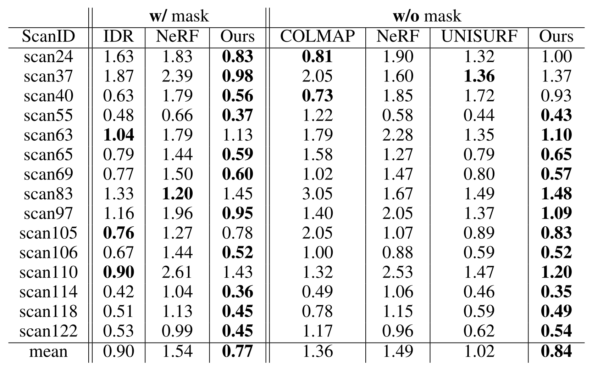
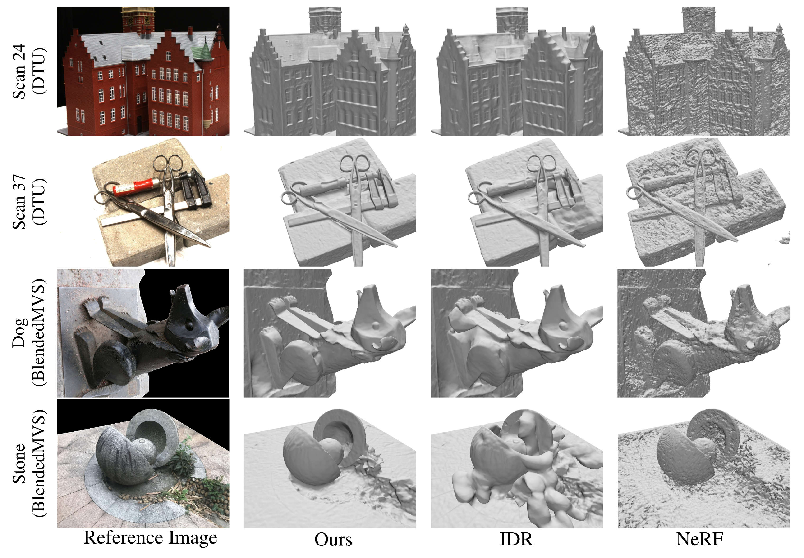
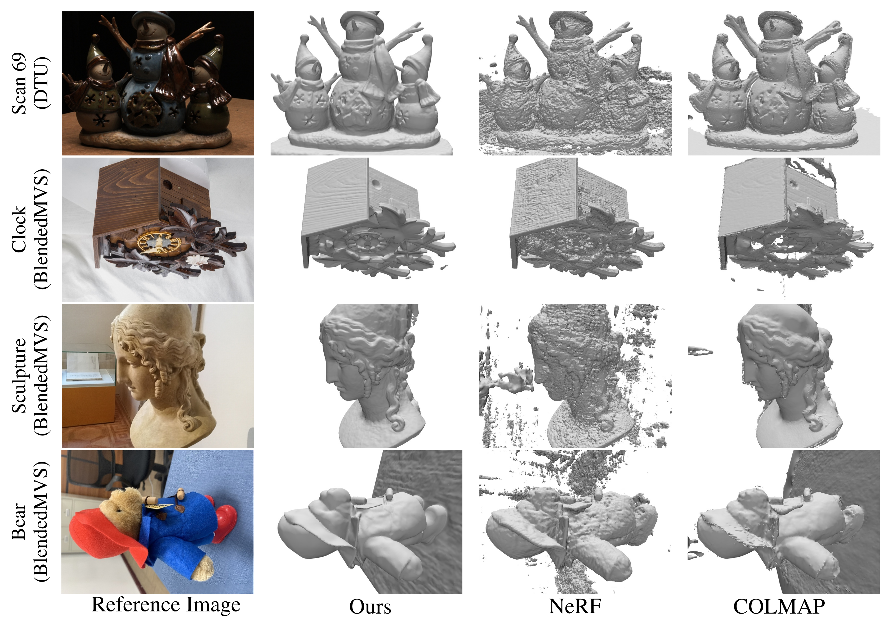

# NeuS: Learning Neural Implicit Surfaces by Volume Rendering for Multi-view Reconstruction

## ABSTRACT
We present a novel neural surface reconstruction method, called NeuS, for reconstructing objects and scenes with high fidelity from 2D image inputs. Existing neural surface reconstruction approaches, such as DVR and IDR, require foreground mask as supervision, easily get trapped in local minima, and therefore struggle with the reconstruction of objects with severe self-occlusion or thin structures. Meanwhile, recent neural methods for novel view synthesis, such as NeRF and its variants, use volume rendering to produce a neural scene representation with robustness of optimization, even for highly complex objects. However, extracting high-quality surfaces from this learned implicit representation is difficult because there are not sufficient surface constraints in the representation. In NeuS, we propose to represent a surface as the zero-level set of a signed distance function (SDF) and develop a new volume rendering method to train a neural SDF representation. We observe that the conventional volume rendering method causes inherent geometric errors (i.e. bias) for surface reconstruction, and therefore propose a new formulation that is free of bias in the first order of approximation, thus leading to more accurate surface reconstruction even without the mask supervision. Experiments on the DTU dataset and the BlendedMVS dataset show that NeuS outperforms the state-of-the-arts in high-quality surface reconstruction, especially for objects and scenes with complex structures and self-occlusion.

## FILES & LINKS
- **URL:**  [Open Online](http://arxiv.org/abs/2106.10689)
- **Zotero Entry:** [PDF](zotero://select/library/items/24EHA565)

## 1. PROBLEMS
考虑一组 3D 物体图片 $\{\mathcal{I}_{k}\}$ ，目标为重建表面曲面 $\mathcal{S}$．

## 2. METHOD

### Scene Representation
物体场景由两个函数表示（均由 MLP 编码）：

$$
f: \mathbb{R}^3 \to \mathbb{R},\quad c: \mathbb{R}^3 \times \mathbb{S}^2 \to \mathbb{R}^3
$$

对空间点 $\mathbf{x}\in \mathbb{R}^3$ 和观察方向 $\mathbf{v}\in \mathbb{S}^2$ ，$f(\mathbf{x})$ 表示 $\mathbf{x}$ 到 $\mathcal{S}$ 的带符号距离（即 SDF），$c(\mathbf{x},\mathbf{v})$ 为对应颜色．
物体表面 $\mathcal{S}$ 可表示为 SDF 的零水平集：

$$
\mathcal{S} = \left\{ \mathbf{x}\in \mathbb{R}^3\vert f(\mathbf{x}) = 0 \right\} 
$$

引入概率密度函数 $\phi_{s}(f(\mathbf{x}))$ ，称为 **S-密度（S-density）**．其中 $\phi_{s}(x) = se^{-sx}/(1+e^{-sx})^{2}$ 称为 **逻辑密度函数（Logistics Density Distribution）**，是 Sigmoid 函数 $\Phi_{s}(x) = (1+e^{-sx})^{-1}$ 的导数．

???+ note "Remark"
	- $\phi_{s}(x)$ 可以是任意以 $0$ 为中心的钟形密度函数．
	- $\phi_{s}(x)$ 选取为逻辑密度函数有两个主要原因：计算方便（尤其积分有显式表示，见 [Solution](#solution)）以及 $\operatorname{std}(\phi_{s}) = 1/s$  可作为训练参数．

### Rendering
给定一像素 $p$ ，记 $\mathbf{o}$ 为观察点，$\mathbf{v}$ 为单位方向，$p$ 点发出的光线为 $\left\{ \mathbf{p}(t)=\mathbf{o}+t \mathbf{v}\vert t\geq 0 \right\}$．作体渲染：

$$
C(\mathbf{o},\mathbf{v}) = \int_{0}^{+\infty} w(t)c(\mathbf{p}(t),\mathbf{v}) \, dt 
$$

其中 $C(\mathbf{o},\mathbf{v})$ 为 $p$ 处输出颜色，$w(t)$ 为 $\mathbf{p}(t)$ 处权重．

关键点为建立 $C$ 和 $f$ 之间的合适联系．即基于 SDF $f$ 推导合适的权重 $w(t)$．为提高重建质量，提出如下两点约束：

- **无偏（Unbiased）**．$w(t)$ 在光线与曲面相交点处取得极大值．即：给定光线 $\mathbf{p}(t)$ ，若 $f(\mathbf{p}(t^*))=0$ ，则 $t^*$ 为 $w(t)$ 极大值点．
- **遮挡感知（Occlusion-aware）**．若两点 SDF 值相同，则距离 $\mathbf{o}$ 近的点 $w$ 值更大．即：给定 $t_{0},t_{1}$ 满足 $f(t_{0})=f(t_{1})$ 且 $t_{0}<t_{1}$ ，则 $w(t_{0})>w(t_{1})$．

### Solution
先考虑两种常见 $w(t)$：

- NeRF 中的一种自然解为：
  
    $$
    w(t) = T(t)\sigma(t) \tag{$\ast$} \label{star}
    $$
  
    其中 $\sigma(t)$ 为 **体密度（Volume Density）**，$T(t):=\exp \left( -\int_{0}^{t} \sigma(u) \, du \right)$ 为 **累积透射率（Accumulated Transmittance）**．
  
    可取 $\sigma(t)=\phi_{s}(f(\mathbf{p}(t)))$ ，此解满足：遮挡感知✓，无偏✗．

- 一个简单的无偏构造为：
  
    $$
    w(t) = \frac{\phi_{s}(f(\mathbf{p}(t)))}{\int_{0}^{+\infty} \phi_{s}(f(\mathbf{p}(u))) \, du } \tag{$\ast\ast$} \label{star2}
    $$
  
    此解满足：无偏✓，遮挡感知✗．

若将两者结合，即可同时满足无偏和遮挡感知．想法为从无偏构造出发，推导出类似 $\eqref{star}$ 式的形式．为此，仿照体密度 $\sigma(t)$ 定义不透明密度函数 $\rho(t)$ ，权重函数可记为：

$$
w(t) = T(t)\rho(t), \quad T(t) = \exp\left( -\int_{0}^{t}\rho(u)  \, du  \right) 
$$

先考虑最简单情形：曲面为一个距离相机无穷远的平面．此时 $\eqref{star2}$ 式满足两个约束，以此推导 $\rho(t)$ 形式．

记 $f(\mathbf{p}(t^*))=0$ ，$\theta=\angle(\mathbf{v},\mathbf{n})$ ，则 SDF $f(\mathbf{p}(t))=-\vert\cos\theta \vert \cdot (t-t^*)$ ，计算有： 

$$
\begin{align}
w(t) &= \lim_{ t^* \to +\infty } \frac{\phi_{s}(f(\mathbf{p}(t)))}{\int_{0}^{+\infty} \phi_{s}(f(\mathbf{p}(u))) \, du } \\
&= \lim_{ t^* \to +\infty } \frac{\phi_{s}(f(\mathbf{p}(t)))}{\int_{0}^{+\infty} \phi_{s}(-\vert\cos\theta\vert(u-t^*)) \, du } \\
&= \lim_{ t^* \to +\infty } \frac{\phi_{s}(f(\mathbf{p}(t)))}{\vert\cos\theta\vert^{-1}\int_{-\vert\cos\theta\vert t^*}^{+\infty} \phi_{s}(\hat{u}) \, d\hat{u} } \\
&= \vert\cos\theta\vert \phi_{s}(f(\mathbf{p}(t))) \\
&= -\frac{d\Phi_{s}}{dt}(f(\mathbf{p}(t))) 
\end{align}
$$

另一方面，在体渲染框架下计算有：

$$
\begin{align}
w(t) = T(t)\rho(t) = -\frac{dT}{dt}(t) 
\end{align}
$$

两式结合有：

$$
\begin{align}
T(t) &= \Phi_{s}(f(\mathbf{p}(t))) \\
\rho(t) &= \frac{-\frac{d\Phi_{s}}{dt} (f(\mathbf{p}(t)))}{\Phi_{s}(f(\mathbf{p}(t)))}
\end{align}
$$

此时权重偏置对比图如下：

/// caption
Figure 1: (a) 朴素解的权重偏差； (b) 本文解的权重函数，在 SDF 的一阶近似中无偏．
 ///

如上为单平面相交情形．在多平面情况下需确保 $\rho$ 非负，从而做截断得到一般情形的不透明度密度函数 $\rho(t)$ ：

$$
\rho(t) = \max \left( \frac{-\frac{d\Phi_{s}}{dt} (f(\mathbf{p}(t)))}{\Phi_{s}(f(\mathbf{p}(t)))} ,0 \right) 
$$

此时多曲面权重分布图如下：

/// caption
Figure 2: 多曲面相交情况下的权重分布图．
///

### Discretization
采用 NeRF 中的近似方案。

在光线上采样 $n$ 个点 $\left\{ \mathbf{p}_{i}=\mathbf{o}+t_{i}\mathbf{v}\vert i=1,\dots,n, t_{i}<t_{i+1} \right\}$ ，对应像素颜色为：

$$
\hat{C} = \sum_{i=1}^n T_{i}\alpha_{i}c_{i}
$$

其中 $T_{i}$ 为离散累积透射率 $T_{i}=\prod_{j=1}^{i-1} (1-\alpha_{i})$ ，$\alpha_{i}$ 为离散不透明度：

$$
\begin{align}
\alpha_{i} &= 1 - \exp \left( -\int_{t_{i}}^{t_{i+1}} \rho(t) \, dt  \right)  \\
&= \max \left( \frac{\Phi_{s}(f(\mathbf{p}(t_{i}))) - \Phi_{s}(f(\mathbf{p}(t_{i+1})))}{\Phi_{s}(f(\mathbf{p}(t_{i})))}, 0 \right) 
\end{align}
$$

### Training
记世界空间 $P=\{ C_{k},M_{k},\mathbf{o}_{k},\mathbf{v}_{k} \}$，其中 $C_{k}$ 为像素颜色，$M_{k}\in \{0,1\}$ 为可选掩码值．每轮迭代对一张图片采样 $\text{batch_size} = m$ 个像素，及对应射线上 $\text{sampling_size} = n$ 个点．训练目标为拟合 $f$ 和 $c$ 的 MLP 及标准差 $s$ ．

损失函数定义如下：

$$
\mathcal{L} = \mathcal{L}_{color} + \lambda \mathcal{L}_{reg} + \beta \mathcal{L}_{mask}
$$

- 颜色损失定义为：

	$$
	\mathcal{L}_{color} = \frac{1}{m} \sum_{k} \mathcal{R}(\hat{C_{k}},C_{k})
	$$

	与 IDR 中同样取 $\mathcal{R} = \text{L1 loss}$ ，对异常值健壮并且训练稳定．

- 添加 Eikonal 项作为 SDF 正则项：

	$$
	\mathcal{L}_{reg} = \frac{1}{nm} \sum_{k,i}\left( \Vert \nabla f(\hat{\mathbf{p}}_{k,i})\Vert_{2} - 1 \right)^{2} 
	$$

- 可选 mask 损失定义为：

	$$
	\mathcal{L}_{mask} = \operatorname{BCE}(M_{k},\hat{O}_{k})
	$$
	
	其中 $\hat{O}_{k}=\sum_{i=1}^n T_{k,i}\alpha_{k,i}$ 为沿光线权重和，$\operatorname{BCE}$ 为二元交叉熵损失．

???+ note "Hierarchical Sampling"
	本文使用类似于 NeRF 中的 “分层抽样策略”．首先对射线上的点进行均匀采样，然后在粗略概率估计的基础上迭代地进行重要性采样．

## 3. EXPERIMENTS
### Datasets
- [DTU](https://roboimagedata.compute.dtu.dk/?page_id=36) 数据集．每个场景包含 $49$ 或 $64$ 张图片，分辨率 $1600 \times 1200$ ．可选掩码由 IDR 提供．
- [BlendedMVS](https://github.com/yoyo000/blendedmvs) 数据集（低分辨率版）．每个场景包含 $31-143$ 张图片，分辨率 $768 \times 576$ ．可选掩码由数据集本身提供．

### Baselines
- IDR - SOTA 级别的表面渲染方法．
- NeRF - SOTA 级别的体渲染方法．
- COLMAP - 广泛使用的 MVS 方法．
- UNISURF - 将表面渲染和体渲染与占用场统一作为场景表示的方法．

### Implementation
- 设备：$\text{NVIDIA RTX2080Ti GPU}$
- 参数：取 $\text{sampling_size} = 512$ ，$\text{iterations} = 300\mathrm{k}$ ，无掩码 $\text{time} = 16\mathrm{h}$，带掩码 $\text{time} = 14\mathrm{h}$ ．

### Comparison

/// caption
Table 1: DTU数据集的定量评估． COLMAP 结果通过trim=0 获得．
///

/// caption
Figure 3: 带掩模监督的表面重建对比图．
///

/// caption
Figure 4: 无掩模监督的表面重建对比图．
///

## 4. THINKING

