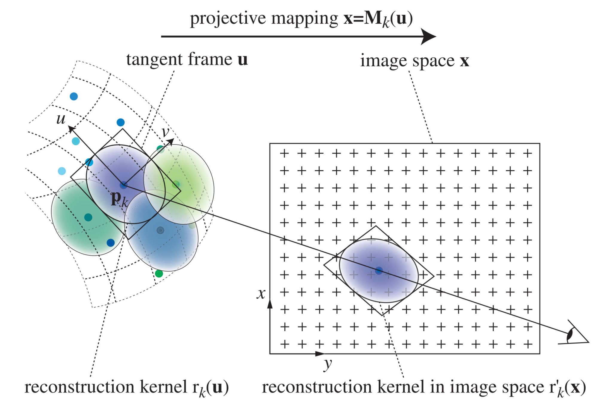
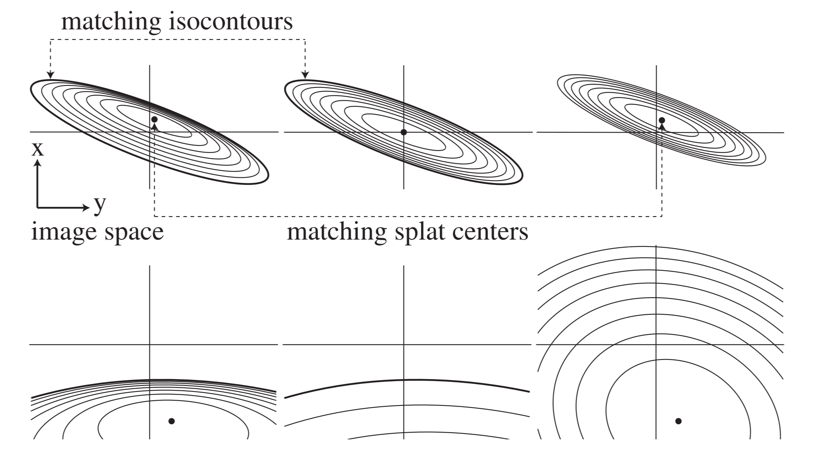
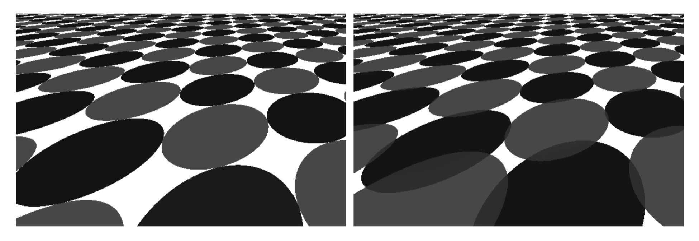
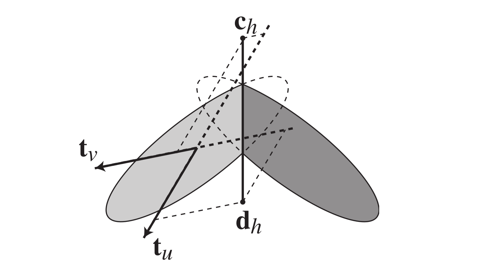

# Perspective Accurate Splatting

## ABSTRACT
We present a novel algorithm for accurate, high quality point rendering, which is based on the formulation of splatting using homogeneous coordinates. In contrast to previous methods, this leads to perspective correct splat shapes, avoiding artifacts such as holes caused by the affine approximation of the perspective projection. Further, our algorithm implements the EWA resampling filter, hence providing high image quality with anisotropic texture filtering. We also present an extension of our rendering primitive that facilitates the display of sharp edges and corners. Finally, we describe an efficient implementation of the entire point rendering pipeline using vertex and fragment programs of current GPUs.

## FILES & LINKS
- **URL:** [Open Online](https://cgl.ethz.ch/Downloads/Publications/Papers/2004/Zwi04/Zwi04.pdf)
- **Zotero Entry:** [PDF](zotero://select/library/items/XX6GPJH7)

## 1. PROBLEMS
给定不规则分布的表面点 ${\mathbf{p}_k}$ ，各点具有局部切平面、重建核 $r_{k}$ ，及颜色样本 $f_{k}$，目标为将点样本重建为连续图像，并避免透视投影、重采样和几何尖锐特征带来的伪影．

已有 [Surface Splatting](surface-splatting.md) 在各点中心将透视投影局部仿射化，能够得到高质量的各向异性过滤，但 splat 的投影外形并非严格透视正确．在大倾角、远离视轴的位置，相邻 splat 可能在图像空间分离，出现孔洞．此外，平滑重建核难以保留尖锐边缘和角点．

## 2. METHOD
### Point Rendering as a Resampling Process
点采样表面可视为非均匀采样信号．在点 $\mathbf{p}_k$ 的局部切平面上定义二维重建核 $r_k(\mathbf{u})$ ，局部坐标为 $\mathbf{u}=(u,v)$ ，颜色样本为 $f_k$ ．记切平面到图像空间的投影映射为 $\mathbf{M}_k$ ，可得渲染：

$$
g(\mathbf{x})=\sum_k f_k r_k\!\left(\mathbf{M}_k^{-1}(\mathbf{x})\right)=\sum_k f_k r_k'(\mathbf{x})
$$

其中 $r_k'$ 为投影到图像空间的重建核．因 $g$ 包含任意高频信息，直接采样会导致混叠，故先与低通滤波器 $h$ 卷积：

$$
g'(\mathbf{x})=\sum_k f_k\left(r_k'\otimes h\right)(\mathbf{x})=\sum_k f_k\rho_k(\mathbf{x})
$$

其中 $\rho_k$ 为合并重建与带限步骤的 **重采样滤波器（Resampling Filter）**．因各核通常不满足单位分解，通常需进行归一化．

选取 2D Gaussian 作为重建核和低通滤波器，其定义为：

$$
\mathcal{G}_{\boldsymbol{\Sigma}}(\mathbf{x})=\frac{|\boldsymbol{\Sigma}^{-1}|^{1/2}}{2\pi}\exp\!\left(-\frac{1}{2}\mathbf{x}\boldsymbol{\Sigma}^{-1}\mathbf{x}^{\mathsf T}\right)
$$

记重建核和低通滤波器分别为 $r_k=\mathcal{G}_{\mathbf{R}_k}$ 和 $h=\mathcal{G}_{\mathbf{H}}$  ．

用仿射映射近似透视投影 $\mathbf{M}_{k}$ 后，图像空间重建核为：

$$
r'_{k}(\mathbf{x}) = \frac{1}{|\mathbf{R}'_{k}|^{1/2}}g_{\mathbf{R}'_{k}}(\mathbf{x})
$$

对应重采样滤波器为：

$$
\rho_k(\mathbf{x})=\frac{1}{|\mathbf{R}_k'|^{1/2}}\mathcal{G}_{\mathbf{R}_k'+\mathbf{H}}(\mathbf{x})
$$

一般取 $\mathbf{H}=\mathbf{I}$ ，称之为 **EWA 重采样滤波器（EWA Resampling Filter）** ． 详细推导见 [Surface Splatting](surface-splatting.md#2-method)  ．

/// caption
Figure 1:  局部切平面上的重建核投影到图像空间示意图．
///

### Perspective Accurate Splatting Using Homogeneous Coordinates

下面的探究如何获得准确的图像空间重建核外形，以实现视角正确 ．

#### Homogeneous Coordinates and Projective Mappings

在齐次坐标下，2D-to-2D 投影映射可写为 $\mathbf{x}=\mathbf{u}\mathbf{M}^\star$ ，其中 $\mathbf{x},\mathbf{u}$ 分别为原空间点和目标空间点齐次坐标，$\mathbf{M}^\star$ 为 $3\times3$ 投影变换 ．下面研究 $\mathbf{M}^\star$ 表达式：

对相机空间中的点 $\mathbf{p}_k$ ，取切平面基向量 $\mathbf{t}_u,\mathbf{t}_v$ ．切平面上的三维点 $\mathbf{p}=(p_{x},p_{y},p_{z})$ 可表示为：

$$
\mathbf{p}=(u,v,1)\begin{bmatrix}
\mathbf{t}_u\\
\mathbf{t}_v\\
\mathbf{p}_k
\end{bmatrix}=(u,v,1)\mathbf{M}_k
$$

其中 $\mathbf{u}_{h}:=(u,v,1)$ 可视为 $\mathbf{p}$ 在切平面上的齐次坐标 ．

令投影中心为原点，图像平面为 $z=1$ ，则点 $\mathbf{p}$ 在图像平面上的透视投影为：

$$
(x,y,1)=\left(\frac{p_x}{p_z},\frac{p_y}{p_z},1\right)
$$

其中 $\mathbf{x}_{h}:=(x,y,1)$ 可视为 $\mathbf{p}$ 在图像平面上的齐次坐标 ．

将 $\mathbf{p}$ 看作齐次图像坐标，则有：

$$
\mathbf{u}_{h}\mathbf{M}_{k} = (p_{x},p_{y},p_{z}) = \left(\frac{p_x}{p_z},\frac{p_y}{p_z},1\right) = \mathbf{x}_{h}
$$

即投影映射 $\mathbf{M}^\star=\mathbf{M}_{k}$ ，逆映射则由 $\mathbf{u}_h=\mathbf{x}_h\mathbf{M}_k^{-1}$ 给出．

#### Implicit Conics in Homogeneous Coordinates
Gaussian 等值线为椭圆，可用二次曲线的隐式形式表示：

$$
\phi(x,y)=Ax^2+2Bxy+Cy^2+2Dx+2Ey-F=0
$$

令 $\Delta=AC-B^2$ ．当 $A\ge0$ 时，$\Delta>0$、$\Delta=0$、$\Delta<0$ 分别对应椭圆、抛物线、双曲线．在齐次坐标中，二次曲线矩阵形式为：

$$
\mathbf{x}_h\mathbf{Q}_h\mathbf{x}_h^{\mathsf T}=0,\quad
\mathbf{Q}_h=\begin{bmatrix}
A & B & D\\
B & C & E\\
D & E & -F
\end{bmatrix}, \quad \mathbf{x}_{h}=\begin{bmatrix}
x & y & 1
\end{bmatrix}
$$

当 $D=E=0$ ，二次曲线中心为原点，此时：

$$
Ax^{2}+2Bxy+Cy^{2}=F
$$

称为 **中心二次曲线（Central Conic）** ．

一般二次曲线可平移为中心二次曲线 ．设偏移量为 $\mathbf{x}_t=(x_t,y_t)$ ，由一次项为零的可得：

$$
\mathbf{x}_t=\left(\frac{BE-CD}{\Delta},\frac{BD-AE}{\Delta}\right)
$$

此时中心形式为：

$$
Ax^{2} + 2Bxy + Cy^{2} =F-Dx_t-Ey_t
$$

光栅化时只需测试二次曲线包围内的像素．由极值位置满足的导数关系：

$$
\begin{align}
\frac{\partial \phi}{\partial y} &= 2Bx + 2Cy + 2E = 0 \\
\frac{\partial \phi}{\partial x} &= 2Ax + 2By + 2D = 0
\end{align}
$$

计算可得紧致的轴对齐包围盒：

$$
\begin{align}
x_{\max},x_{\min}&=x_t\pm\sqrt{\frac{C(F-Dx_t-Ey_t)}{\Delta}} \\
y_{\max},y_{\min}&=y_t\pm\sqrt{\frac{A(F-Dx_t-Ey_t)}{\Delta}}
\end{align}
$$

#### Projective Mappings of Conics
给定切平面中的二次曲线 $\mathbf{u}_h\mathbf{Q}_h\mathbf{u}_h^{\mathsf T}=0$ 和投影 $\mathbf{x}_h=\mathbf{u}_h\mathbf{M}_k$ ，代入 $\mathbf{u}_h=\mathbf{x}_h\mathbf{M}_k^{-1}$ 有：

$$
\mathbf{x}_h\mathbf{Q}_h'\mathbf{x}_h^{\mathsf T}=0,\quad
\mathbf{Q}_h'=\mathbf{M}_k^{-1}\mathbf{Q}_h\mathbf{M}_k^{-\mathsf T}
$$

即二次曲线在投影变换下仍为二次曲线．记：

$$
\mathbf{Q}_h'=\begin{bmatrix}a&b&d\\b&c&e\\d&e&-f\end{bmatrix},\quad
\mathbf{Q}''=\begin{bmatrix}a&b\\b&c\end{bmatrix}
$$

对投影后的二次曲线中心化得包围区域表达式：

$$
(\mathbf{x}-\mathbf{x}_t)\mathbf{Q}''(\mathbf{x}-\mathbf{x}_t)^{\mathsf T}\le f-dx_t-ey_t
$$

注意到该中心形式可视为原二次曲线经过仿射变换得到，其与投影变换得到的区域具有相同边界，但曲线内部各点的映射并不相同 ．

#### Application to Gaussian Filters
实际渲染只计算 Gaussian 的有限支集．设截断值 $F_g$ （通常有 $1<F_g<2$ ），切平面中的截断等值线为：

$$
\mathbf{u}\mathbf{R}_k^{-1}\mathbf{u}^{\mathsf T}=F_g^2
$$

在齐次坐标下可表示为：

$$
\mathbf{u}_{h}\mathbf{Q}_{h}\mathbf{u}_{h}^\mathsf{T} = 0, \quad \mathbf{Q}_h=\begin{bmatrix}
\mathbf{R}_k^{-1}&\mathbf{0}\\
\mathbf{0}&-F_g^2
\end{bmatrix}, \quad \mathbf{u}_{h}=\begin{bmatrix}
u & v & 1
\end{bmatrix}
$$

按前述方法将该等值线透视投影并平移到中心，再缩放使得右侧为 $F_g^2$ 可得：

$$
\mathbf{Q}'''=\frac{F_g^2}{f-dx_t-ey_t}\mathbf{Q}''
$$

从而重建核在图像空间的仿射近似为：

$$
r'_{k}(\mathbf{x}) = \frac{1}{|\mathbf{Q}'''|^{1/2}}g_{\mathbf({Q}''')^{-1}}(\mathbf{x}-\mathbf{x}_{t})
$$

此时重建核截断外轮廓与精确投影变换一致，如下两图所示：

/// caption
Figure 2:  上左：Gaussian 等值线精确投影变换结果；上中：视角准确仿射近似结果，最外侧等值线是正确的；上右：中心匹配仿射近似，中心附近是正确的 ．底行：中心匹配近似的一种较差情况对比 ．
///

/// caption
Figure 3:  点采样平面的透视投影结果对比图 ．左：视角准确仿射近似；右：中心匹配仿射近似 ．
///

???+ note "Remark"
	与中心匹配的局部仿射近似相比，这一近似选择使指定等值线匹配，而中心 $\mathbf{x}_t$ 不一定是点 $\mathbf{p}_k$ 的精确透视投影位置，其他等值线及内部权重也并非逐点透视正确．相邻重建核在切平面上恰好接触时，其截断边界投影后仍接触，从而避免大倾角视角下的孔洞．

### Rendering Sharp Features
尖锐边缘与角点包含高频几何变化，仅靠平滑重建核需要极高的采样密度．为此在局部切平面中额外存储 **剪裁线（Clip Line）** ．相邻表面两侧的切平面相交，得到共享的剪裁线；核在剪裁线一侧正常求值，在另一侧丢弃．共享边界可避免剪裁产生新的孔洞．

设剪裁线上的两个齐次点为 $\mathbf{c}_h,\mathbf{d}_h$ ，其投影为：

$$
\mathbf{c}_h'=\mathbf{c}_h\mathbf{M}_k,\qquad
\mathbf{d}_h'=\mathbf{d}_h\mathbf{M}_k
$$

齐次归一化后得到二维点 $\mathbf{c}',\mathbf{d}'$ ，取与 $\mathbf{d}'-\mathbf{c}'$ 垂直且指向保留侧的向量 $\boldsymbol{\Sigma}$ ．对图像空间像素 $\mathbf{x}$，仅当：

$$
(\mathbf{x}-\mathbf{c}')\cdot\boldsymbol{\Sigma}>0
$$

才计算重采样核．边缘一般只需一条剪裁线，角点需要两条．

/// caption
Figure 4:  相邻切平面交线所定义的剪裁线，以及剪裁 splat 后的尖锐边缘与角点．
///

### Implementation
使用 GPU 顶点程序和片段程序，以 OpenGL 点基元代替四边形或三角形承载 splat ．渲染分为三遍：

1. 渲染沿视线略作偏移的深度图像．
2. 只进行深度测试而不更新深度，启用颜色混合，累积各 splat 的颜色与核权重．
3. 按累积权重归一化颜色，得到最终像素值．

顶点程序计算 $\mathbf{Q}'''$、滤波方差 $\mathbf{R}_k'+\mathbf{H}$ 及投影二次曲线的轴对齐包围盒，并据此设置点基元尺寸．当 $\mathbf{M}_k$ 条件数过大、切平面接近退化为线段，或投影二次曲线不再是椭圆时，丢弃对应 splat ．

片段程序对包围盒中的每个像素计算：

$$
r^2=(\mathbf{x}-\mathbf{x}_t)(\mathbf{R}_k'+\mathbf{H})^{-1}(\mathbf{x}-\mathbf{x}_t)^{\mathsf T}
$$

若 $r^2<F_g^2$ ，通过一维查找表读取 Gaussian 权重；否则丢弃片段．剪裁 splat 时再增加剪裁线的半平面测试．

## 3. EXPERIMENTS
在 GeForceFX 5950 GPU、Pentium IV 3.0 GHz CPU 上，对约 10 万至 65 万点的对象测试．下表单位为百万 splat / 秒：

| 实现 | 512×512 单遍 | 512×512 三遍 | 1280×1024 单遍 | 1280×1024 三遍 |
| --- | ---: | ---: | ---: | ---: |
| Cg | 2.9 | 1.4 | 2.8 | 1.2 |
| 汇编优化 | 11.2 | 3.1 | 10.4 | 2.8 |

开启 Gaussian 预滤波可以消除棋盘格纹理中的明显莫尔纹．在大倾角且偏离视轴的观察位置，中心匹配的仿射 splat 会留下孔洞；等值线匹配的 splat 保持连续覆盖．带剪裁线的 splat 还可用 6433 个点表现 CSG 对象的尖锐边缘与角点．

## 4. THINKING
- **精确性边界：** 透视正确的是选定 Gaussian 等值线所限定的 splat 形状，而非整个 Gaussian 函数的逐点投影．滤波仍是以 $\mathbf{x}_t$ 为中心、方差 $\mathbf{R}_k'+\mathbf{H}$ 的仿射 Gaussian 近似．
- **与 [Surface Splatting](./surface-splatting.md#screen-space-ewa) 的关系：** 保留屏幕空间 EWA 的“重建核投影 + 低通滤波”框架，将原先在点中心线性化的外形估计，改为基于齐次二次曲线的截断轮廓估计．
- **采样与几何的分工：** EWA 低通处理纹理缩小时的混叠；剪裁线处理几何不连续性；二次曲线投影处理极端透视下 splat 覆盖不连续的问题．三者解决的伪影不同．
- **限制：** 需要计算并求逆 $3\times3$ 投影矩阵及二次曲线矩阵；接近退化的 splat 会被剔除．固定等值线匹配也不能保证核内部的透视精确性．
