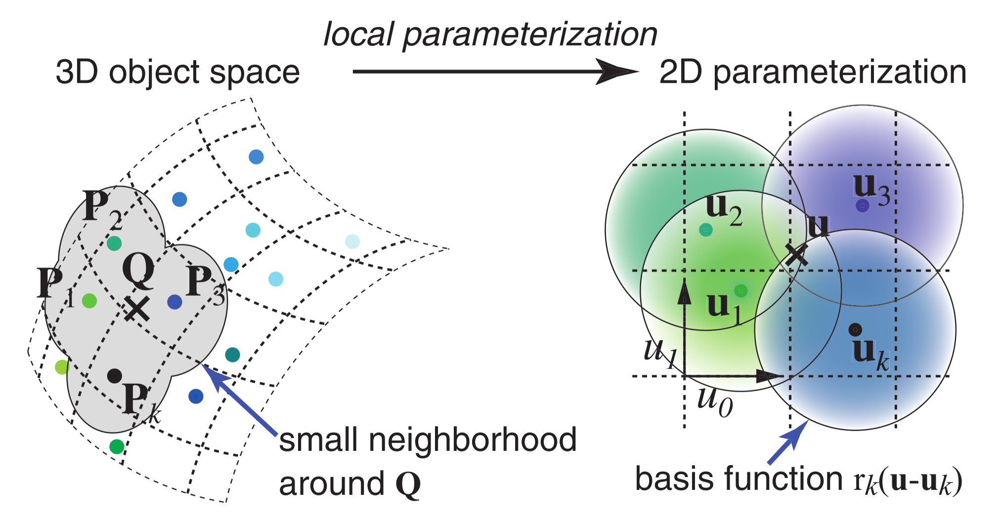
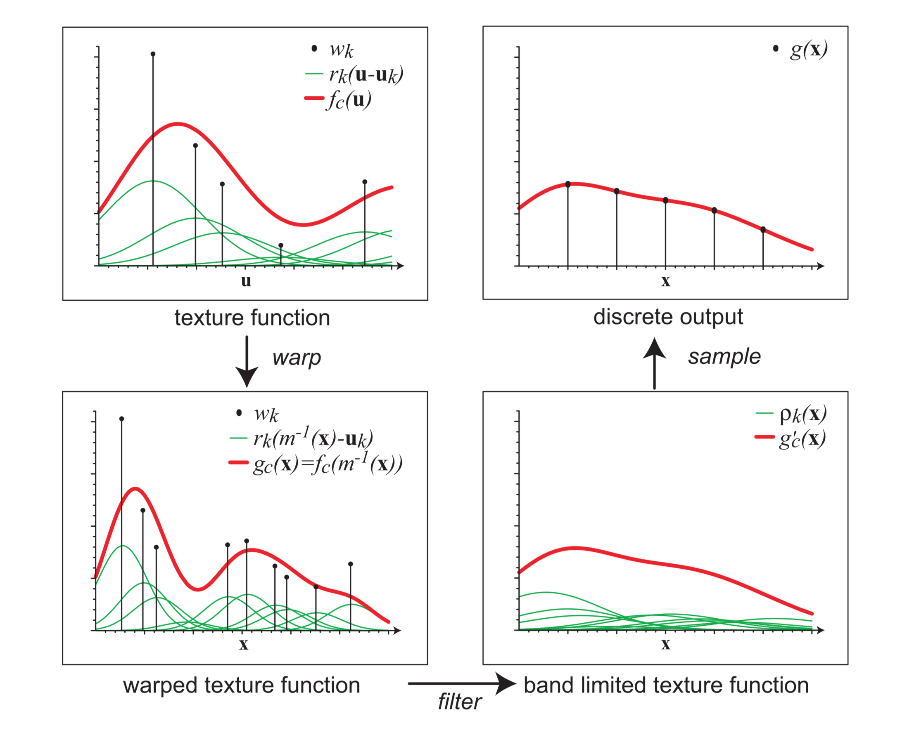
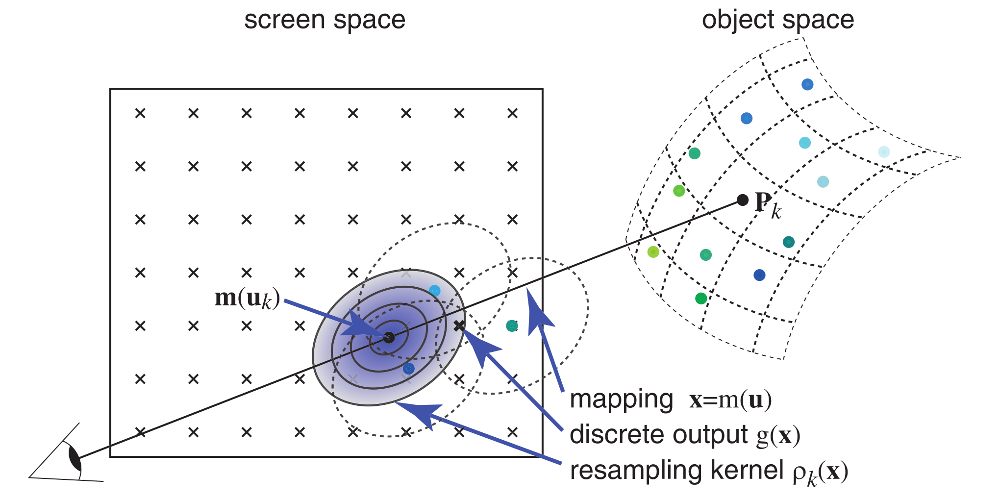

# Surface Splatting

## ABSTRACT
Modern laser range and optical scanners need rendering techniques that can handle millions of points with high resolution textures. This paper describes a point rendering and texture filtering technique called surface splatting which directly renders opaque and transparent surfaces from point clouds without connectivity. It is based on a novel screen space formulation of the Elliptical Weighted Average (EWA) filter. Our rigorous mathematical analysis extends the texture resampling framework of Heckbert to irregularly spaced point samples. To render the points, we develop a surface splat primitive that implements the screen space EWA filter. Moreover, we show how to optimally sample image and procedural textures to irregular point data during pre-processing. We also compare the optimal algorithm with a more efficient view-independent EWA pre-filter. Surface splatting makes the benefits of EWA texture filtering available to point-based rendering. It provides high quality anisotropic texture filtering, hidden surface removal, edge anti-aliasing, and order-independent transparency.

## FILES & LINKS
- **URL:** [Open Online](https://dl.acm.org/doi/10.1145/383259.383289)
- **Zotero Entry:** [PDF](zotero://select/library/items/IZ9AN7QN)

## 1. PROBLEMS
给定无连接关系的不规则三维点集：

$$
\mathcal{P}=\{P_k\},
$$

各点具有位置、法向、径向对称基函数 $r_{k}$ ，颜色 $w_{k}^r,w_{k}^g,w_{k}^b$ 。目标是在保证纹理细节的同时完成高质量点渲染。需要同时解决如下问题：

- 从不规则点样本重建连续的表面纹理函数。
- 进行从物体空间到屏幕空间的正确重采样，避免纹理混叠和过度模糊。
- 在没有拓扑连接的情况下完成隐藏面消除。
- 支持透明表面和边缘抗锯齿，并尽量减少额外的存储和计算。

## 2. METHOD
### Surface Texture Function
与三角网格不同，点渲染没有「Texture → Object → Screen」的复合二维映射，因此纹理必须显式存储在点的局部表面参数化中。

考虑表面点 $\mathbf{Q}$ ，对其邻域建立局部二维表面参数化，如下图所示：

/// caption
Figure 1:  在基于点的对象表面上定义纹理函数。
///

点 $\mathbf{Q}$ 和邻域点 $\mathbf{P}_k$ 在该参数化中的坐标分别记为 $\mathbf{u}$ 和 $\mathbf{u}_k$ ，连续表面函数定义为：

$$
f_c(\mathbf{u})=\sum_{k\in\mathbb{N}}w_k r_k(\mathbf{u}-\mathbf{u}_k)
$$

选取有局部支集或适合被截取的基函数 $r_{k}$ 。

### Rendering as Resampling
将点表面渲染视为连续函数的「Warping → Filtering → Sampling」三步重采样过程。设从局部表面参数空间到屏幕空间的映射为 $\mathbf{x}=\mathbf{m}(\mathbf{u}):\mathbb{R}^{2}\to \mathbb{R}^{2}$ ，渲染分为三步：

- **变形（Warping）**：
	
	将 $f_{c}(\mathbf{u})$ 变换为屏幕空间连续信号 $g_{c}(\mathbf{x})$ ：
	
	$$
	g_c(\mathbf{x}) = (f_{c}\circ\mathbf{m}^{-1})(\mathbf{x}) = f_c\!\left(\mathbf{m}^{-1}(x)\right)
	$$

- **滤波（Filtering）**：
	
	使用低通滤波器 $h$ 对屏幕空间信号 $g_{c}(\mathbf{x})$ 进行带限：
	
	$$
	g_c'(\mathbf{x})=g_c(\mathbf{x})\otimes h(\mathbf{x})=\int_{\mathbb{R}^2}g_c(\xi)h(\mathbf{x}-\xi)\,d\xi
	$$

- **采样（Sampling）**：
	
	与屏幕像素冲激串 $i$ 相乘，得到离散图像 $g(\mathbf{x})$：

$$
g(\mathbf{x})=g_c'(\mathbf{x})i(\mathbf{x}).
$$

如下图所示：

/// caption
Figure 2:  纹理函数的变形、滤波、采样示意图。
///

代入 $f_{c}(\mathbf{u})$ 表达式，$g_{c}'(\mathbf{x})$ 可显式写为：

$$
\begin{align}
g_c'(\mathbf{x}) &= \int_{\mathbb{R}^{2}} h(\mathbf{x}-\xi) \sum_{k\in \mathbb{N}} w_{k}r_{k}(\mathbf{m}^{-1}(\xi)-\mathbf{u}_{k})\, d\xi \\
&= \sum_{k\in\mathbb{N}}w_k\rho_k(\mathbf{x})
\end{align}
$$

其中：

$$
\rho_k(\mathbf{x}):=\int_{\mathbb{R}^2}h(\mathbf{x}-\xi)r_k\!\left(\mathbf{m}^{-1}(\xi)-\mathbf{u}_k\right)\,d\xi
$$

称为 **重采样核（Resampling Kernel）**。$g_{c}'(\mathbf{x})$ 形式表明可以先逐点构造屏幕空间核，再将所有核的贡献累积到图像缓冲区，称该框架为 **表面泼溅（Surface Splatting）**，示意图如下：

/// caption
Figure 3:  表面泼溅渲染示意图。重建核前向累积在屏幕空间。
///

为简化 $\rho_{k}(\mathbf{x})$ 中的积分计算，在各点 $\mathbf{u}_k$ 附近使用 $\mathbf{m}$ 的局部仿射近似 $\mathbf{m}_{\mathbf{u}_{k}}$：

$$
\mathbf{m}_{\mathbf{u}_k}(\mathbf{u})=\mathbf{x}_k+\mathbf{J}_{\mathbf{u}_k}(\mathbf{u}-\mathbf{u}_k)
$$

其中 $\mathbf{x}_k=\mathbf{m}(\mathbf{u}_k)$ ，Jacobian 为 $\mathbf{J}_{\mathbf{u}_k}=\frac{\partial \mathbf{m}}{\partial \mathbf{u}}(\mathbf{u}_k)$ 。

令变形后的基函数为 $r_k'(\mathbf{x})=r_k(\mathbf{J}_{\mathbf{u}_{k}}^{-1}\mathbf{x})$，计算有：

$$
\begin{align}
\rho_{k}(\mathbf{x}) &= \int_{\mathbb{R}^{2}} h(\mathbf{x}-\mathbf{m}_{\mathbf{u}_{k}}(\mathbf{u}_{k})-\xi)r_{k}'(\xi)\,d\xi \\
&= (r_k'\otimes h)\!\left(\mathbf{x}-\mathbf{m}_{\mathbf{u}_{k}}(\mathbf{u}_k)\right)
\end{align}
$$

即重采样核 $\rho_{k}(\mathbf{x})$ 可表示为变换后的基函数 $r_{k}'$ 和低通滤波器 $h$ 的卷积。下文省略 $\mathbf{m}$ 和 $\mathbf{J}$ 的下标 $\mathbf{u}_{k}$ 。

### Screen Space EWA

选择椭圆 Gaussian 作为基函数和低通滤波器，因其在仿射和卷积运算下封闭，详见 [EWA-Splatting](./ewa-splatting.md#elliptical-gaussian-kernels) 。方差为 $\boldsymbol{\Sigma}$ 的椭圆 Gaussian 定义为：

$$
\mathcal{G}_{\boldsymbol{\Sigma}}(\mathbf{x})=\frac{1}{2\pi |\boldsymbol{\Sigma}|^{1/2}}\exp\!\left(-\frac{1}{2}\mathbf{x}^\mathsf{T}\boldsymbol{\Sigma}^{-1}\mathbf{x}\right)
$$

取 $r_{k}$ 和 $h$ 分别为方差 $\boldsymbol{\Sigma}_{k}^r$ 和 $\boldsymbol{\Sigma}^h$ 的 Gaussian 。计算有：

$$
\begin{align}
r_k'(\mathbf{x}) &= r(\mathbf{J}^{-1}\mathbf{x}) = \mathcal{G}_{\boldsymbol{\Sigma}_{k}^r}(\mathbf{J}^{-1}\mathbf{x}) = \frac{1}{|\mathbf{J}^{-1}|}\mathcal{G}_{\mathbf{J}\boldsymbol{\Sigma}_k^r\mathbf{J}^\mathsf{T}}(\mathbf{x}) \\
h(\mathbf{x}) &= \mathcal{G}_{\Sigma^h}(\mathbf{x})
\end{align}
$$

通常取 $\boldsymbol{\Sigma}^h=\mathbf{I}$ ，重建核 $\rho_{k}$ 同样有如下 Gaussian 形式：

$$
\begin{align}
\rho_k(\mathbf{x}) &= (r_{k}'\otimes h)(\mathbf{x}-\mathbf{m}(\mathbf{u}_{k})) \\
&= \frac{1}{|\mathbf{J}^{-1}|}(\mathcal{G}_{\mathbf{J}\boldsymbol{\Sigma}_{k}^r\mathbf{J}^\mathsf{T}}\otimes \mathcal{G}_{\boldsymbol{\Sigma}^h})(\mathbf{x}-\mathbf{m}(\mathbf{u}_{k})) \\
&= \frac{1}{|\mathbf{J}^{-1}|}\mathcal{G}_{\mathbf{J}\boldsymbol{\Sigma}_k^r\mathbf{J}^\mathsf{T}+\mathbf{I}}\!\left(\mathbf{x}-\mathbf{m}(\mathbf{u}_k)\right)
\end{align}
$$

代入 $g_{c}'$ 式中可得：

$$
g_{c}'(\mathbf{x}) = \sum_{k\in \mathbb{N}} w_{k} \frac{1}{|\mathbf{J}^{-1}|} \mathcal{G}_{\mathbf{J}\boldsymbol{\Sigma}_{k}^r\mathbf{J}^\mathsf{T}+\mathbf{I}}(\mathbf{x}-\mathbf{m}(\mathbf{u}_{k}))
$$

称之为 **屏幕空间 EWA（Screen Space EWA）**。

???+ note "Remark"
	[Heckbert] 中表述了 **源空间 EWA（Source Space EWA）** 方法：
	
	$$
	g_{c}'(\mathbf{x}) = \sum_{k\in \mathbb{N}} w_{k}\mathcal{G}_{\boldsymbol{\Sigma}_{k}^r+\mathbf{J}^{-1}{\mathbf{J}^{-1}}^\mathsf{T}}(\mathbf{m}^{-1}(\mathbf{x})-\mathbf{u}_{k})
	$$
	
	由关系式：
	
	$$
	\mathbf{x}-\mathbf{m}(\mathbf{u}_{k})=\mathbf{m}(\mathbf{m}^{-1}(\mathbf{x})-\mathbf{u}_{k})=\mathbf{J}\cdot(\mathbf{m}^{-1}(\mathbf{x})-\mathbf{u}_{k})
	$$
	
	知两式数学上等价，但实际含义不同。源空间 EWA 相当于对点云进行光线追踪以寻找表面交点；屏幕空间 EWA 可以直接前向累积，更适合交互式点渲染。

### Surface Splatting Algorithm

表面泼溅算法步骤如下：

1. 将点 $\mathbf{P}_k$ 投影到屏幕空间 $\mathbf{m}(\mathbf{u}_k)$ 。
2. 根据局部投影 Jacobian $\mathbf{J}$ 确定 Gaussian 重采样核 $\rho_k$。
3. 将 $\rho_k$ 的贡献泼溅到累积缓冲区，同时过滤颜色、法向、权重和相机空间深度。
4. 所有点处理完成后，对每个像素执行延迟着色（Deferred Shading）。

#### Determining the resampling kernel
重采样核 $\rho_{k}$ 由 Jacobian $\mathbf{J}$ 决定，其为局部表面坐标到视口坐标的 2D 变换，可由如下三部分组成：

- 仿射视角变换（物体空间→相机空间）：
  
  约束该变换禁止非均匀缩放或剪切，从而保 $r_{k}$ 的旋转不变性。因此对应 Jacobian 为一致缩放矩阵，缩放因子记为 $s_{mv}$ 。

- 透视投影变换（相机空间→屏幕空间）：
  
  为计算该变换 Jacobian ，先构造局部表面参数化：
  
  给定相机空间物体表面点 $\mathbf{P}_{k}$ 及其法向 $\mathbf{n}_{k}$ ，以切平面近似局部表面。选取切平面正交基 $\mathbf{u}_{0},\mathbf{u}_{1}$ ，由于 $r_{k}$ 对称性，基向量方向任意。考虑将屏幕空间基向量 $\mathbf{x}_{0},\mathbf{x}_{1}$ 映射到
  
  
  
  
- 视口变换（屏幕空间→视口空间）：
  
  约束该变换为平移和一致缩放，因此对应 Jacobian 也为一致缩放矩阵，缩放因子记为 $s_{vp}$ 。

视角变换、透视投影和视口映射的 Jacobian 组合为：

$$
J=s_{vp}\,J_{pr}\,s_{mv},
$$

为计算透视投影的局部 Jacobian，先在点 $P_k$ 的切平面上建立正交基 $u_0,u_1$。将屏幕坐标轴沿穿过投影中心和 $P_k$ 的视线反投影到切平面，得到向量 $\tilde{x}_0,\tilde{x}_1$，并令 $u_0=\tilde{x}_0/\|\tilde{x}_0\|$。于是逆映射的 Jacobian 为：

$$
J_{pr}^{-1}=\begin{pmatrix}
\tilde{x}_0\cdot u_0 & \tilde{x}_1\cdot u_0\\
0 & \tilde{x}_1\cdot u_1
\end{pmatrix}.
$$

#### Kernel Evaluation and Visibility
Gaussian 理论上具有无限支集，实际仅在如下椭圆区域内计算：

$$
\beta(x)=\frac{1}{2}x^\mathsf{T}\left(I+J^{-\mathsf{T}}J^{-1}\right)x<c.
$$

典型取值为 $c=1$。由于核被截断，需要按像素内所有贡献的和进行归一化：

$$
g(x)=\sum_{k\in\mathcal{N}}w_k\frac{\rho_k(x)}{\sum_{j\in\mathcal{N}}\rho_j(x)}. \tag{6} \label{6}
$$

为处理多层表面，在每个覆盖像素处计算点所在切平面的相机空间 $z$ 值。若新贡献与已存贡献的深度差小于阈值，则将其累积到同一表面；否则，仅当新贡献更靠近观察者时替换像素数据。这样无需点的全局排序即可完成隐藏面消除。延迟着色还避免了对最终不可见点进行着色。

### Texture Acquisition
论文讨论两类纹理获取方式：点自带颜色，以及将外部图像或过程纹理映射到点云。

#### Per-Point Color
扫描系统为每个点提供颜色样本 $c_k$。若假设基函数形成单位分解，可直接取 $w_k=c_k$。但对不规则点集，直接归一化基函数会产生有理函数，破坏前述 EWA 推导。因此论文在渲染阶段归一化重采样核，即使用式 $\eqref{6}$，无需额外计算。

基函数方差应匹配局部点密度。若局部切平面近似边长为 $h$ 的抖动规则网格，可取：

$$
V_k^r=\begin{pmatrix}h^2&0\\0&h^2\end{pmatrix}.
$$

$h$ 也可以由邻域中最大点间距预计算并存入层次结构。

#### Texture Mapping
设纹理空间坐标为 $s$，到物体局部参数空间的映射为 $u=t(s)$。先用重建核 $n(s)$ 从规则纹理样本 $c_i$ 得到连续纹理：

$$
c_c(s)=\sum_i c_i n(s-s_i).
$$

映射到物体空间后得到 $\tilde f_c(u)=c_c(t^{-1}(u))$。通过最小化 $L_2$ 误差确定点权重：

$$
F(w)=\left\|\tilde f_c(u)-f_c(u)\right\|_{L_2}^2.
$$

令 $w=(w_j)$，对 $F$ 求梯度并令其为零，得到线性系统：

$$
Rw=c,
$$

其中

$$
R_{kj}=\langle r_k,r_j\rangle,\qquad c_k=\sum_i c_i\left\langle r_k,n_i\circ t^{-1}\right\rangle
$$

若进一步假设基函数正交，则 $R=I$，系数退化为 view-independent EWA 的形式。论文实验表明，最小二乘优化在放大纹理时比 view-independent EWA 更清晰。

[figure]
/// caption
Figure 2: 纹理最优采样与 view-independent EWA 采样在缩小、放大和极端放大下的对比。
///

### Transparency
透明度使用固定层数 $l$ 的多层 A-buffer。每个像素的一个 fragment 收集同一表面的所有 splat 贡献。处理新贡献时依次执行：

1. **累积或分离：** 依据 $z$ 阈值判断新贡献是否属于已有表面；若属于则累积，否则创建临时 fragment。
2. **插入：** 若 fragment 数尚未达到上限 $l$，将临时 fragment 写入空槽位。
3. **合并：** 若超过上限，选择两个 fragment 合并。合并前先着色，并按深度差优先选择更可能属于同一表面的片段。

前片段和后片段的颜色、透明度分别为 $(c_f,\alpha_f)$ 和 $(c_b,\alpha_b)$，合并结果为：

$$
c_o=c_f\alpha_f+c_b\alpha_b(1-\alpha_f),
$$

$$
\alpha_o=\alpha_f+\alpha_b(1-\alpha_f)
$$

所有 splat 完成后，fragment 从后向前混合得到最终像素。该方法无需预先对全部点排序，但在相交表面或高曲率区域，由于不同表面贡献被错误合并，仍可能出现伪影。

[figure]
/// caption
Figure 3: 多层 A-buffer 渲染相交透明表面时的 fragment 合并与边缘抗锯齿。
///

### Edge Antialiasing
边缘抗锯齿需要估计一个 fragment 对像素的部分覆盖率。论文假设基函数位于规则网格且单位方差，因此近似满足单位分解；变形和带限后，所有重采样核的和仍近似为常数：

$$
q=\sum_{k\in\mathcal{N}}\rho_k(x)\approx1.
$$

当 $q<1$ 时，表示表面没有完全覆盖像素。考虑有限支集和不规则采样，取完整覆盖阈值 $\tau=0.4$，定义：

$$
q'=q/\tau.
$$

最终将 fragment 透明度修正为：

$$
\alpha'=\begin{cases}
\alpha q',&q'<1\\
\alpha,&q'\ge1.
\end{cases}
$$

## 3. EXPERIMENTS
作者以软件实现 surface splatting，并在预处理阶段将几何模型转换为点对象，同时构建支持多分辨率和渐进式渲染的层次结构。实验包含激光扫描人头、Matterhorn 地形以及直升机等点采样模型，并比较屏幕空间 EWA、源空间 EWA、圆形 splat 和椭圆 splat。

在 1.1 GHz AMD Athlon、1.5 GB 内存的系统上，使用三层 frame buffer 时，典型性能如下：

| 数据集 | 点数 | 256×256 | 512×512 |
| --- | ---: | ---: | ---: |
| Scanned Head | 429,075 | 1.3 fps | 0.7 fps |
| Matterhorn | 4,782,011 | 0.2 fps | 0.1 fps |
| Helicopter | 987,552 | 0.6 fps | 0.3 fps |

每个像素需要 $3\times38=114$ 字节，故三层 frame buffer 在 256×256 和 512×512 分辨率下分别约占 6.375 MB 和 25.5 MB。质量对比显示：

- 屏幕空间 EWA 与源空间 EWA 的纹理质量基本等价，同时不需要层次结构进行反向查找。
- 圆形 splat 在缩小场景中尚可，但放大时会过度模糊。
- 仅依据法向构造椭圆 splat、忽略带限步骤，会在纹理缩小时产生混叠。
- 屏幕空间 EWA 在缩小和放大之间提供连续过渡，并同时保持各向异性过滤质量。

## 4. THINKING
- **核心抽象：** Surface splatting 将点渲染重新表述为“局部表面函数的屏幕空间重采样”。一旦把每个点的贡献写成重采样核，投影、低通和像素采样便能在同一框架中处理。
- **为什么使用屏幕空间 EWA：** 源空间 EWA 需要将屏幕像素反向映射到表面并寻找交点，对无连接点云不实用；屏幕空间形式只需前向投影和核累积。
- **与 EWA volume splatting 的联系：** 两者都利用 Gaussian 在仿射变换和卷积下的封闭性，但本文将三维体核替换为切平面上的定向二维核，因而能更直接地表达表面纹理的各向异性。
- **主要近似来源：** 切平面近似、有限 Gaussian 支集、局部参数化不一致以及固定数量 fragment 的合并都会引入误差。高曲率、表面相交和几何欠采样区域尤其容易出现伪影。
- **工程启示：** 归一化重采样核同时解决了有限支集造成的能量损失；延迟着色避免了不可见点的着色；Jacobian 和 Gaussian 协方差可以预计算或通过前向差分高效评估。
- **后续方向：** 论文提出将屏幕空间 EWA 推广到体数据、探索硬件实现，并通过更高采样率或更高阶局部表面近似减少相交和高曲率区域的几何误差。

